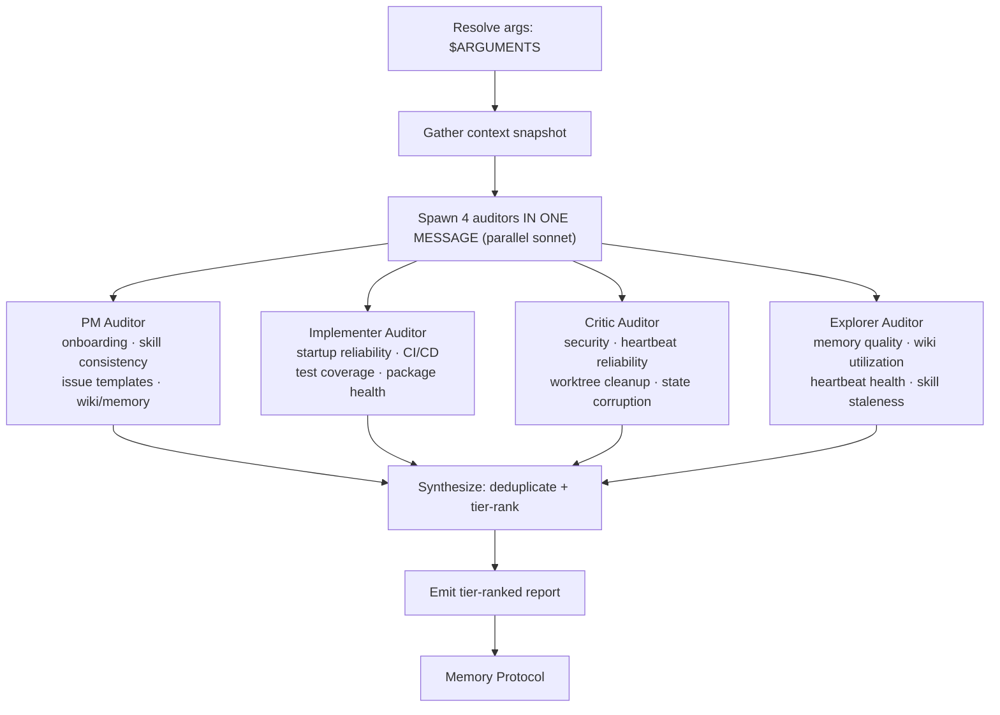

# Harness Audit

Run 4 parallel audit perspectives (PM, Implementer, Critic, Explorer), synthesize their ranked findings, and produce a single tier-classified improvement list with recommended next actions.

**Core principle: evidence over opinion.** Every finding must cite a specific file, observed behavior, or gap — no speculative items.

## External proposal implementation audits

When the user asks whether an external article, repo, or social post should be implemented into Open Harness, use this skill as a decision audit rather than a generic repo-health audit. If the request also says “Add to Wiki,” ingest the source first (or in parallel) and cite the resulting wiki entry/snapshot in the GitHub issue. Convene at least three perspectives — product/alignment, implementer/feasibility, and critic/security/reliability — then synthesize a recommendation with non-goals, acceptance criteria, and gating criteria before any larger implementation.

Use `references/external-proposal-implementation-audit.md` for the detailed reusable pattern and the Lat.md/CodeGraph case studies.

## Decision Flow



## Instructions

### 1. Resolve arguments

Arguments received: `$ARGUMENTS`

- If `--focus <area>` is present, restrict each auditor to that area (pass as a constraint)
- If `--dry-run` is present, print the briefing + auditor prompts and stop — do not spawn agents
- Otherwise proceed with a full 4-agent audit

### 2. Gather context snapshot

Read the following before spawning agents. Pass the assembled snapshot to every auditor.

```bash
# Harness structure
ls /home/sandbox/harness/.claude/skills/
ls /home/sandbox/harness/.claude/agents/ 2>/dev/null || echo "no agents dir"
ls /home/sandbox/harness/crons/ 2>/dev/null || echo "no crons"
ls /home/sandbox/harness/memory/ 2>/dev/null | tail -10
ls /home/sandbox/harness/wiki/ 2>/dev/null | head -20

# Package health
cat /home/sandbox/harness/package.json 2>/dev/null | head -30
cat /home/sandbox/harness/packages/docs/package.json 2>/dev/null | head -30

# CI definition
ls /home/sandbox/harness/.github/workflows/ 2>/dev/null

# Worktrees
git -C /home/sandbox/harness worktree list 2>/dev/null

# Recent memory
tail -40 /home/sandbox/harness/memory/MEMORY.md 2>/dev/null
```

Assemble a **Context Snapshot** (compact markdown, ~300 words):

```markdown
## Harness Context Snapshot — YYYY-MM-DD

### Skills present
[list]

### Agents present
[list or "none"]

### Heartbeats
[list files + frontmatter status if readable]

### Memory logs (recent)
[last 10 daily log files]

### Wiki pages
[list or "none"]

### Packages
- root: [version, dep count]
- packages/docs: [version, dep count]

### CI workflows
[list]

### Git worktrees
[list]

### Focus constraint
[value of --focus or "none — full audit"]
```

### 3. Spawn 4 auditors in ONE message (parallel)

Launch 4 Agent tool calls **in a single message**. Each receives the Context Snapshot and its specific audit mandate below. All agents use **sonnet** model and **Ultra compression** for their output (consumed by the synthesis step, not humans).

---

#### PM Auditor

> You are a Product Manager auditing the Open Harness project. Read the Context Snapshot provided. Then inspect the repo at `/home/sandbox/harness` for evidence supporting or refuting each check below. Use Read, Glob, and Grep tools freely. Return findings in the Ultra-compressed format defined at the end.
>
> **Audit areas:**
>
> 1. **Developer onboarding friction** — Read `.devcontainer/`, `Makefile`, `install/`, `CLAUDE.md`, `workspace/AGENTS.md`. Count the distinct manual steps required from `git clone` to a working sandbox. Flag any step that is undocumented, error-prone, or requires copy-pasting secrets.
>
> 2. **Skill consistency** — Read every `SKILL.md` under `.claude/skills/` and `workspace/.claude/skills/`. Check: does each have valid YAML frontmatter (name, description)? Does each follow imperative instructions? Are any stale (no recent invocation evidence in memory logs)?
>
> 3. **Issue template completeness** — List `.github/ISSUE_TEMPLATE/` files. For each template, check: does it have required fields, clear labels, and assignment guidance?
>
> 4. **Wiki/memory utilization** — Count wiki pages under `wiki/`. Count daily memory logs under `memory/`. Are logs recent (within 7 days)? Are wiki pages populated or placeholder-empty?
>
> **Return format (Ultra compression):**
> ```
> PM_FINDINGS
> [AREA] [SEVERITY: H/M/L] [EFFORT: S/M/L] [FINDING] | [EVIDENCE: file or observation]
> ...
> WORKING
> [what is functioning well]
> END
> ```

---

#### Implementer Auditor

> You are a senior engineer auditing the Open Harness project. Read the Context Snapshot provided. Then inspect the repo at `/home/sandbox/harness`. Use Read, Glob, Grep, and Bash tools freely. Return findings in the Ultra-compressed format defined at the end.
>
> **Audit areas:**
>
> 1. **Startup reliability** — Read `.devcontainer/docker-compose.yml` and `.devcontainer/entrypoint.sh`. Look for: race conditions (services starting before deps are ready), silent failure paths (errors swallowed without exit codes), stale workspace auto-start hooks, missing healthchecks on compose services.
>
> 2. **Test coverage** — Check `scripts/__tests__/` and `packages/docs/` for test files. Run `ls scripts/__tests__/ 2>/dev/null` and `ls packages/docs/src/__tests__/ 2>/dev/null`. Check `.github/workflows/` for test job definitions. Are the orchestrator scripts and docs app tested in CI?
>
> 3. **CI/CD completeness** — Read each workflow file. Are there gaps: missing lint, missing type-check, no test job, no release job, no deploy step?
>
> 4. **Package health** — For root `package.json` and each `packages/*/package.json`, check: pinned vs caret deps, presence of `build` script, presence of `test` script.
>
> 5. **Compose overlay fragility** — Read `.devcontainer/docker-compose*.yml` files. Look for: hardcoded paths, missing `restart: unless-stopped` on long-lived services, volumes without named mounts, environment variables without defaults.
>
> **Return format (Ultra compression):**
> ```
> IMP_FINDINGS
> [AREA] [SEVERITY: H/M/L] [EFFORT: S/M/L] [FINDING] | [EVIDENCE: file:line or command output]
> ...
> WORKING
> [what is solid]
> END
> ```

---

#### Critic Auditor

> You are an adversarial security and reliability critic auditing the Open Harness project. Assume everything is broken until proven otherwise. Read the Context Snapshot. Inspect `/home/sandbox/harness`. Use Read, Glob, Grep, and Bash tools. Return findings in the Ultra-compressed format defined at the end.
>
> **Audit areas:**
>
> 1. **Security posture** — Check: is the Docker socket mounted into containers (`/var/run/docker.sock`)? Are any containers running with `--privileged` or `user: root`? Are there default passwords or hardcoded secrets in compose files or entrypoints? Is sudo unrestricted inside the sandbox?
>
> 2. **Cron reliability** — Read all cron definitions in `crons/`. For each: is there a watchdog/restart mechanism? What happens if the cron runtime crashes — does it auto-recover? Is the cron/daemon config present and valid?
>
> 3. **Worktree cleanup** — Run `git -C /home/sandbox/harness worktree list`. Identify orphaned agent branches (`agent/*`) with no recent commits (check `git log --since="7 days ago"`). Is there any automated cleanup?
>
> 4. **State corruption risks** — Look for: shared files written by multiple agents concurrently (e.g., `MEMORY.md`), no file locking on append operations, mid-commit crash scenarios (partial writes to critical files), compose volumes that could diverge.
>
> **Return format (Ultra compression):**
> ```
> CRITIC_FINDINGS
> [AREA] [SEVERITY: H/M/L] [EFFORT: S/M/L] [FINDING] | [EVIDENCE: file or observed gap]
> ...
> WORKING
> [what is hardened or acceptable]
> END
> ```

---

#### Explorer Auditor

> You are a system archaeologist auditing the Open Harness project. Your job is to discover what is actually happening vs. what the documentation claims. Read the Context Snapshot. Inspect `/home/sandbox/harness` and `/home/sandbox/harness/workspace`. Use Read, Glob, Grep, and Bash tools. Return findings in the Ultra-compressed format defined at the end.
>
> **Audit areas:**
>
> 1. **Memory system quality** — Read the 5 most recent daily logs in `memory/`. Are entries following the Memory Improvement Protocol (Result/Action/Observation/Duration)? Is quality declining over time (shorter entries, missing fields)? Are entries actually present?
>
> 2. **Wiki utilization** — List all files under `wiki/`. For each, check if it has substantive content (>10 lines) or is a placeholder stub. What percentage is populated?
>
> 3. **Cron health** — For each cron definition in `crons/`, classify: ACTIVE (recently logged evidence), STALE (defined but no recent log evidence), MISCONFIGURED (broken frontmatter or missing schedule). Check memory logs for cron execution traces.
>
> 4. **Agent worktree status** — Run `git -C /home/sandbox/harness worktree list` and `git -C /home/sandbox/harness branch -a | grep agent/`. Classify each: ACTIVE (commits in last 7 days), IDLE (commits 7-30 days ago), ORPHANED (no commits in 30+ days or branch deleted).
>
> 5. **Skill usage patterns** — Read `memory/MEMORY.md` and recent daily logs. Which skills appear in memory entries (evidence of use)? Which skills exist in `.claude/skills/` but never appear in logs (potentially stale or unknown)?
>
> **Return format (Ultra compression):**
> ```
> EXP_FINDINGS
> [AREA] [SEVERITY: H/M/L] [EFFORT: S/M/L] [FINDING] | [EVIDENCE: file or log reference]
> ...
> WORKING
> [what is healthy]
> END
> ```

---

### 4. Synthesize findings

After all 4 auditors return, synthesize into the output format:

1. **Deduplicate** — if 2+ auditors flag the same issue, merge into one entry (note multiple sources)
2. **Tier-rank** using this matrix:

| Tier | Criteria |
|------|----------|
| **Tier 1: Fix Now** | Severity H + any effort, OR Severity M + Effort S |
| **Tier 2: Build Next** | Severity M + Effort M/L, OR Severity L + Effort S with clear payoff |
| **Tier 3: Design Decisions Needed** | Requires architectural choice, policy decision, or cross-team alignment before action |

3. **Identify what's working** — consolidate all WORKING entries from auditors
4. **Select top 3 actions** — the 3 highest-leverage Tier 1 items (or Tier 2 if Tier 1 is empty), stated as concrete next steps (e.g., "Add healthcheck to postgres service in `.devcontainer/docker-compose.yml`")

### 5. Emit the report

```
## Harness Audit — YYYY-MM-DD

### Tier 1: Fix Now (high impact, low-medium effort)
| # | Issue | Source | Effort | Why |
|---|-------|--------|--------|-----|
| 1 | ... | PM/IMP/CRITIC/EXP | S/M/L | ... |

### Tier 2: Build Next (medium impact, medium effort)
| # | Issue | Source | Effort | Why |
|---|-------|--------|--------|-----|

### Tier 3: Design Decisions Needed
| # | Issue | Source | Why |
|---|-------|--------|-----|

### What's Working (keep investing)
- ...

### Recommended Next 3 Actions
1. ...
2. ...
3. ...
```

### 6. Memory Protocol

Append to `memory/YYYY-MM-DD/log.md` where today = `date -u +%Y-%m-%d`:

```markdown
## [Harness Audit] — HH:MM UTC
- **Result**: OP
- **Action**: audited N areas, found M tier-1 issues
- **Observation**: [one sentence — top finding]
```

See `context/rules/memory.md` for the canonical Memory Improvement Protocol.

## Reference

### Auditor-to-area mapping

| Auditor | Primary areas |
|---------|--------------|
| PM | Onboarding, skill consistency, issue templates, wiki/memory utilization |
| Implementer | Startup reliability, test coverage, CI/CD, package health, compose overlays |
| Critic | Security, heartbeat reliability, worktree cleanup, state corruption |
| Explorer | Memory quality, wiki utilization, heartbeat health, worktree status, skill usage |

### Severity and effort definitions

| Label | Severity meaning | Effort meaning |
|-------|-----------------|---------------|
| H | Data loss, security breach, or blocks all agents | S = < 1 hour |
| M | Degrades reliability or developer experience | M = 1 hour – 1 day |
| L | Nice-to-have, cosmetic, or minor friction | L = > 1 day |

### Key paths

| Resource | Path |
|----------|------|
| Orchestrator skills | `.claude/skills/` |
| Workspace skills | `workspace/.claude/skills/` |
| Crons | `crons/` |
| Memory logs | `memory/YYYY-MM-DD/log.md` |
| Long-term memory | `memory/MEMORY.md` |
| Wiki | `wiki/` |
| Compose | `.devcontainer/docker-compose.yml` |
| Entrypoint | `.devcontainer/entrypoint.sh` |
| CI workflows | `.github/workflows/` |
| Docs app | `packages/docs/` |
| Orchestrator scripts | `scripts/` (with tests in `scripts/__tests__/`) |
