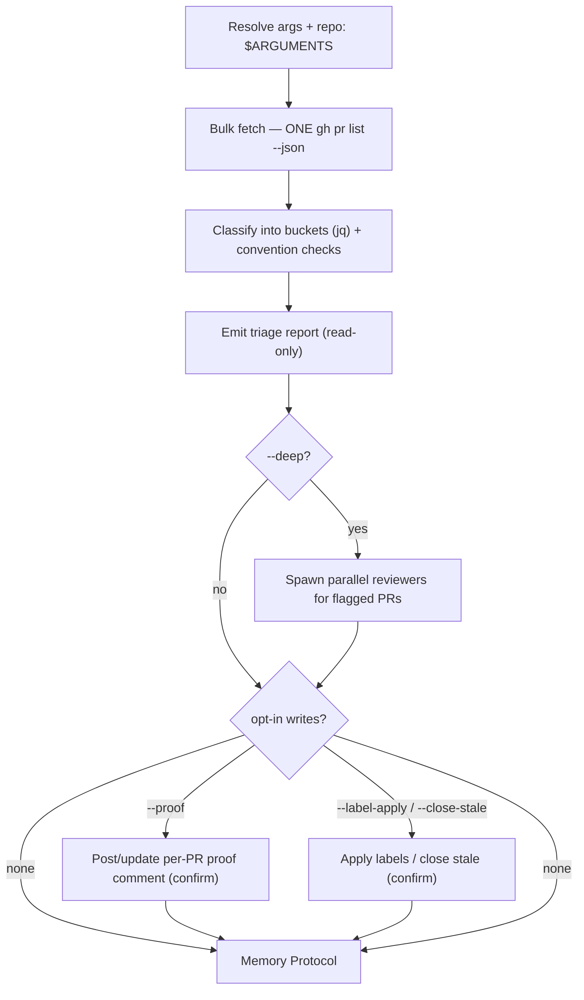

# PR Audit

Triage the whole open-PR queue and surface what needs attention.

**Core principle: one bulk query, then classify — never loop per-PR, and never
mutate without explicit opt-in.** A single `gh pr list --json` call pulls every
triage signal (CI, mergeability, reviews, age, draft) for every open PR; all
classification is local `jq` over that one payload. The skill is read-only by
default — depth (`--deep`) and writes (`--proof`, `--label-apply`,
`--close-stale`) happen only when the flag is present, and every mutation
confirms first.

## Decision Flow



## Instructions

### 1. Resolve arguments & repo

Arguments received: `$ARGUMENTS`

Parse flags (all optional):

| Flag | Effect |
|------|--------|
| `--deep` | After triage, fan out parallel reviewers for flagged PRs (§5) |
| `--proof` | Write each PR's verdict back as an idempotent comment (§6) — **mutating** |
| `--label <l>` | Restrict the audit to PRs carrying label `<l>` |
| `--author <a>` | Restrict to PRs by author `<a>` |
| `--mine` | Restrict to the authenticated user's PRs |
| `--base <b>` | Restrict to PRs targeting base branch `<b>` |
| `--stale-days <n>` | Staleness threshold in days (default **14**) |
| `--label-apply` | Apply triage labels (§7) — **mutating** |
| `--close-stale <n>` | Close PRs idle > n days (§7) — **mutating** |
| `--dry-run` | Print intended mutations/proof bodies; do not write |

Resolve the target repo exactly as `/ci-status` does (reuse, don't reinvent):

```bash
if [ -n "$REPO_OVERRIDE" ]; then
  case "$REPO_OVERRIDE" in
    */*) REPO="$REPO_OVERRIDE" ;;
    *) echo "ERROR: --repo must be owner/name format (got '$REPO_OVERRIDE')"; exit 1 ;;
  esac
else
  REPO=$(gh repo view --json nameWithOwner --jq .nameWithOwner)
fi
[ -n "$REPO" ] || { echo "ERROR: could not derive repo — is gh authenticated? Try: gh auth login"; exit 1; }

STALE_DAYS=14   # override with --stale-days
BASE_DEFAULT=development   # the harness default target branch (context/rules/git.md)
# --mine → resolve login:  ME=$(gh api user --jq .login)
```

Build filter flags from the parsed args: `--label "$L"`, `--author "$A"`,
`--base "$B"` (pass `--author "$ME"` for `--mine`). Absent flags → no filter.

### 2. Bulk fetch — ONE call (the efficient core)

```bash
gh pr list --state open --repo "$REPO" --limit 200 \
  $LABEL_FILTER $AUTHOR_FILTER $BASE_FILTER \
  --json number,title,headRefName,baseRefName,isDraft,mergeable,mergeStateStatus,reviewDecision,statusCheckRollup,createdAt,updatedAt,author,additions,deletions,changedFiles,labels,url \
  > /tmp/pr-audit.json

echo "open PRs fetched: $(jq 'length' /tmp/pr-audit.json)"
```

`statusCheckRollup` here is the **same field `/ci-status` reads** — CI state for
every PR arrives in this one payload, so there is no per-PR `gh pr checks` loop.
If the set is empty, report "no open PRs match" and skip to the Memory Protocol.

### 3. Classify into buckets

Annotate each PR with a derived CI state and age, then assign buckets. Run this
`jq` over the cached payload (no further network calls):

```bash
jq -r --argjson stale "$STALE_DAYS" --arg base "$BASE_DEFAULT" '
  def ci_state:
    [ (.statusCheckRollup // [])[] | (.conclusion // .state // .status // "") ] as $t
    | if ($t|length)==0 then "NONE"
      elif ($t | any(. as $x | ["FAILURE","ERROR","TIMED_OUT","CANCELLED","ACTION_REQUIRED","STARTUP_FAILURE"] | index($x))) then "FAIL"
      elif ($t | any(. as $x | ["IN_PROGRESS","QUEUED","PENDING","WAITING","EXPECTED"] | index($x))) then "PEND"
      else "PASS" end;
  .[]
  | . + {
      ci: ci_state,
      age: (((now - (.updatedAt|fromdateiso8601))/86400) | floor),
      title_ok: (.title | test("^FROM .+ TO .+")),
      base_ok: (.baseRefName == $base),
      reviewers: ((.reviewDecision // "") | length > 0)
    }
  | . + {
      draft_sub: (if .isDraft then
                    (if (.mergeable=="MERGEABLE" and .mergeStateStatus=="CLEAN" and .ci=="PASS")
                     then "promotable" else "wip" end)
                  else "" end)
    }
  | [ .number, .ci, .age, .isDraft, .draft_sub, .mergeable, .mergeStateStatus,
      (.reviewDecision // "NONE"), .title_ok, .base_ok, .baseRefName,
      .changedFiles, (.author.login), .title ]
  | @tsv
' /tmp/pr-audit.json
```

Assign each PR **one primary state** (first matching rule wins — the order below
*is* the actionability priority), then layer **orthogonal flags** on top. A
single primary state avoids contradictions like "ready" *and* "needs review" on
the same green PR; flags annotate whatever state the PR is in.

**Primary state — first match wins, top to bottom:**

| State | Rule |
|-------|------|
| 📝 **Draft** | `isDraft==true` — checked **first**. A draft is intentional WIP, so its CI/conflict/review state is *expected*, not actionable; drafts never enter the buckets below. Classify their readiness with the **draft sub-status** table instead. |
| ❌ **CI failing** | `ci=="FAIL"` |
| ⚠ **Conflicting / behind** | `mergeable=="CONFLICTING"` \|\| `mergeStateStatus ∈ {DIRTY, BEHIND}` |
| 🔴 **Changes requested** | `reviewDecision=="CHANGES_REQUESTED"` |
| 👀 **Needs review** | `reviewDecision=="REVIEW_REQUIRED"` (review is *required* but not yet given) |
| ✅ **Ready to merge** | `mergeable=="MERGEABLE"` && `mergeStateStatus=="CLEAN"` && `ci=="PASS"` && `reviewDecision ∈ {APPROVED, "", null}` — the same selector `crons/heartbeat.md` uses to nudge merges |
| ⏳ **Pending / other** | none of the above (e.g. `ci=="PEND"`, or `mergeable=="UNKNOWN"` — re-check shortly) |

Because Draft wins first, the actionable states below it (CI-failing … pending)
describe **ready-for-review PRs only** — a draft's red CI or conflict is WIP, and
surfaces as a draft sub-status, never as an actionable alarm.

> Note on empty `reviewDecision`: a repo without required reviews returns `""`,
> so a green PR is **Ready**, not Needs-review. Only `REVIEW_REQUIRED` (branch
> protection awaiting a review) lands in Needs-review — this is why #70-style
> solo-dev PRs read as Ready rather than nagging for a reviewer that isn't required.

**Draft sub-status — classify each 📝 Draft (the `draft_sub` column) by
*readiness*, not actionability:**

| Sub-status | Rule | Meaning |
|------------|------|---------|
| ✅ **promotable** | `mergeable=="MERGEABLE" && mergeStateStatus=="CLEAN" && ci=="PASS"` | green WIP — could be marked ready (`gh pr ready <N>`) |
| 🚧 **still-WIP** | otherwise (red/pending CI, or `CONFLICTING`/`DIRTY`/`BEHIND`) | expected work-in-progress; informational only, never a "fix me" alarm |

A stale draft (💤, below) is *draft-limbo* — an investigation/resume target for the owner or watchdog. It is **not** a ready/actionable PR, not an auto-undraft signal, and must still be classified `Draft (promotable)` by a fresh `/pr-audit` run before any `gh pr ready`.

**Orthogonal flags — tag any PR regardless of its primary state:**

| Flag | Rule |
|------|------|
| 💤 **Stale** | `age > STALE_DAYS` (days since `updatedAt`); on a 📝 Draft this is *draft-limbo* |
| 📐 **Convention** | `title_ok==false` (not `FROM … TO …`), or `base_ok==false` (base ≠ `development`), or oversized (`changedFiles > 50`) — see `context/rules/git.md` |

### 4. Emit the triage report

When the user asks for a PR link only **after it is verified green by `/pr-audit`**, do not report the link until the fresh audit classifies that PR as `Ready to merge` or otherwise shows `ci=="PASS"`, `mergeable=="MERGEABLE"`, and `mergeStateStatus=="CLEAN"`. Treat `SKIPPED` checks such as PR-context deploy jobs as neutral, but call them out briefly if the user asked for green verification.

One section per **non-empty primary state**, most-actionable first. Drafts get
their own block **after** the actionable (ready-for-review) sections — least
urgent, never mixed in. Each PR is one line, carries its 💤/📐 flags inline, and
lists the recommended read-only command (report-and-recommend, like
`/drift-check` — never auto-run):

```
## Open PR Audit — YYYY-MM-DD  (N open · filters: <…>)

### ❌ CI failing (ready-for-review)
| PR | Title | CI | Age | Flags | Recommend |
|----|-------|----|-----|-------|-----------|
| #81 | … | ✗ build | 3d | — | fix branch (`--deep` for root cause) |

### ⚠ Conflicting / behind · 🔴 Changes requested · 👀 Needs review · ✅ Ready to merge
…one section per non-empty actionable state, same column shape (ready-for-review PRs only)…

### 📝 Drafts — work-in-progress (not actionable)
| PR | Title | Sub-status | Age | Flags | Recommend |
|----|-------|-----------|-----|-------|-----------|
| #68 | … | ✅ promotable | 2d | — | mark ready (`gh pr ready 68`) |
| #72 | … | 🚧 still-WIP  | 1d | — | finish work; no action |
| #41 | … | 🚧 still-WIP  | 21d | 💤 limbo | promote or close |

### Flag rollup
💤 stale: #41   📐 convention: #73 (title), #55 (base≠development)

### Summary
ci-fail F · conflict C · changes-req X · needs-review R · ready M · pending P · draft D (✅ promotable Dp · 🚧 wip Dw)  ·  flagged: stale S, conv V
```

A flag never moves a PR out of its state section — `#68` stale + ready shows
under **Ready to merge** with a 💤 in its Flags column and again in the rollup.

When `--label autopilot`, append a **cap-headroom** line citing
`.claude/skills/autopilot/SKILL.md` (§ Guardrails): `total open <n>/10`,
`created today <n>/6` (a same-day close/merge frees a slot). If any autopilot
PRs are stale drafts, report them as draft-limbo investigation/resume targets;
they are not ready/actionable PRs and must still pass `/pr-audit`'s
`Draft (promotable)` classification before any `gh pr ready`:

```bash
echo "autopilot caps — total: $(gh pr list --state open --label autopilot --json number --jq 'length')/10 · today: $(gh pr list --state open --search "label:autopilot created:>=$(date -u +%Y-%m-%d)" --json number --jq 'length')/6"
```

**Autopilot draft-cap pitfall:** stale-by-age is not the only draft-limbo signal.
A same-day draft backlog can saturate the autopilot creation cap before any PR is
24h stale, leaving the loop unable to open another PR. In that case, surface the
cap saturation explicitly, then look for a draft that is already `Draft
(promotable)` (green checks + mergeable + clean) and, if the operator asked to
address the backlog rather than merely audit it, mark only that freshly-audited
PR ready with `gh pr ready <N>`. Never use cap saturation alone to undraft,
close, merge, or kill a session; it is a resume/investigate signal until a fresh
`/pr-audit` classification proves the individual PR is promotable.

### 5. `--deep` escalation (optional)

Only when `--deep` is set. For PRs in the **CI-failing / conflicting /
changes-requested** buckets (the ones whose *why* isn't visible from metadata),
spawn parallel sub-agent reviewers **in one message**, capped at ~5 (state in
the report if more were flagged than reviewed — no silent truncation). Brief
each per `context/rules/advisor-model.md` (Goal / Constraints / Acceptance /
Start here / Out of scope). Each reviewer:

- reads `gh pr diff <N>` and `gh pr checks <N>` (and the failing job log for CI reds)
- returns a **structured verdict**: first line `ROOT-CAUSE:` (CI red → failing
  job + likely cause; conflict → conflicting files), then a one-line fix hint.

Append each verdict to its PR's row. This **complements, not duplicates,
`/code-review`** — for full diff-level correctness on a single PR, point the
user at `/code-review <PR#>` rather than re-implementing diff review here.

### 6. `--proof` — write each PR's verdict back (human-visibility path)

Only when `--proof` is set. For every audited PR, post **or update** a per-PR
proof comment so an async reviewer sees the auditor's evidence on the PR itself.
**Mutating → confirm the batch first** (show the PR count and a sample body);
`--dry-run` prints the bodies and writes nothing.

Body template (the hidden marker on line 1 is load-bearing — see idempotency):

```markdown
<!-- pr-audit-proof -->
🤖 **PR Audit — YYYY-MM-DD** · bucket: **<bucket>**
- CI: <✓ green | ❌ `<job>` red ([run](<url>)) | ⏳ pending | — none>
- Mergeable: <state> · Reviews: <decision/none> · Age: <Nd> (updated <Nd> ago)
- Convention: title <ok/✗> · base=<branch> <ok/✗>
- Root cause: <only when --deep produced one>

_Read-only audit; verdict is advisory. Re-run updates this comment._
```

For a **draft**, `bucket:` carries the sub-status — `Draft (promotable)` or
`Draft (WIP)` — so a green draft gets a "consider marking ready" nudge while a
WIP draft's verdict stays purely informational.

**Idempotency** — re-runs must update the same comment, not stack duplicates.
Find a prior proof by the `<!-- pr-audit-proof -->` marker and edit it; create
only if none exists:

```bash
PROOF_ID=$(gh api "repos/$REPO/issues/$N/comments" \
  --jq '[.[] | select(.body | startswith("<!-- pr-audit-proof -->"))][-1].id // empty')
if [ -n "$PROOF_ID" ]; then
  gh api -X PATCH "repos/$REPO/issues/comments/$PROOF_ID" -f body="$BODY" >/dev/null
else
  gh pr comment "$N" --repo "$REPO" --body "$BODY"
fi
```

### 7. Other opt-in actions (mutating — confirm first)

Default does nothing here. Each requires an explicit flag and a confirmation.

- `--label-apply` → add triage labels (`needs-review` / `stale` / `ci-failing`)
  via `gh pr edit <N> --add-label <label>`. Skip labels that don't exist rather
  than creating them silently; report which were skipped.
- `--close-stale <n>` → `gh pr close <N>` for PRs idle > n days. **Always print
  the full target list and require explicit confirmation** before closing — a
  close is hard to reverse and outward-facing; look at each target's age/title
  before acting. `--dry-run` prints the intended closes and exits.

### 8. Memory Protocol

Append to `memory/$(date -u +%Y-%m-%d)/log.md` (create the dir first):

```markdown
## PR Audit -- HH:MM UTC
- **Result**: OP | DRY-RUN | PARTIAL | FAIL
- **Scope**: [N open PRs; filters]
- **Triage**: ready M | review R | ci-fail F | conflict C | stale S | draft D (promotable Dp)
- **Actions**: [none | proof posted X | labeled Y | closed Z]
- **Observation**: [one sentence — top finding]
```

Then run the qualify/improve pass per `context/rules/memory.md`.

## Reference

### Bucket definitions & recommended action

| Bucket | Signal | Recommended (operator) action |
|--------|--------|-------------------------------|
| ✅ Ready to merge | green + clean + approved | `gh pr merge <N>` |
| ❌ CI failing | rollup has a failure | fix the branch; `--deep` for root cause |
| ⚠ Conflicting / behind | CONFLICTING / DIRTY / BEHIND | rebase on `development` |
| 🔴 Changes requested | review demands changes | address review |
| 👀 Needs review | `REVIEW_REQUIRED` pending | request a reviewer |
| 📝 Draft (separate WIP class) | `isDraft` — checked first; sub-status ✅ promotable (green+clean) / 🚧 still-WIP / 💤 limbo (stale) | Only `Draft (promotable)` can be considered for `gh pr ready <N>`; stale/limbo drafts are investigation/resume targets, not auto-undraft signals |
| ⏳ Pending / other | CI running / mergeable unknown | re-check shortly |
| 💤 Stale (flag) | no update > `--stale-days` | ping or `--close-stale` |
| 📐 Convention (flag) | title/base/size off-spec | fix title/base per `git.md` |

### `gh pr list --json` field glossary

| Field | Used for |
|-------|----------|
| `isDraft`, `mergeable`, `mergeStateStatus` | ready / conflict buckets (heartbeat selector) |
| `statusCheckRollup` | CI state without a per-PR `gh pr checks` loop |
| `reviewDecision` | review buckets (`APPROVED`/`CHANGES_REQUESTED`/`REVIEW_REQUIRED`/∅) |
| `createdAt`, `updatedAt` | age / staleness |
| `title`, `baseRefName`, `changedFiles` | convention checks |
| `labels`, `author`, `url`, `number` | filtering, proof comment, reporting |

### Severity / thresholds

| Knob | Default | Meaning |
|------|---------|---------|
| `--stale-days` | 14 | days since `updatedAt` before a PR is stale |
| oversized | > 50 changed files | flagged as a convention/size concern |
| deep cap | ~5 PRs | max parallel reviewers per run (report overflow) |

### Key paths

| Resource | Path |
|----------|------|
| Repo-resolution / `REPO_OVERRIDE` pattern | `.claude/skills/ci-status/SKILL.md` |
| Ready-PR selector | `crons/heartbeat.md` (autopilot ready-PR nudge) |
| PR title / base / size conventions | `context/rules/git.md` |
| Autopilot caps (10 total / 6 daily) | `.claude/skills/autopilot/SKILL.md` § Guardrails |
| Parallel-agent briefing format | `context/rules/advisor-model.md` |
| Per-PR diff correctness (escalate, don't duplicate) | `/code-review` |
| Memory Improvement Protocol | `context/rules/memory.md` |
