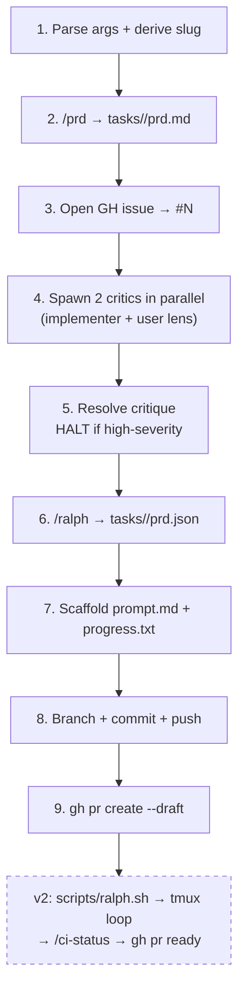

# Ship Spec

Compose the existing primitives (`/prd`, `.claude/agents/critic.md`, `/ralph`, `gh`, `git`) into one durable invocation that produces a fully-scaffolded task + draft PR. Each stage produces an inspectable artifact; the pipeline is resumable from any stage.

**Core principle: critic gate before commitment.** Critics review the PRD before the issue is opened, the branch created, or anything is pushed. The cheapest thing to revise is the spec itself — make that the gate.

## Pipeline (v1: stages 1–9)



## Stages

### Stage 1 — Parse args + derive slug

Arguments received: `$ARGUMENTS`

Extract:
- **`<feature-description>`** (required) — the first positional arg, free text
- **`--plan <path>`** (optional) — if provided, use the file content as comprehensive input to `/prd` and skip clarifying questions
- **`--prefix <type>`** (optional, default `feat`) — branch + issue prefix per `.claude/rules/git.md` (`feat | bug | task | audit | skill | agent`)

Derive `<slug>` per `/prd` rules: lowercase, kebab-case, `[a-z0-9-]+`, **≤5 words**, not `archive`. Reject and ask for a shorter name if invalid.

The slug is the universal key — it's the task directory, tmux session name, second segment of the branch, and embedded in the PR title. Choose once; never re-derive.

### Stage 2 — `/prd` → `tasks/<slug>/prd.md`

Invoke the `prd` skill via the Skill tool:

```
Skill: prd
args: <feature-description> + optional plan-file content
```

If `--plan <path>` was provided, pass the plan content with explicit instruction to skip clarifying questions (the plan answers them). Otherwise allow the skill to ask its standard 3-5 clarifying questions before generating.

Verify output exists at `tasks/<slug>/prd.md` before proceeding.

### Stage 3 — Open GH issue → `#N`

Compose issue body from the prd.md introduction + goals sections. Title format per `.claude/rules/git.md`:

```bash
gh issue create \
  --title "<prefix>: <slug-as-prose>" \
  --label "<prefix>" \
  --body "$(cat <<'EOF'
## Summary
<from prd.md introduction>

## Goals
<from prd.md goals>

## PRD
- tasks/<slug>/prd.md (this branch)

## Tracking
This issue tracks the work scaffolded by /ship-spec. The PR will be opened as draft once the task scaffold is committed.
EOF
)"
```

Capture the returned issue URL; extract `<N>` (issue number) for downstream use.

If `gh label create <prefix>` is needed (label doesn't exist), create it first with a sensible color.

### Stage 4 — Two critics in parallel

Launch **two `Agent` tool calls in a single message** (parallel execution) with `subagent_type: "critic"`. Different framings — symmetric critics waste context.

#### Critic A — Implementer's lens

> You are an adversarial implementer reviewing a PRD before any code is written. Read `tasks/<slug>/prd.md`. Your job: surface technical risks BEFORE implementation begins.
>
> Focus on:
> 1. **Vague acceptance criteria** — flag any AC that isn't directly verifiable
> 2. **Missing dependencies** — what does each story silently assume exists?
> 3. **Pattern conflicts** — does any story break an existing convention in this repo? Read `.claude/rules/*.md` and `tasks/openharness-v07-convergence/prd.json` for established patterns.
> 4. **Scope creep within stories** — are any "single iteration" stories actually 2+ stories?
> 5. **Hidden destructive operations** — does any story imply file deletion / branch deletion / PR closure that isn't explicitly gated?
>
> Return:
> ```
> CRITIC_A — IMPLEMENTER LENS
> [SEVERITY: H/M/L] [STORY: US-NNN or *] [FINDING] | [EVIDENCE: file or AC text] | [RECOMMENDATION]
> ...
> ```

#### Critic B — User's lens

> You are an adversarial user reviewing a PRD before implementation. Read `tasks/<slug>/prd.md` and `.claude/ICP.md`. Your job: surface scope and framing risks BEFORE the team commits.
>
> Focus on:
> 1. **Scope ambiguity** — what's NOT in the Non-Goals section that should be?
> 2. **ICP misalignment** — does any story drift from `.claude/ICP.md` v1 framing?
> 3. **Hidden expectations** — what would a user reasonably expect this to do that the PRD doesn't address?
> 4. **Premature optimization** — any story that solves a problem the user doesn't have yet?
> 5. **Missing rollback/escape hatch** — for destructive stories, is there a documented way to undo?
>
> Return:
> ```
> CRITIC_B — USER LENS
> [SEVERITY: H/M/L] [STORY: US-NNN or *] [FINDING] | [EVIDENCE: file or PRD section] | [RECOMMENDATION]
> ...
> ```

Write both critics' raw output to `tasks/<slug>/critique.md`:

```markdown
# Critique — <slug>

Generated <date>; reviews `prd.md` post-/prd, pre-/ralph.

## Critic A — Implementer lens
<raw output>

## Critic B — User lens
<raw output>

## Synthesis
- **High-severity findings**: <count>
- **Medium-severity findings**: <count>
- **Recommendation**: PROCEED | REVISE-PRD | HALT
```

### Stage 5 — Resolve critique

Read `tasks/<slug>/critique.md`. Apply the gate:

| Condition | Action |
|---|---|
| Any finding `SEVERITY: H` with no AC-level mitigation | **HALT.** Print critique.md path + summary. User must revise prd.md and re-run `/ship-spec` (resumes from stage 6 since prior artifacts exist) |
| Only `SEVERITY: M` or `L` findings | **PROCEED.** Append synthesis paragraph to prd.md noting the medium/low risks were acknowledged; continue to stage 6 |
| No findings | **PROCEED.** Append "Critics found no issues" line to prd.md; continue |

The HALT path is the whole point. Critics are the short feedback loop; honoring their high-severity findings is what makes this safer than the v0.7 convergence pattern.

### Stage 6 — `/ralph` → `tasks/<slug>/prd.json`

Invoke the `ralph` skill:

```
Skill: ralph
args: tasks/<slug>/ --issue <N> --prefix <prefix>
```

The skill produces `tasks/<slug>/prd.json` with `branchName: <prefix>/<N>-<slug>`. Verify it exists and parses (use `node -e "require('./tasks/<slug>/prd.json')"`).

### Stage 7 — Scaffold `prompt.md` + `progress.txt`

Clone `tasks/openharness-v07-convergence/prompt.md` as the template. Adapt:
- Replace `openharness-v07-convergence` with `<slug>` throughout
- Replace `task/210-openharness-v07-convergence` with `<prefix>/<N>-<slug>`
- Update the read-context list (step 1) to point at this task's prd.md, prd.json, critique.md, progress.txt
- Reference `.claude/rules/advisor-model.md` for any critic-gated stories

Write `tasks/<slug>/progress.txt` with header only:

```
# progress

```

Verify the four-file contract exists:

```bash
for f in prd.md prd.json prompt.md progress.txt; do
  [ -f "tasks/<slug>/$f" ] || { echo "MISSING: $f"; exit 1; }
done
```

(critique.md is a fifth file but optional — not part of the SPEC contract; only present when critics ran.)

### Stage 8 — Branch + commit + push

```bash
# Resume-safe: checkout existing branch or create new
git fetch origin
git checkout -b "<prefix>/<N>-<slug>" origin/development 2>/dev/null \
  || git checkout "<prefix>/<N>-<slug>"

git add "tasks/<slug>/"
git commit -m "$(cat <<'EOF'
<prefix>: scaffold <slug> task

Four-file contract per SPEC v0.7 §tasks/:
- prd.md: <N> user stories
- prd.json: schemaVersion 1, branchName <prefix>/<N>-<slug>
- prompt.md: Ralph iteration instructions
- progress.txt: empty header
- critique.md: 2-critic review (advisor-model 3-step variant)

Tracks #<N>. PRD generated by /prd; reviewed by 2 critics
(implementer + user lens); converted by /ralph.

Co-Authored-By: Claude Opus 4.7 (1M context) <noreply@anthropic.com>
EOF
)"

git push -u origin "<prefix>/<N>-<slug>"
```

Pre-commit hook runs lint + tests; do not bypass.

### Stage 9 — `gh pr create --draft`

```bash
gh pr create \
  --draft \
  --base development \
  --head "<prefix>/<N>-<slug>" \
  --title "FROM <prefix>/<N>-<slug> TO development" \
  --body "$(cat <<'EOF'
Closes #<N>.

**Status: DRAFT — ralph loop has not yet been launched.**

## Summary
<from prd.md introduction, 2-3 lines>

## Stories
<numbered list from prd.json — title only>

## Critique
- High-severity findings: <count>
- Medium-severity findings: <count>
- Recommendation: <from critique.md>

## Next steps (manual)
1. \`scripts/ralph.sh <slug>\` — launch the loop in tmux
2. Monitor: \`tmux attach -t <slug>\` or \`tail -f tasks/<slug>/progress.txt\`
3. After STATUS: COMPLETE: \`git push && gh pr ready <pr-number> && /ci-status\`

🤖 Generated with [Claude Code](https://claude.com/claude-code) via /ship-spec
EOF
)"
```

Capture the PR URL; print it as the final pipeline output.

## Halt conditions

| Stage | Halt trigger | Recovery |
|---|---|---|
| 1 | Slug invalid (>5 words, contains `/`, equals `archive`) | Ask user for shorter name; re-invoke |
| 2 | `/prd` fails or produces empty file | Inspect skill error; user revises feature description |
| 3 | `gh issue create` fails (auth, label, repo perms) | Diagnose; manual issue creation; re-run from stage 4 with `--issue <N>` |
| 4 | Either critic crashes or returns malformed output | Re-spawn the failed critic alone; partial critique.md is acceptable |
| 5 | High-severity finding without mitigation | **HALT.** User revises prd.md; re-runs `/ship-spec` (idempotency picks up from stage 6) |
| 6 | `/ralph` hard-fails (missing `--issue`, malformed prd.md) | Inspect skill error; revise inputs; re-run from stage 6 |
| 7 | Four-file contract incomplete | Print missing files; abort; user investigates |
| 8 | Pre-commit hook fails (lint, tests) | Fix issue; re-run from stage 8 |
| 9 | `gh pr create` fails (no remote, branch missing on origin) | Verify push from stage 8; re-run from stage 9 |

## Idempotency

Every stage checks for prior state and resumes rather than duplicating:

| Stage | Resume check | Behavior |
|---|---|---|
| 2 | `tasks/<slug>/prd.md` exists | `/prd` runs in update mode (existing skill behavior) |
| 3 | Issue with title/label exists | Reuse existing `#N`; don't create duplicate |
| 4 | `tasks/<slug>/critique.md` exists and is recent (<24h) | Skip; reuse |
| 6 | `tasks/<slug>/prd.json` exists | `/ralph` archives prior + regenerates (existing skill behavior) |
| 7 | `prompt.md` / `progress.txt` exist | Skip if present |
| 8 | Branch exists on origin | Checkout + commit on top |
| 9 | Draft PR exists for this branch | Update body + comment-update; don't create duplicate |

The whole pipeline can be re-invoked safely. Failed stage = fix + re-run; resume happens automatically.

## v1 vs v2

| Stage | v1 (this skill) | v2 (future) |
|---|---|---|
| 1–9 | ✓ included | unchanged |
| 10 | manual: `scripts/ralph.sh <slug>` | auto-launch tmux loop |
| 11 | manual: tail progress.txt | auto-poll for `STATUS: COMPLETE` |
| 12 | manual: `git push` | auto-push iteration commits |
| 13 | manual: `gh pr ready <M>` | auto-promote when STATUS: COMPLETE + CI green |
| 14 | manual: `/ci-status` | auto-invoke after final push |

v1 stops at draft PR because the loop launch is the highest-blast-radius step in the pipeline. Two or three real runs of v1 will reveal whether the critic phase catches enough to justify auto-launching the loop.

## Reference

### Slug rules (from `/prd` skill)

- Lowercase kebab-case, matches `[a-z0-9-]+`
- ≤5 hyphen-separated words
- Not `archive` (reserved)
- Examples: `slack-thread-replies`, `install-prereq-detection`, `architecture-cleanup-pass-1`

### Branch + commit conventions (from `.claude/rules/git.md`)

- Branch: `<prefix>/<issue#>-<slug>`
- Commit: `<type>: <description>` (where `<type>` matches `<prefix>` for scaffold commits)
- PR title: `FROM <branch> TO <target>` (literal)
- PR body: `Closes #<N>` link required

### Existing primitives this composes

| Primitive | Path | Role |
|---|---|---|
| `/prd` skill | `.claude/skills/prd/SKILL.md` | Stage 2 — markdown PRD generation |
| `critic` agent | `.claude/agents/critic.md` | Stage 4 — adversarial review |
| `/ralph` skill | `.claude/skills/ralph/SKILL.md` | Stage 6 — markdown → JSON conversion |
| `scripts/ralph.sh` | `scripts/ralph.sh` | (v2 — loop launcher) |
| `/ci-status` skill | `.claude/skills/ci-status/SKILL.md` | (v2 — CI verification) |
| advisor-model rule | `.claude/rules/advisor-model.md` | Critic-gate pattern (3-step variant) |
| Convergence task template | `tasks/openharness-v07-convergence/` | Stage 7 — prompt.md template |
