# Ship Spec

Compose the existing primitives (`/prd`, wiki synthesis per `.mifune/skills/wiki/references/schema.md`, DeepWiki comparison, `.claude/agents/critic.md`, `/ralph`, `gh`, `git`, `/compact`, an expert `/worktrees` Advisor launched via `/goal`, an Advisor-monitored `scripts/ralph.sh` loop (`/delegate` optional inside), `/eval`, `/pr-audit`) into one durable invocation that produces a fully-scaffolded task and a ready-for-review PR. The draft PR is an observability checkpoint while implementation is pending, not the terminal state. After scaffolding, the orchestrator compacts and hands off to an expert Advisor — launched in its own tmux session via a `/goal`-prefixed prompt — that isolates work in a worktree, **drives an Advisor-monitored `scripts/ralph.sh` loop by default** (`--executor=ralph`; `/delegate` is an optional within-iteration fan-out tool, never a replacement for the loop; `--executor=delegate-advisor` selects the legacy `/delegate` worker fan-out), revises required wiki entries from implementation evidence, then undrafts the PR through a `/pr-audit` promotable gate. Each stage produces an inspectable artifact; the pipeline is resumable from any stage.

**Core principle: critic gate before commitment.** Critics review the PRD before the issue is opened, the branch created, or anything is pushed. The cheapest thing to revise is the spec itself — make that the gate.

## Pipeline (stages 1–13, with two `/compact` checkpoints)

```mermaid
flowchart TD
    A["1. Parse args + derive slug"] --> B["2. /prd → tasks/<slug>/prd.md"]
    B --> W["2.5 Wiki alignment<br/>compare local spec/wiki against DeepWiki"]
    W --> D["3. Spawn 2 critics in parallel<br/>(implementer + user lens)<br/>cross-check wiki alignment + protected paths"]
    D --> E["4. Resolve critique<br/>HALT if high-severity"]
    E --> C["5. Open GH issue → #N<br/>(only after PROCEED)"]
    C --> F["6. /ralph → tasks/<slug>/prd.json"]
    F --> G["7. Scaffold prompt.md + progress.txt"]
    G --> G2["7.5 /compact (before implement)<br/>after PRD artifacts"]
    G2 --> H["8. Branch + commit + push"]
    H --> I["9. gh pr create --draft<br/>(observability checkpoint)"]
    I --> J["10. Launch /worktrees Advisor in tmux via /goal<br/>→ Advisor-monitored scripts/ralph.sh loop (default)<br/>→ /delegate optional inside; monitor to STATUS: COMPLETE"]
    J --> K["11. /eval gate"]
    K --> W2["11.25 Wiki revision gate<br/>if Wiki Alignment required"]
    W2 --> K2["11.5 /compact (after implement)<br/>before the audit"]
    K2 --> L["12. /pr-audit (separate executor)<br/>→ promotable?"]
    L --> M["13. gh pr ready<br/>(only if promotable; else stay draft)"]
```



**Stage ordering rationale**: critics run BEFORE the GH issue is opened (this was reordered in v1.1, issue #218). The earlier ordering created dangling issues when critics halted; now no GitHub-side state changes until the spec passes the critic gate.

## Stages

### Stage 1 — Parse args + derive slug

Arguments received: `$ARGUMENTS`

Extract:
- **`<feature-description>`** (required) — the first positional arg, free text
- **`--plan <path>`** (optional) — if provided, use the file content as comprehensive input to `/prd` and skip clarifying questions
- **`--prefix <type>`** (optional, default `feat`) — branch + issue prefix per `.claude/skills/git/SKILL.md` (`feat | bug | task | audit | skill | agent`)
- **`--issue <N>`** (optional) — link an EXISTING GitHub issue instead of creating one. When present, set `ISSUE_NUM=<N>` and skip Stage 5's `gh issue create`; `<N>` flows into the branch (`<prefix>/<N>-<slug>`), `/ralph --issue <N>`, `prompt.md`, and the PR `Closes #<N>` link, exactly as a freshly-created issue number would
- **`--repo <owner/name>`** (optional, default `mifunedev/openharness`) — GitHub repository for issue/PR operations.
- **`--remote <name>`** (optional, default resolved from `--repo`) — git remote to fetch/push work branches.
- **`--base <branch>`** (optional, default `development`) — PR base and branch start point.
- **`--executor=ralph|delegate-advisor`** (optional, default `ralph`) — Stage 10 build executor. `ralph` (default): the Advisor monitors `scripts/ralph.sh` directly (the Monitored async loop; `/delegate` is an optional within-iteration fan-out tool, never a replacement for the loop). `delegate-advisor`: the legacy `/delegate --plan tasks/<slug>/prd.json` worker fan-out.

```bash
SHIP_SPEC_REPO="${SHIP_SPEC_REPO:-mifunedev/openharness}"
SHIP_SPEC_BASE="${SHIP_SPEC_BASE:-development}"
case "${ARGUMENTS:-}" in *--repo*) SHIP_SPEC_REPO=$(printf '%s\n' "$ARGUMENTS" | sed -n 's/.*--repo[ =]\([^ ]*\).*/\1/p') ;; esac
case "${ARGUMENTS:-}" in *--base*) SHIP_SPEC_BASE=$(printf '%s\n' "$ARGUMENTS" | sed -n 's/.*--base[ =]\([^ ]*\).*/\1/p') ;; esac
SHIP_SPEC_EXECUTOR="${SHIP_SPEC_EXECUTOR:-ralph}"
case "${ARGUMENTS:-}" in *--executor=delegate-advisor*) SHIP_SPEC_EXECUTOR=delegate-advisor ;; *--executor=ralph*) SHIP_SPEC_EXECUTOR=ralph ;; esac
case "$SHIP_SPEC_EXECUTOR" in ralph|delegate-advisor) ;; *) echo "ERROR: invalid SHIP_SPEC_EXECUTOR=$SHIP_SPEC_EXECUTOR"; exit 1 ;; esac
resolve_ship_spec_remote() {
  git remote -v | awk -v repo="$SHIP_SPEC_REPO" '
    BEGIN { want=tolower(repo) }
    $3 == "(fetch)" {
      url=$2
      sub(/\.git$/, "", url)
      sub(/^.*github.com[:\/]/, "", url)
      if (tolower(url) == want) { print $1; exit }
    }'
}
case "${ARGUMENTS:-}" in *--remote*) SHIP_SPEC_REMOTE=$(printf '%s\n' "$ARGUMENTS" | sed -n 's/.*--remote[ =]\([^ ]*\).*/\1/p') ;; esac
SHIP_SPEC_REMOTE="${SHIP_SPEC_REMOTE:-$(resolve_ship_spec_remote)}"
[ -n "$SHIP_SPEC_REMOTE" ] || { echo "ERROR: no local git remote for $SHIP_SPEC_REPO"; exit 1; }
echo "ship-spec target: repo=$SHIP_SPEC_REPO remote=$SHIP_SPEC_REMOTE base=$SHIP_SPEC_BASE executor=$SHIP_SPEC_EXECUTOR"
```

Derive `<slug>` per `/prd` rules: lowercase, kebab-case, `[a-z0-9-]+`, **≤5 words**, not `archive`. Reject and ask for a shorter name if invalid.

The slug is the universal key — it's the task directory, tmux session name, second segment of the branch, and embedded in the PR title. Choose once; never re-derive.

### Stage 2 — `/prd` → `tasks/<slug>/prd.md`

Invoke the `prd` skill via the Skill tool:

```
Skill: prd
args: <feature-description> + optional plan-file content
```

If `--plan <path>` was provided, pass the plan content with explicit instruction to skip clarifying questions (the plan answers them). Otherwise allow the skill to ask its standard 3-5 clarifying questions before generating.

Verify output exists at `tasks/<slug>/prd.md` before proceeding.

### Stage 2.5 — Wiki alignment + DeepWiki comparison

Before critics run, make the PRD explicit about wiki impact. Read `.mifune/skills/wiki/references/schema.md` and compare the spec's topic against the public DeepWiki for this repository (`https://deepwiki.com/mifunedev/openharness`), opening the most relevant DeepWiki page(s) when the topic maps to an existing subsystem. Record the result in `tasks/<slug>/prd.md` as a `## Wiki Alignment` section:

```markdown
## Wiki Alignment

- **Impact**: REQUIRED | NOT-APPLICABLE
- **Local entries**: `.mifune/skills/wiki/corpus/<slug>.md` to create/update, or `none`
- **Spec alignment**: <how the wiki entry must reflect this PRD's goals, non-goals, and acceptance criteria>
- **DeepWiki comparison**: <source-file/page-shape/terminology gaps found against https://deepwiki.com/mifunedev/openharness, or "no relevant DeepWiki page found">
- **Acceptance criteria**: <wiki update checks to add to the relevant story when REQUIRED>
```

`Impact: REQUIRED` when the task changes harness architecture, skill behavior, agent roles, runtime flow, conceptual vocabulary, or public prose that introduces a reusable mechanism. `Impact: NOT-APPLICABLE` is allowed for narrow code/test chores, but it must say why.

When impact is required, revise the PRD before critics run so at least one story includes acceptance criteria for:
- local wiki entry creation/update aligned with the PRD's goals, non-goals, and final behavior;
- DeepWiki-style body shape: relevant source files, line-cited claims, system relationships when applicable, and `## See Also`;
- explicit comparison against the relevant DeepWiki page(s), naming any source-file coverage or terminology differences;
- `.mifune/skills/wiki/corpus/README.md` index freshness via `/wiki lint` or `bash evals/probes/wiki-readme-index.sh`.

### Stage 3 — Two critics in parallel

Launch **two `Agent` tool calls in a single message** (parallel execution) with `subagent_type: "critic"`. Different framings — symmetric critics waste context.

Both critics receive an additional cross-check instruction: read `.claude/protected-paths.txt` and flag any proposed deletion of an entry on that list as `SEVERITY: H` unless the AC has an explicit override note. This is the gate that would have caught the v0.7 convergence regression (PR #212, US-012).

#### Critic A — Implementer's lens

> You are an adversarial implementer reviewing a PRD before any code is written. Read `tasks/<slug>/prd.md`. Read `.claude/protected-paths.txt` and treat its entries as MUST-NOT-DELETE without an override note. Your job: surface technical risks BEFORE implementation begins.
>
> Focus on:
> 1. **Vague acceptance criteria** — flag any AC that isn't directly verifiable
> 2. **Missing dependencies** — what does each story silently assume exists?
> 3. **Pattern conflicts** — does any story break an existing convention in this repo? Read `AGENTS.md` + the relevant `.mifune/skills/*/SKILL.md` (and any sibling `tasks/*/prd.json`, if present) for established patterns.
> 4. **Scope creep within stories** — are any "single iteration" stories actually 2+ stories?
> 5. **Hidden destructive operations** — does any story imply file deletion / branch deletion / PR closure that isn't explicitly gated?
> 6. **Wiki alignment** — if the task changes architecture, skill behavior, runtime flow, agent roles, or reusable vocabulary, does `## Wiki Alignment` exist, require the right local wiki updates, and compare against the relevant DeepWiki page(s)? Missing or shallow wiki alignment is SEVERITY: M; mark SEVERITY: H if the PRD would publish contradictory wiki guidance.
> 7. **Protected-path violations** — does any story propose touching a `.claude/protected-paths.txt` entry without override note? If yes, raise SEVERITY: H and tag the finding with `[PROTECTED-PATH]`.
>
> Return:
> ```
> CRITIC_A — IMPLEMENTER LENS
> [SEVERITY: H/M/L] [STORY: US-NNN or *] [FINDING] | [EVIDENCE: file or AC text] | [RECOMMENDATION]
> ...
> ```

#### Critic B — User's lens

> You are an adversarial user reviewing a PRD before implementation. Read `tasks/<slug>/prd.md` and `context/USER.md` (the single-developer / single-project framing). Read `.claude/protected-paths.txt` and treat its entries as MUST-NOT-DELETE without an override note. Your job: surface scope and framing risks BEFORE the team commits.
>
> Focus on:
> 1. **Scope ambiguity** — what's NOT in the Non-Goals section that should be?
> 2. **Audience misalignment** — does any story drift from the single-developer, single-project framing in `context/USER.md`?
> 3. **Hidden expectations** — what would a user reasonably expect this to do that the PRD doesn't address?
> 4. **Premature optimization** — any story that solves a problem the user doesn't have yet?
> 5. **Missing rollback/escape hatch** — for destructive stories, is there a documented way to undo?
> 6. **Wiki usefulness** — will the wiki update teach the operator and later agents the same conceptual model the spec is implementing, and does it meet the DeepWiki-style standard rather than becoming a loose note? Missing or unhelpful wiki alignment is SEVERITY: M.
> 7. **Protected-path violations** — does any story propose touching a `.claude/protected-paths.txt` entry without override note? If yes, raise SEVERITY: H and tag the finding with `[PROTECTED-PATH]`.
>
> Return:
> ```
> CRITIC_B — USER LENS
> [SEVERITY: H/M/L] [STORY: US-NNN or *] [FINDING] | [EVIDENCE: file or PRD section] | [RECOMMENDATION]
> ...
> ```

Write both critics' raw output to `tasks/<slug>/critique.md`:

```markdown
# Critique — <slug>

Generated <date>; reviews `prd.md` post-/prd, pre-/ralph.

## Critic A — Implementer lens
<raw output>

## Critic B — User lens
<raw output>

## Synthesis
- **High-severity findings**: <count>
- **Medium-severity findings**: <count>
- **Recommendation**: PROCEED | REVISE-PRD | HALT
```

### Stage 4 — Resolve critique

Read `tasks/<slug>/critique.md`. Apply the gate:

| Condition | Action |
|---|---|
| Any finding `SEVERITY: H` with no AC-level mitigation (including `[PROTECTED-PATH]` violations) | **HALT.** Print critique.md path + summary. User must revise prd.md and re-run `/ship-spec` (resumes from stage 3 since prior artifacts exist; nothing GitHub-side has happened yet) |
| Only `SEVERITY: M` or `L` findings | **PROCEED.** Append synthesis paragraph to prd.md noting the medium/low risks were acknowledged; continue to stage 5 |
| No findings | **PROCEED.** Append "Critics found no issues" line to prd.md; continue |

The HALT path is the whole point. Critics are the short feedback loop; honoring their high-severity findings is what makes this safer than the v0.7 convergence pattern. Note: stages 1-4 produce ONLY local artifacts (prd.md, critique.md). No GitHub-side state exists until stage 5 — meaning a HALT is fully reversible with `rm -rf tasks/<slug>/`.

### Stage 5 — Open GH issue → `#N`

Only reached after stage 4 PROCEED.

**If `--issue <N>` was provided**: skip issue creation entirely — set `N=<N>`, print `Using existing issue #<N> (--issue); skipping creation.`, optionally confirm it exists with `gh issue view <N> --repo "$SHIP_SPEC_REPO"`, and continue to Stage 6. Everything below in this stage applies ONLY when creating a fresh issue (no `--issue` flag).

Compose issue body from the prd.md introduction + goals sections. Title format per `.claude/skills/git/SKILL.md`:

```bash
gh issue create \
  --repo "$SHIP_SPEC_REPO" \
  --title "<prefix>: <slug-as-prose>" \
  --label "<prefix>" \
  --body-file <(printf '%s\n' \
    "## Summary" \
    "<from prd.md introduction>" \
    "" \
    "## Goals" \
    "<from prd.md goals>" \
    "" \
    "## PRD" \
    "- tasks/<slug>/prd.md (this branch)" \
    "" \
    "## Wiki Alignment" \
    "- Impact: <REQUIRED | NOT-APPLICABLE from prd.md>" \
    "- DeepWiki comparison: <one-line summary from prd.md>" \
    "" \
    "## Critique" \
    "- High: <count>, Medium: <count>, Low: <count>" \
    "- Recommendation: PROCEED" \
    "" \
    "## Tracking" \
    "Scaffolded by /ship-spec. Critics ran clean (or with mitigated findings) before this issue was opened. Draft PR to follow.")
```

Capture the returned issue URL; extract `<N>` (issue number) for downstream use.

If `gh label create <prefix> --repo "$SHIP_SPEC_REPO"` is needed (label doesn't exist), create it first with a sensible color. Heredoc bodies are safe — the `deny-env-dump.sh` hook strips heredoc bodies before pattern-scanning, so `--body "$(cat <<'EOF' ... EOF)"` is fine.

### Stage 6 — `/ralph` → `tasks/<slug>/prd.json`

Invoke the `ralph` skill:

```
Skill: ralph
args: tasks/<slug>/ --issue <N> --prefix <prefix>
```

The skill produces `tasks/<slug>/prd.json` with `branchName: <prefix>/<N>-<slug>`. Verify it exists and parses (use `node -e "require('./tasks/<slug>/prd.json')"`).

### Stage 7 — Scaffold `prompt.md` + `progress.txt`

Clone `.claude/skills/ship-spec/templates/prompt.md` as the template (it ships with `<slug>`, `<prefix>/<N>-<slug>`, `<NNN>`, and `#<issue>` placeholders). Adapt:
- Replace `<slug>` with this task's slug throughout
- Replace `<prefix>/<N>-<slug>` with the real branch name
- Replace `#<issue>` with the tracking issue number
- Confirm the read-context list (step 1) points at this task's prd.md, prd.json, critique.md, progress.txt (the template already references `.mifune/skills/advisor/SKILL.md` for critic-gated stories)

Write `tasks/<slug>/progress.txt` with header only:

```
# progress

```

Verify the four-file contract exists:

```bash
for f in prd.md prd.json prompt.md progress.txt; do
  [ -f "tasks/<slug>/$f" ] || { echo "MISSING: $f"; exit 1; }
done
```

(critique.md is a fifth file but optional — not part of the SPEC contract; only present when critics ran.)

### Stage 7.5 — `/compact` before implement (after PRD artifacts)

This is the first of two compacts that bracket the implement phase. The PRD artifacts now exist on disk and the heaviest planning context — `/prd` plus the two critics — is already spent. Run `/compact` to reclaim that context before the commit/PR and the implementation handoff. Preserve only the handoff keys:

```text
Preserve /ship-spec handoff context: slug <slug>, prefix <prefix>, issue #<N>, branch <prefix>/<N>-<slug>, critique H/M/L counts, four-file contract path tasks/<slug>/. Stages 8–9 re-read prd.md/prd.json/critique.md from disk.
```

Stages 8–9 re-read the files from disk, so a post-compact context is sufficient. `/compact` is an optimization, not a gate — if it is unavailable or errors, log a warning and continue.

### Stage 8 — Branch + commit + push

```bash
# Resume-safe: checkout existing branch or create new
git fetch "$SHIP_SPEC_REMOTE" "$SHIP_SPEC_BASE"
git checkout -b "<prefix>/<N>-<slug>" "$SHIP_SPEC_REMOTE/$SHIP_SPEC_BASE" 2>/dev/null \
  || git checkout "<prefix>/<N>-<slug>"

git add "tasks/<slug>/"
git commit -m "$(cat <<'EOF'
<prefix>: scaffold <slug> task

Four-file contract per SPEC v0.7 §tasks/:
- prd.md: <N> user stories
- prd.json: schemaVersion 1, branchName <prefix>/<N>-<slug>
- prompt.md: Ralph iteration instructions
- progress.txt: empty header
- critique.md: 2-critic review (advisor-model 3-step variant)

Tracks #<N>. PRD generated by /prd; reviewed by 2 critics
(implementer + user lens); converted by /ralph.

Submitted-by: <active submitter>
EOF
)"

git push -u "$SHIP_SPEC_REMOTE" "<prefix>/<N>-<slug>"
```

`Submitted-by:` is mandatory and must name the model/agent that actually
submits the commit (for example `Submitted-by: Claude`, `Submitted-by: Codex`,
or `Submitted-by: Pi`). Do not hard-code Claude when the active submitter is a
fallback harness.

Pre-commit hook runs lint + tests; do not bypass.

### Stage 9 — `gh pr create --draft`

```bash
gh pr create \
  --repo "$SHIP_SPEC_REPO" \
  --draft \
  --base "$SHIP_SPEC_BASE" \
  --head "<prefix>/<N>-<slug>" \
  --title "FROM <prefix>/<N>-<slug> TO $SHIP_SPEC_BASE" \
  --body "$(cat <<'EOF'
Closes #<N>.

**Status: DRAFT — implementation, /eval, and /pr-audit promotable gates are still pending.**

## Summary
<from prd.md introduction, 2-3 lines>

## Stories
<numbered list from prd.json — title only>

## Critique
- High-severity findings: <count>
- Medium-severity findings: <count>
- Recommendation: <from critique.md>

## Next steps (automated)
1. Launch the expert `/worktrees` Advisor in tmux session `agent-ship-<slug>` via `/goal` (the pre-implement `/compact` already ran in Stage 7.5).
2. Advisor: monitor `scripts/ralph.sh <slug>` directly in an isolated worktree (`--executor=ralph`, the default Monitored async loop; `/delegate` optional inside an iteration — `--executor=delegate-advisor` for the legacy worker fan-out); monitor to `STATUS: COMPLETE`; run `/eval`; revise required wiki entries against the spec and DeepWiki comparison; then `/compact` before the audit.
3. A separate executor runs `/pr-audit` immediately before any undraft; this PR is marked ready (`gh pr ready`) only when that fresh audit classifies it promotable (CI green + mergeable + clean). Heartbeat stale-draft watchdog output — including draft-age and draft-cap/backlog warnings — is only a resume/investigation hint, never an undraft signal.

🤖 Generated with [Claude Code](https://claude.com/claude-code) via /ship-spec
EOF
)"
```

Capture the PR URL and PR number `<PR>`. This is an observability checkpoint, not the final pipeline output.

### Stage 10 — Launch the expert `/worktrees` Advisor (tmux + `/goal`)

The orchestrator does not implement inline. It launches an **expert Advisor on `/worktrees`** — the per-task orchestrator that, by default (`--executor=ralph`), monitors the `scripts/ralph.sh` loop directly to completion (and may run one loop per independent task in parallel; `/delegate` is optional inside an iteration), or with `--executor=delegate-advisor` drives the legacy `/delegate` ralph executors — in its own detached tmux session, driven by a `/goal`-prefixed prompt so goal-mode persists the run to completion. Session name `agent-ship-<slug>` (sanitize slashes/space → `-`), distinct from the `<slug>`-named loop sessions `scripts/ralph.sh` creates. The Advisor session is launched in **both** modes.

**Build worktree — reuse vs. create.** When `$CRON_WORKTREE` is set (autopilot's default), this run is ALREADY inside an isolated worktree that Stage 8 put on the feature branch, so the Advisor **reuses it** — it does NOT create a second worktree (a second `git worktree add` for the same branch would nest under the cron worktree via the relative path, or fail with `branch already checked out`). Standalone (no `$CRON_WORKTREE`) the Advisor creates `.worktrees/<prefix>/<N>-<slug>` as before. Start the Advisor session **in the build worktree** with `-c`, and bake the worktree path into the prompt — a new tmux session does not inherit `$CRON_WORKTREE` from the launching client, so passing it via env is unreliable:

```bash
SESSION="agent-ship-<slug>"   # e.g. printf %s "<slug>" | tr '/:[:space:]' '-'
WT="${CRON_WORKTREE:-}"       # set by the cron runtime in worktree mode; empty standalone
tmux new-session -d -s "$SESSION" -c "${WT:-$PWD}" \
  '<harness> "/goal <advisor-prompt>" 2>&1 | tee /tmp/'"$SESSION"'.log'
# <harness> = the active agent CLI (pi | claude | codex); pi matches the cron default
```

**Advisor `/goal` prompt** (one line; fill the placeholders — when `$CRON_WORKTREE` is set, substitute its actual path for `<worktree>` and use the "reuse" branch of step 1):

> `/goal` As an **expert Advisor on `/worktrees`**, implement `tasks/<slug>/prd.json` for PR `#<PR>` on branch `<prefix>/<N>-<slug>`. (1) **If `<worktree>` is already provided** (autopilot's `$CRON_WORKTREE`, already on branch `<prefix>/<N>-<slug>`): `cd <worktree>` and do NOT create another worktree. **Otherwise** create an isolated worktree at `.worktrees/<prefix>/<N>-<slug>` via `/worktrees` and `cd` into it. (2) **Drive the build per `$SHIP_SPEC_EXECUTOR` (default `ralph`).** *Default (`ralph`)* — the Monitored async loop: launch `scripts/ralph.sh <slug>` in a named tmux session and **own the `STATUS: COMPLETE` watch yourself** (poll `tasks/<slug>/progress.txt` + the loop's tmux liveness; never delegate the watch to a sub-agent that returns early). A ralph iteration **may** call `/delegate` to fan out one story's disjoint files, but `/delegate` does **not** replace the loop. Given multiple **independent** tasks, run one `scripts/ralph.sh` per task in parallel (each its own slug + tmux session) and monitor each to its own `STATUS: COMPLETE`. *Opt-in (`--executor=delegate-advisor`)* — instead orchestrate with `/delegate --plan tasks/<slug>/prd.json`: spawn `general-purpose` worker(s) that each `cd` into that worktree and run `scripts/ralph.sh <slug>`, monitoring `tasks/<slug>/progress.txt` for `STATUS: COMPLETE` and the workers' tmux liveness. (3) Run the `/eval` gate (Stage 11). (4) If `tasks/<slug>/prd.md` has `## Wiki Alignment` with `Impact: REQUIRED`, revise the named `.mifune/skills/wiki/corpus/*.md` entries after implementation so they match the spec's final behavior and acceptance criteria, include DeepWiki-style relevant source files/line citations/system relationships, preserve the recorded DeepWiki comparison, and refresh `.mifune/skills/wiki/corpus/README.md`; verify with `bash evals/probes/wiki-readme-index.sh`. (5) Run `/compact` (Stage 11.5) to clear the implementation context before the audit. (6) In a **separate executor**, run `/pr-audit` for PR `#<PR>` and run `gh pr ready <PR> --repo "$SHIP_SPEC_REPO"` **only if it is classified promotable** (CI green + mergeable + clean); otherwise `gh pr comment` the blocking gate and leave it draft. Never `gh pr merge`. Leave this tmux session alive for attach.

The Advisor owns Stages 11–13 inside its session. The orchestrator's turn ends after launching it and reporting the session name; the ready-for-review PR is produced asynchronously by the Advisor. Each worker commits the implementation on `<prefix>/<N>-<slug>` with a `Submitted-by:` trailer (per `templates/prompt.md`); worktree isolation keeps concurrent work off the shared checkout (avoiding the autopilot shared-checkout contamination class). If `tmux` is unavailable, fall back to running the executor inline (`scripts/ralph.sh <slug>`) and continue to Stage 11 in the foreground. Stage 13 still requires a fresh Stage 12 `/pr-audit` immediately before `gh pr ready`; stale-draft watchdog/heartbeat output cannot substitute for that audit.

### Stage 11 — `/eval` gate

Run `/eval` (the Advisor runs this inside its session) while still on the work branch. If it updates `evals/RESULTS.md`, commit the benchmark refresh on the branch. Treat only a NEW green→red probe regression or a non-zero eval runner exit as blocking; a pre-existing red with an unchanged delta is non-gating but should be disclosed in the PR.

### Stage 11.25 — Wiki revision gate

If `tasks/<slug>/prd.md` has `## Wiki Alignment` with `Impact: REQUIRED`, the Advisor must revise the named `.mifune/skills/wiki/corpus/*.md` entries after implementation and before `/pr-audit`. The revision must align with:
- the PRD's goals, non-goals, acceptance criteria, and completed behavior;
- the DeepWiki comparison captured in Stage 2.5;
- `.mifune/skills/wiki/references/schema.md`'s DeepWiki-style standard: relevant source files, line-cited claims, system relationships for pipelines/runtime/architecture topics, and `## See Also` navigation.

Refresh `.mifune/skills/wiki/corpus/README.md` via `/wiki lint` or the atomic fallback in `/wiki ingest`, then run:

```bash
bash evals/probes/wiki-readme-index.sh
```

Commit wiki changes with the implementation branch. If the wiki impact was `REQUIRED` and the named entries were not updated or the index probe fails, leave the PR draft and comment the missing wiki gate.

### Stage 11.5 — `/compact` after implement (before the audit)

The second of the two compacts that bracket the implement phase. The ralph loop and `/eval` have spent significant context in the Advisor's session; run `/compact` so the `/pr-audit` audit and the undraft decision start clean. Preserve the finalize keys:

```text
Preserve /ship-spec finalize context: slug <slug>, branch <prefix>/<N>-<slug>, issue #<N>, PR #<PR>, implementation complete (STATUS: COMPLETE), /eval result, wiki alignment gate result (REQUIRED updated or NOT-APPLICABLE), undraft gate (/pr-audit promotable → gh pr ready, else comment + stay draft), no auto-merge, tmux session agent-ship-<slug> left alive.
```

Non-blocking — if `/compact` is unavailable or errors, log a warning and continue to Stage 12.

### Stage 12 — `/pr-audit` promotable gate (separate executor)

Push the branch so CI runs (`git push "$SHIP_SPEC_REMOTE" HEAD`). The Advisor then hands off to a **separate executor** (a `/delegate` worker or `Agent` call — "another executor") whose sole job is to run `/pr-audit` focused on PR `#<PR>` in `$SHIP_SPEC_REPO` immediately before any undraft attempt and report its draft sub-status. `/pr-audit` is read-only: it classifies the draft as **promotable** only when CI is green AND the PR is mergeable AND clean (it reads the `statusCheckRollup`, so it subsumes a bare `/ci-status` check). The executor returns `promotable` / `still-WIP` / `limbo`. Do not infer green from silence — a no-run CI status is not promotable. Do not treat heartbeat stale-draft watchdog output as promotable evidence; it is only a signal to investigate or resume the draft.

### Stage 13 — `gh pr ready` (undraft only if promotable)

When implementation is complete, `/eval` has no new green→red regression, and an immediately preceding Stage 12 `/pr-audit` classified the PR **promotable**, the executor undrafts it. Do not undraft from stale-draft watchdog output, age, draft backlog/cap saturation, or heartbeat nudges alone:

```bash
gh pr ready <PR> --repo "$SHIP_SPEC_REPO"
```

Otherwise (not promotable: red/pending CI, conflicts, or a new eval regression) keep the PR draft and add a comment naming the blocking gate plus resume/fix instructions:

```bash
gh pr comment <PR> --repo "$SHIP_SPEC_REPO" --body "ship-spec: PR left draft — <blocking gate>. Resume: <command>."
```

Never auto-merge. The `agent-ship-<slug>` tmux session is left alive for attach/continue (per `.mifune/skills/t3/references/sandbox-processes.md`). Print the PR URL and terminal status (`READY` or `DRAFT-BLOCKED`) as the final pipeline output.

## Halt conditions

| Stage | Halt trigger | Recovery |
|---|---|---|
| 1 | Slug invalid (>5 words, contains `/`, equals `archive`) | Ask user for shorter name; re-invoke |
| 2 | `/prd` fails or produces empty file | Inspect skill error; user revises feature description |
| 2.5 | Wiki alignment cannot be assessed because DeepWiki is unreachable | Continue only if the PRD records the failure and adds a follow-up comparison AC when wiki impact is REQUIRED |
| 3 | Either critic crashes or returns malformed output | Re-spawn the failed critic alone; partial critique.md is acceptable |
| 4 | High-severity finding without mitigation (incl. `[PROTECTED-PATH]` violations) | **HALT.** User revises prd.md; re-runs `/ship-spec` (idempotency picks up from stage 3 to re-run critics on revised PRD). No GitHub-side state was created. |
| 5 | `gh issue create` fails (auth, label, repo perms) | Diagnose; manual issue creation; re-run from stage 6 with `--issue <N>` |
| 6 | `/ralph` hard-fails (missing `--issue`, malformed prd.md) | Inspect skill error; revise inputs; re-run from stage 6 |
| 7 | Four-file contract incomplete | Print missing files; abort; user investigates |
| 7.5 | `/compact` unavailable or errors | Non-blocking; log a warning and continue (stages 8–9 re-read from disk) |
| 8 | Pre-commit hook fails (lint, tests) | Fix issue; re-run from stage 8 |
| 9 | `gh pr create` fails (no remote, branch missing on target remote) | Verify push from stage 8; re-run from stage 9 |
| 10 | `tmux` unavailable, or the Advisor/worker stalls, times out, or leaves acceptance criteria incomplete | If `tmux` is missing, run the executor inline; otherwise leave PR draft and comment the resume command (`scripts/ralph.sh <slug>` / attach `agent-ship-<slug>`) |
| 11 | `/eval` reports a NEW green→red regression or exits non-zero | Leave PR draft; fix or document the regression, then re-run `/eval` |
| 11.25 | Wiki impact REQUIRED but entries are missing, stale against the implemented behavior, not compared against DeepWiki, or README index probe fails | Leave PR draft; fix wiki entries/index, then re-run the wiki gate |
| 11.5 | `/compact` unavailable or errors | Non-blocking; log a warning and continue to the audit |
| 12 | `/pr-audit` cannot classify (gh/API error), or CI is red/pending so the PR is not promotable | Leave PR draft; fix CI and re-run the audit executor |
| 13 | PR not promotable, or `gh pr ready` fails | Leave draft + comment the blocking gate; diagnose PR state/permissions; never merge |

## Idempotency

Every stage checks for prior state and resumes rather than duplicating:

| Stage | Resume check | Behavior |
|---|---|---|
| 2 | `tasks/<slug>/prd.md` exists | `/prd` runs in update mode (existing skill behavior) |
| 2.5 | `## Wiki Alignment` exists and still matches the PRD goals/stories | Reuse; otherwise update the section before critics |
| 3 | `tasks/<slug>/critique.md` exists and is recent (<24h) AND prd.md unchanged since | Skip; reuse |
| 4 | (no resume — pure decision step) | Re-evaluate critique.md every run |
| 5 | `--issue <N>` provided, or issue with matching title/label exists | If `--issue <N>`: skip creation, reuse `<N>`. Else reuse the matching issue; never create a duplicate |
| 6 | `tasks/<slug>/prd.json` exists | `/ralph` archives prior + regenerates (existing skill behavior) |
| 7 | `prompt.md` / `progress.txt` exist | Skip if present |
| 7.5 | (no resume — context optimization) | Always safe to run; skip silently if `/compact` is unavailable |
| 8 | Branch exists on target remote | Checkout + commit on top |
| 9 | Draft PR exists for this branch | Update body + comment-update; don't create duplicate |
| 10 | `progress.txt` already says `STATUS: COMPLETE`; or the `agent-ship-<slug>`/ralph tmux session is already running | Skip relaunch — attach/monitor the existing session (`scripts/ralph.sh` reattaches idempotently); worktree present → reuse |
| 11 | `evals/RESULTS.md` already reflects the current probe set and no new regression exists | Continue to the audit step; otherwise re-run `/eval` |
| 11.25 | Wiki impact NOT-APPLICABLE, or required entries already match implementation and index probe passes | Continue to compact/audit |
| 11.5 | (no resume — context optimization) | Always safe to run; skip silently if `/compact` is unavailable |
| 12 | `/pr-audit` already classified this PR promotable | Continue to the undraft step |
| 13 | PR is already ready-for-review | Print terminal status; do not mutate |

The whole pipeline can be re-invoked safely. Failed stage = fix + re-run; resume happens automatically.

## Finalization contract

`/ship-spec` opens a draft PR early so reviewers can observe the scaffold, but a successful run does not stop there. After scaffolding it compacts and hands off to an expert `/worktrees` Advisor (launched in a tmux session via `/goal`) that drives `/delegate` workers each running `scripts/ralph.sh`. The terminal successful state is a ready-for-review PR, reached only after implementation completes, `/eval` shows no new green→red regression, required wiki entries are updated against the spec and DeepWiki comparison, and a separate `/pr-audit` executor immediately classifies the PR **promotable** (CI green + mergeable + clean) before `gh pr ready`. Draft is reserved for blocked states: critic HALT, incomplete executor, new eval regression, missing/stale wiki alignment, not-promotable PR (red/pending CI or conflicts), or an explicit user stop. Heartbeat stale-draft watchdog output may trigger investigation/resume work, but it never authorizes `gh pr ready`. Never auto-merge.

## Reference

### Slug rules (from `/prd` skill)

- Lowercase kebab-case, matches `[a-z0-9-]+`
- ≤5 hyphen-separated words
- Not `archive` (reserved)
- Examples: `slack-thread-replies`, `install-prereq-detection`, `architecture-cleanup-pass-1`

### Branch + commit conventions (from `.claude/skills/git/SKILL.md`)

- Branch: `<prefix>/<issue#>-<slug>`
- Commit: `<type>: <description>` (where `<type>` matches `<prefix>` for scaffold commits)
- PR title: `FROM <branch> TO <target>` (literal)
- PR body: `Closes #<N>` link required

### Existing primitives this composes

| Primitive | Path | Role |
|---|---|---|
| `/prd` skill | `.claude/skills/prd/SKILL.md` | Stage 2 — markdown PRD generation |
| `critic` agent | `.claude/agents/critic.md` | Stage 4 — adversarial review |
| `/ralph` skill | `.claude/skills/ralph/SKILL.md` | Stage 6 — markdown → JSON conversion |
| Wiki rules | `.mifune/skills/wiki/references/schema.md` | Stages 2.5 & 11.25 — DeepWiki-style source-backed wiki alignment |
| `/compact` | (built-in) | Stages 7.5 & 11.5 — bracket the implement phase (before implement after PRD artifacts; after implement before the audit) |
| `/worktrees` skill | `.claude/skills/worktrees/SKILL.md` | Stage 10 — isolated `.worktrees/<branch>` for the implementation |
| `/delegate` skill | `.claude/skills/delegate/SKILL.md` | Stage 10 — Advisor spawns workers in waves |
| `/goal` (Pi extension) | `.pi/settings.json` (`@narumitw/pi-goal`) | Stage 10 — persists the Advisor run to completion |
| `scripts/ralph.sh` | `scripts/ralph.sh` | Stage 10 — per-worker implementation loop, run inside the worktree |
| `/eval` skill | `.claude/skills/eval/SKILL.md` | Stage 11 — probe regression gate |
| `/pr-audit` skill | `.claude/skills/pr-audit/SKILL.md` | Stage 12 — promotable classification (gates the undraft) |
| `/ci-status` skill | `.claude/skills/ci-status/SKILL.md` | CI verification (subsumed by `/pr-audit`'s promotable check) |
| advisor-model rule | `.mifune/skills/advisor/SKILL.md` | Critic-gate pattern (3-step variant); Advisor handoff |
| sandbox-processes rule | `.mifune/skills/t3/references/sandbox-processes.md` | Stage 10 — tmux session naming for the Advisor |
| Protected-paths list | `.claude/protected-paths.txt` | Stage 3 — load-bearing items critics must not propose deleting |
| Ralph prompt template | `.claude/skills/ship-spec/templates/prompt.md` | Stage 7 — prompt.md template |
