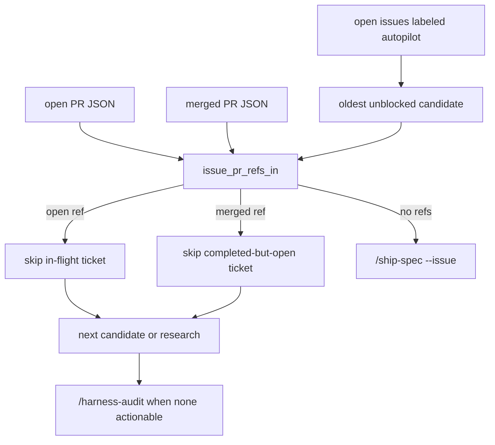

# Autopilot Selection

## Relevant Source Files
- `.claude/skills/autopilot/SKILL.md:211-215` — defines GitHub `autopilot` issues as the work queue and states that actionable tickets must have no open or merged PR reference.
- `.claude/skills/autopilot/SKILL.md:218-245` — bulk-fetches open and merged PR JSON, then shares one issue-reference matcher across both states.
- `.claude/skills/autopilot/SKILL.md:247-266` — skips queue candidates that already have open or merged PR references before selecting the oldest actionable ticket.
- `.claude/skills/autopilot/SKILL.md:291-293` — falls through to `/harness-audit` research when every open ticket already has an open or merged PR.
- `evals/probes/autopilot-merged-pr-reference-dedupe.sh:1-36` — guards the merged-PR dedupe contract.

## Summary
Autopilot selection is issue-queue-first: open GitHub issues labeled `autopilot` are the queue, and the loop picks the oldest actionable ticket. A ticket is actionable only when no open or merged PR already references it, because Open Harness PRs target `development` and GitHub may leave `Closes #N` issues open until default-branch promotion.

## Detail
The selection pass first fetches open PRs and recent merged PRs into local JSON caches (`.claude/skills/autopilot/SKILL.md:218-224`). It then uses `issue_pr_refs_in()` to search linked metadata, branch names, titles, and bodies for the candidate issue number or closing keywords (`.claude/skills/autopilot/SKILL.md:229-245`). That same matcher powers `issue_open_pr_refs()` and `issue_merged_pr_refs()`, preventing a stale linked-PR metadata gap from becoming duplicate work.

The queue loop tests open refs first and merged refs second (`.claude/skills/autopilot/SKILL.md:247-260`). Open refs mean another run is in flight; merged refs mean the ticket is completed but still open, usually because the closing keyword merged into `development` instead of the repository default branch. In both cases the loop advances to the next issue instead of creating a duplicate work branch.

If every open `autopilot` issue is already represented by an open or merged PR, the run treats the queue as having no actionable item and falls through to `/harness-audit` research (`.claude/skills/autopilot/SKILL.md:291-293`). The cap gate still bounds PR creation; merged dedupe only prevents rebuilding completed tickets.

## System Relationships

## See Also
- [[harness-audit]]
- [[cron-runtime]]
