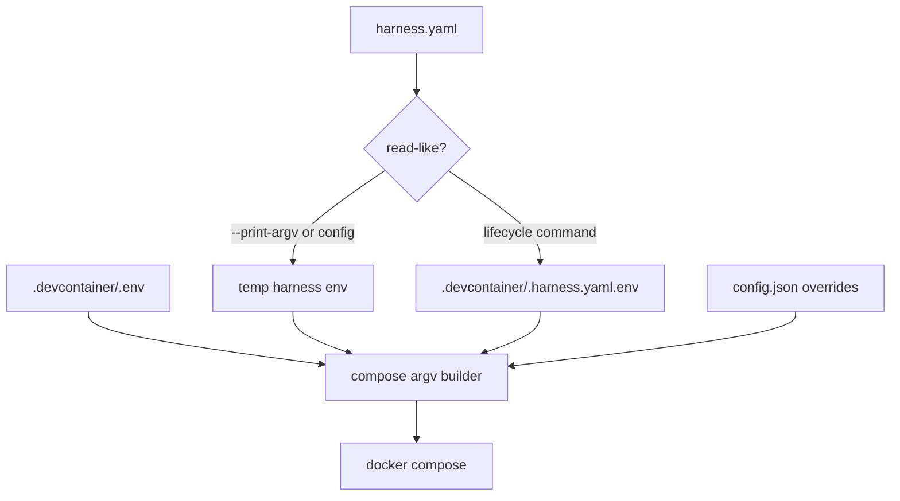

# Compose Wrapper

## Relevant Source Files
- `scripts/docker-compose.sh` — central helper that assembles `docker compose` argv from `.devcontainer/.env`, `harness.yaml`, and `config.json`.
- `scripts/__tests__/compose-args.test.ts` — regression coverage for env-file ordering, override escaping, diagnostics, and lifecycle behavior.
- `Makefile` — routes sandbox lifecycle targets through the helper.
- `scripts/install.sh` — starts the sandbox through the helper after installation.

## Summary
The compose wrapper is the single argv builder for Open Harness sandbox lifecycle commands and diagnostics. It preserves persistent generated env state for real lifecycle operations, but read-like diagnostics use a temporary generated env file so inspection does not dirty or overwrite the worktree.

## Detail
`docker-compose.sh` first resolves the repository, config script, `harness.yaml`, `.devcontainer/.env`, and the persistent generated env path (`scripts/docker-compose.sh:49-54`). It always places `.devcontainer/.env` before any generated harness env file when both exist (`scripts/docker-compose.sh:95-110`), so explicit user env values retain their existing precedence model.

The wrapper classifies a call as read-like when `--print-argv` is active or the compose subcommand is `config` (`scripts/docker-compose.sh:89-93`). For those paths it writes `harness.yaml`-derived env to a temporary file under `${TMPDIR:-/tmp}` and registers a cleanup trap (`scripts/docker-compose.sh:99-104`). Because a cleanup trap cannot run after `exec`, temporary-env compose invocations run `docker compose ...` normally and exit with its status (`scripts/docker-compose.sh:142-145`).

Lifecycle commands such as `up -d`, `run`, `exec`, and `down` are not read-like. They keep writing `.devcontainer/.harness.yaml.env` and then `exec docker compose ...` so the long-standing process replacement behavior remains intact (`scripts/docker-compose.sh:105-110`, `scripts/docker-compose.sh:147`). Tests use `--print-argv` only for diagnostic behavior and a fake `docker` executable for lifecycle behavior (`scripts/__tests__/compose-args.test.ts:33-58`). Coverage proves diagnostics avoid persistent env creation/overwrite while lifecycle commands still persist generated state (`scripts/__tests__/compose-args.test.ts:62-84`, `scripts/__tests__/compose-args.test.ts:128-156`).

## System Relationships

## See Also
- [[sandbox-auth-volumes]]
- [[ci-build-gates]]
