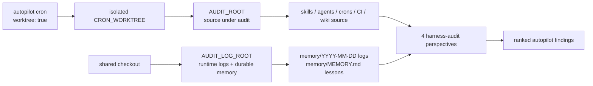

# Harness Audit

## Relevant Source Files
- `.claude/skills/harness-audit/SKILL.md` — resolves `AUDIT_ROOT` for source inspection and `AUDIT_LOG_ROOT` for runtime memory/log context.
- `evals/probes/harness-audit-shared-memory.sh` — guards that durable long-term memory is loaded from `AUDIT_LOG_ROOT`, not the isolated worktree root.
- `evals/probes/harness-audit-memory-path.sh` — guards worktree-aware source inspection through `AUDIT_ROOT`.
- `crons/autopilot.md` — runs hourly autopilot in worktree mode, the scenario where source checkout and durable logs can diverge.

## Summary
`/harness-audit` is the first-principles research pass that feeds the autopilot queue when no actionable `autopilot` issue is available. In worktree-mode cron runs, it must split source inspection from durable memory: audit the isolated checkout via `AUDIT_ROOT`, but read runtime logs and long-term lessons from `AUDIT_LOG_ROOT`.

## Detail
The audit root exists to make source inspection truthful for the checkout that invoked the skill. When `CRON_WORKTREE` points at a valid checkout, `/harness-audit` sets `AUDIT_ROOT` to that worktree; otherwise it falls back to the current repository root. Skills, agents, crons, package metadata, CI workflows, wiki files, and worktree state are all read through that source root.

Runtime observability has a different lifecycle. Cron worktrees are ephemeral and can be based on a public/template branch whose `memory/MEMORY.md` is intentionally sparse, while the live operator's durable lessons and daily logs live in the shared checkout. `/harness-audit` therefore resolves `AUDIT_LOG_ROOT` separately and uses it for recent memory directories and long-term memory.

The context snapshot reports `long_term_memory: loaded` or `long_term_memory: missing-or-unreadable` so a quiet memory miss is visible. Troubleshooting starts by comparing the snapshot's `AUDIT_ROOT` and `AUDIT_LOG_ROOT`: source findings may still be valid, but memory-derived judgments are incomplete until the shared root has a readable `memory/MEMORY.md` or `AUTOPILOT_LOG_ROOT` points at the checkout that owns durable logs.

## System Relationships

## See Also
- [[cron-runtime]]
