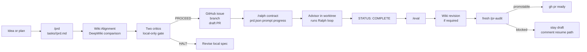

# ship-spec Orchestration Boundary

## Relevant Source Files
- `AGENTS.md:109-149` — defines the eight-phase loop and places `/ship-spec` in phases 1-4.
- `.claude/skills/ship-spec/SKILL.md:17-43` — defines the end-to-end pipeline, wiki alignment checkpoints, and critic-before-commitment ordering.
- `.claude/skills/ship-spec/SKILL.md:74-101` — requires each PRD to declare wiki impact and compare required wiki work against DeepWiki.
- `.claude/skills/ship-spec/SKILL.md:353-366` — requires post-implementation wiki revision before audit when wiki impact is required.
- `scripts/ralph.sh:16` and `scripts/ralph.sh:324-347` — define `STATUS: COMPLETE` as the implementation done sentinel.

## Summary
`/ship-spec` is the harness boundary that turns an idea or plan into an observable, critic-gated implementation run. It covers phases 1-4 of the Open Harness loop for one scoped item, forces wiki impact to be declared and compared against DeepWiki, then hands implementation to an Advisor/Ralph path and waits for audit-grade evidence before the PR becomes ready.

## Detail
The top-level loop says `/ship-spec` covers phases 1-4 for a single item: research/spec, plan, implement handoff, and audit gating (`AGENTS.md:111`). It composes lower-level primitives rather than replacing them: `/prd` writes the human-readable spec, two critics review it, `/ralph` converts it to structured task state, GitHub provides issue/branch/PR observability, and the Advisor/Ralph path performs implementation.

The key property is stage ordering. The skill states that critics run before the issue is opened, the branch is created, or anything is pushed (`.claude/skills/ship-spec/SKILL.md:19`). Its pipeline places `/prd`, wiki alignment, critics, and critique resolution before the first GitHub-side state change (`.claude/skills/ship-spec/SKILL.md:21-43`). That makes a halted spec reversible and prevents dangling remote artifacts when high-severity findings appear.

The PRD now carries the wiki gate explicitly. Stage 2.5 records `Impact: REQUIRED | NOT-APPLICABLE`, names local wiki entries, aligns those entries to the PRD, and compares against the relevant DeepWiki page shape and source coverage (`.claude/skills/ship-spec/SKILL.md:74-101`). Critics then review the wiki plan before commitment.

The draft PR is an observability checkpoint, not success. Ralph owns the done sentinel: it exits when `progress.txt` or the iteration output contains a whole-line `STATUS: COMPLETE` (`scripts/ralph.sh:324-347`). When wiki impact is required, the Advisor must revise the named entries after implementation, preserve the DeepWiki comparison, refresh `wiki/README.md`, and pass the wiki index probe before `/pr-audit` (`.claude/skills/ship-spec/SKILL.md:353-366`). The PR is marked ready only after implementation, eval, wiki, and audit gates clear.

## System Relationships

The boundary is a commitment protocol. Before `PROCEED`, artifacts are local and cheap to revise. After `PROCEED`, `/ship-spec` creates inspectable remote state, but keeps success gated on implementation evidence and audit state.

## See Also
- [[compound-engineering]]
- [[inspectable-agent-harness]]
- [[claude-code-teacher-skill]]
- [[pi-loop]]
