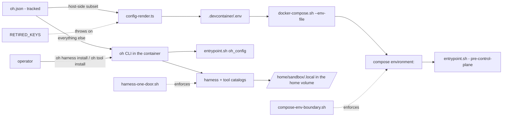

# Compose Environment Boundary

## Relevant Source Files
- `.devcontainer/docker-compose.yml` — the base compose file; its `environment:` block is the surface this page constrains.
- `.devcontainer/docker-compose.image-only.yml` — flavor B; its `environment:` block is byte-identical to flavor A's.
- `.devcontainer/entrypoint.sh` — the `oh_config` / `oh_config_truthy` helpers that read oh.json at boot; installs nothing.
- `.oh/cli/src/lib/config-render.ts` — renders the host-side subset into `.devcontainer/.env`; refuses `RETIRED_KEYS`.
- `.oh/cli/src/commands/harness.ts`, `.oh/cli/src/commands/tool.ts` — the only install door.
- `.oh/evals/probes/compose-env-boundary.sh`, `.oh/evals/probes/harness-one-door.sh` — the tier-A probes that enforce both rules.

## Summary
A value reaches the sandbox through Compose only if a process **outside** the sandbox — or the entrypoint **before** the control plane is readable — must act on it. Everything else lives in the tracked `oh.json` and is read inside the container through the `oh` CLI. Installs are not configuration at all: a harness or tool enters the sandbox only when the operator runs `oh harness install <id>` or `oh tool install <id>` (#948), so neither Compose nor `oh.json` carries an install key.

## Detail
Two routes carry configuration into the sandbox. The host-side route renders a fixed set — `SANDBOX_NAME`, `TZ`, `OH_HOME_MOUNT`, `GIT_USER_NAME`, `GIT_USER_EMAIL`, `DOCKER_SOCKET`, `SANDBOX_SSH`, `SANDBOX_SSH_PORT`, `OH_SANDBOX_IMAGE`, `OH_PULL_POLICY` (`.oh/cli/src/lib/config-render.ts`) — because each selects an overlay, names the project, publishes a port, or is needed before `oh.json` is reachable. The in-container route reads everything else at the moment it is needed: `oh_config` shells `oh config show` once and answers `jq` filters from the cached JSON (`.devcontainer/entrypoint.sh`), degrading to a caller-supplied default when the CLI is missing or old; `config show` rather than a narrower verb, because a baked `oh` can predate a new one on the boot path.

Installs take neither route. Boot provisioning, the `install.*` keys, the persist flags, the `OH_PROVISION_DEFAULTS` off-ramp and the provision-failed marker were retired in #948. `oh harness install <id>` and `oh tool install <id>` probe the running sandbox, install as the sandbox user into `NPM_USER_PREFIX` (`/home/sandbox/.local`) inside the home volume, verify with the catalog's `verifyArgv`, and report; they touch no `oh.json` field. Kinds are `installable` / `on-demand` for harnesses and `baked-in` / `installable` for tools; the catalogs own every pin and checksum, and `entrypoint.sh` holds none. A fresh home volume boots with no harness and no `herdr`, and the healthcheck passes anyway.

Four compose `environment:` literals survive that no config read can supply: `SANDBOX_PASSWORD` (consumed by the entrypoint's own user setup), `CLAUDE_DANGEROUSLY_SKIP_PERMISSIONS`, `CC_SAFETY_NET_STRICT` and `CC_SAFETY_NET_WORKTREE` (read by third-party binaries that know nothing of `oh.json`), plus the `GH_TOKEN` secret, which `config-render.ts` refuses to render.

Three guards keep the boundary closed. `RETIRED_KEYS` throws if a `put()` for a retired variable is ever re-added (`.oh/cli/src/lib/config-render.ts`); the compose probe fails on any `INSTALL_*` key, on `OH_IMAGE_ONLY`, or on any `environment:` key outside the rendered set — across every `docker-compose*.yml` including overlays; and `harness-one-door.sh` fails on a `default` kind, a `harnessKey` / `toolKey`, a provisioner script, an `install` key in `oh-config.ts`, an `OH_PROVISION_*` gate, or an installable binary in the Dockerfile. Overlay `ports:` and `volumes:` blocks are unrestricted; that payload is the part only Docker can act on.

Non-goals: flavor B survives, because `/opt/oh-seed` ships regardless; `INSTALL_PYTHON_KERNEL` and `provision-python.sh` remain, a Dockerfile↔entrypoint duplication rather than a compose one; `start_period: 600s` was sized for the retired provisioning window and is tracked for retuning on #948.

## System Relationships

## See Also
- [[sandbox-dependency-installs]]
- [[oh-cli-portable-lifecycle]]
