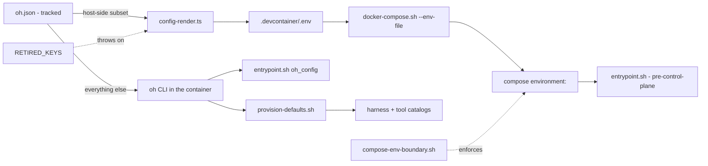

# Compose Environment Boundary

## Relevant Source Files
- `.devcontainer/docker-compose.yml` — the base compose file; its `environment:` block is the surface this page constrains.
- `.devcontainer/docker-compose.image-only.yml` — flavor B (no checkout bind); its `environment:` block is byte-identical to flavor A's.
- `.devcontainer/entrypoint.sh` — holds the `oh_config` / `oh_config_truthy` helpers that read oh.json through the CLI at boot.
- `.oh/cli/src/lib/config-render.ts` — renders the host-side subset into `.devcontainer/.env`, and refuses to render anything in `RETIRED_KEYS`.
- `.oh/scripts/provision-defaults.sh` — installs harnesses and tools from the catalogs, keyed on oh.json rather than the environment.
- `.oh/evals/probes/compose-env-boundary.sh` — the tier-A probe that enforces the rule across every compose file and overlay.
- `.oh/scripts/docker-compose.sh` — the lifecycle door's driver; pins flavor A's compose file and passes the rendered dotenv as `--env-file`.
- `.oh/scripts/deployment-compose.sh` — flavor B's driver; pins the image-only compose file and passes no `--env-file` at all.

## Summary
A value reaches the sandbox through Compose only if a process **outside** the sandbox — or the entrypoint **before** the control plane is readable — must act on it. Everything else lives in the tracked `oh.json` and is read inside the container through the `oh` CLI. The rule exists because the consumer at the end of the old `oh.json → config-render → .env → compose → entrypoint` pipeline sits in the home mount next to the CLI and can read `oh.json` directly; the hop bought nothing and cost three defects.

## Detail
Two routes carry configuration into the sandbox. The host-side route renders a fixed set — `SANDBOX_NAME`, `TZ`, `OH_HOME_MOUNT`, `GIT_USER_NAME`, `GIT_USER_EMAIL`, `DOCKER_SOCKET`, `SANDBOX_SSH`, `SANDBOX_SSH_PORT`, `OH_SANDBOX_IMAGE`, `OH_PULL_POLICY` (`.oh/cli/src/lib/config-render.ts:37`, `.oh/cli/src/lib/config-render.ts:49`) — because each selects an overlay, names the project, publishes a port, or is needed before `oh.json` is reachable. The in-container route reads everything else at the moment it is needed: `oh_config` shells `oh config show` once and answers `jq` filters from the cached JSON (`.devcontainer/entrypoint.sh:86`), degrading to a caller-supplied default when the CLI is missing or old. It deliberately uses `config show` rather than a narrower verb, because a baked `oh` in an already-running container can predate a new one and this is the boot path.

Installs take the second route entirely. `provision-defaults.sh` reads `oh harness list --json` and `oh tool list --json` and installs every entry that is `kind:"default"` or `enabled == true`, where `enabled` is computed from `oh.json` (`.oh/scripts/provision-defaults.sh:129`, `.oh/scripts/provision-defaults.sh:135`). The tool catalog is therefore the sole owner of each pinned version and checksum; `entrypoint.sh` holds none.

Four compose `environment:` literals survive that no config read can supply: `SANDBOX_PASSWORD` (consumed by the entrypoint's own user setup), `CLAUDE_DANGEROUSLY_SKIP_PERMISSIONS`, `CC_SAFETY_NET_STRICT` and `CC_SAFETY_NET_WORKTREE` (read by third-party binaries that know nothing of `oh.json`), plus the `GH_TOKEN` secret, which `config-render.ts` refuses to render (`.oh/cli/src/lib/config-render.ts:53`).

Two guards keep the boundary closed. `RETIRED_KEYS` throws if a `put()` for a retired variable is ever re-added (`.oh/cli/src/lib/config-render.ts:56`), and the tier-A probe fails on any `INSTALL_*` key, on `OH_IMAGE_ONLY`, or on any `environment:` key outside the rendered set — across every `docker-compose*.yml` including overlays. Overlay `ports:` and `volumes:` blocks are unrestricted; that payload is the part only Docker can act on.

**Two drivers, and the dotenv is what separates them.** `docker-compose.sh` is the door for the flavor `oh` manages: it pins `.devcontainer/docker-compose.yml`, layers the `composeOverrides[]`, and passes the rendered dotenv as `--env-file`. That dotenv is exactly the host-side subset above, so it carries the operator's own `SANDBOX_NAME`, `OH_SANDBOX_IMAGE`, and `OH_PULL_POLICY`. A caller that wants to boot a *different* image under a *different* project name therefore cannot reuse it, and `.oh/scripts/deployment-compose.sh` exists for that: it pins `.devcontainer/docker-compose.image-only.yml`, passes no `--env-file`, takes its whole configuration from the environment its caller exports, and points `DOCKER_CONFIG` at an empty directory so an ambient `credsStore` cannot fail an anonymous pull. It adds no compose file and no `environment:` key, so the boundary probe's scope is unchanged. `.oh/scripts/deployment-guard.sh` — and through it `/deploy-check` and `.github/workflows/deployment-guard.yml` — is its only caller (#937).

Non-goals worth recording so a later reader does not treat them as oversights: flavor B survives, and since #937 it is no longer only a survivor — it is the flavor the deployment guard boots, so the entrypoint's seed branch and the boot-time install now have a live oracle instead of only the in-process simulation in `oh-image-only-deploy.sh`; `INSTALL_PYTHON_KERNEL` remains, because it is a Dockerfile↔entrypoint duplication rather than a compose one; and every retired `oh.json` field stays settable through `oh config set` — only its `.env` projection is gone.

## System Relationships

## See Also
- [[sandbox-dependency-installs]]
- [[oh-cli-portable-lifecycle]]
