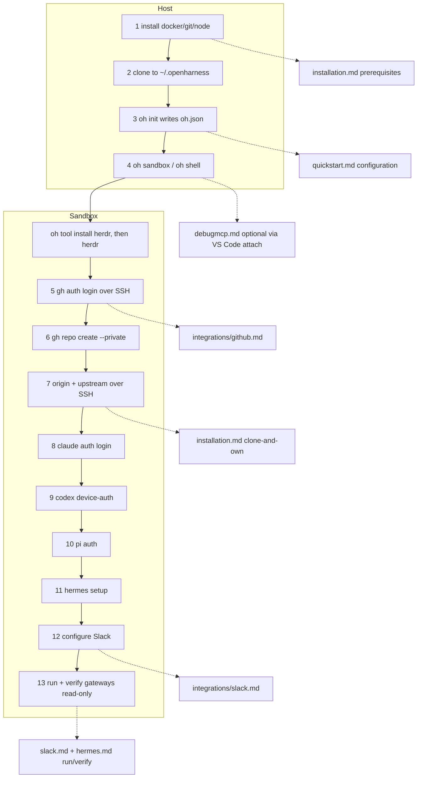

# Fresh-Machine Setup Flow

## Relevant Source Files
- `docs/quickstart.md` — the **canonical human walkthrough** (13 ordered steps, commands inlined). This entry is a synthesis + doc-handoff map only; keep it in sync with quickstart's step list.
- `docs/installation.md` — host prerequisites and the clone-and-own private-origin + upstream pattern.
- `docs/integrations/github.md` — SSH auth (interactive + entrypoint auto-keygen).
- `docs/integrations/debugmcp.md` — DebugMCP extension runbook.
- `docs/integrations/slack.md`, `docs/harnesses/hermes.md` — Slack config + gateway run/verify.
- `.devcontainer/entrypoint.sh:275-309` — auto SSH keygen + pubkey upload when `GH_TOKEN` carries `admin:public_key`.
- `.oh/scripts/gateway.sh` — sandbox-only lifecycle for the sibling `client-slack-pi` / `client-slack-hermes` sessions.

## Summary
Validated 2026-07-01 on a bare OVHcloud host: the path from a fresh Linux machine to an
authenticated multi-agent Open Harness sandbox is 13 ordered steps. Steps 1–4 run on the
**host** (install deps, clone, write `oh.json`, bring the sandbox up); steps 5–13 run
**inside the sandbox** (install Herdr and each harness through the CLI, GitHub SSH auth,
private origin + upstream, per-harness auth, Slack, gateway run/verify). Each fact has one canonical doc home, and `quickstart.md` is the single
self-sufficient human walkthrough.

## Detail
Host prerequisites are Docker (+ Compose), Git, and **Node.js >= 20** — `oh` is the only
lifecycle door and needs Node to run (issue #881 retired the Makefile; `get-oh.sh`
installs Node when it is missing). Non-secret configuration lives in the tracked `oh.json`
(`name`, `timezone`, `git.userName` / `git.userEmail`, `access.*`); the CLI renders the
host-side subset into `.devcontainer/.env`, which is read on every path including VS Code
"Reopen in Container". Secrets live in a gitignored dotenv; nothing secret is committed.
Nothing installs at boot: a fresh sandbox has no `herdr` and no agent CLI until
`oh tool install herdr` / `oh harness install <id>` (#948).

The recommended repo topology is **clone-and-own**: clone upstream, create a *private* repo
as `origin`, keep `mifunedev/openharness` as `upstream`. Both remotes use SSH URLs so pushes
ride the key generated in-sandbox. GitHub auth has two SSH paths: interactive (pick SSH
during login, generate a key, paste a token) or automatic (the entrypoint generates an
ed25519 key and uploads the public key when `GH_TOKEN` carries `admin:public_key`;
idempotent).

Per-harness auth, in order, each after its `oh harness install <id>`: Claude (verified
against v2.1.198), Codex (device-auth), Pi (provider OAuth), and Hermes. The **most straightforward
cross-provider login** is `/login` → **device mode** from an agent's interactive session — a
short code + URL that works on a headless/remote host, where browser-redirect OAuth
typically fails; explicit `--device-auth` CLI flags (e.g. `codex login --device-auth`) are
equivalents. **DebugMCP** is a separate, optional cross-harness MCP debugging capability, enabled by
the VS Code attach-to-container route after `oh sandbox`; any MCP-capable harness can
drive it.

Slack + gateways: `pi-messenger-bridge` bridges Slack to Pi; Hermes uses its native
gateway. One `.oh/scripts/gateway.sh` lifecycle manages both in sibling tmux sessions
(`client-slack-pi`, `client-slack-hermes`), each with its own Slack app. Run commands are
sandbox-only (they need `pi` / `hermes` on `PATH`). Verify a live gateway read-only
(`tmux attach -r`, detach with `Ctrl-b d`); logs mirror to `/tmp/client-slack-{pi,hermes}.log`.

`confidence: provisional` — the Claude auth command and the `gateway status` / `tmux -r`
mechanics are live-verified in the running sandbox; Pi/Hermes/Slack auth were not re-run
live for this entry. Commands themselves live in `quickstart.md`, not here.

## System Relationships

## See Also
- [[sandbox-dependency-installs]]
- [[oh-cli-portable-lifecycle]]
