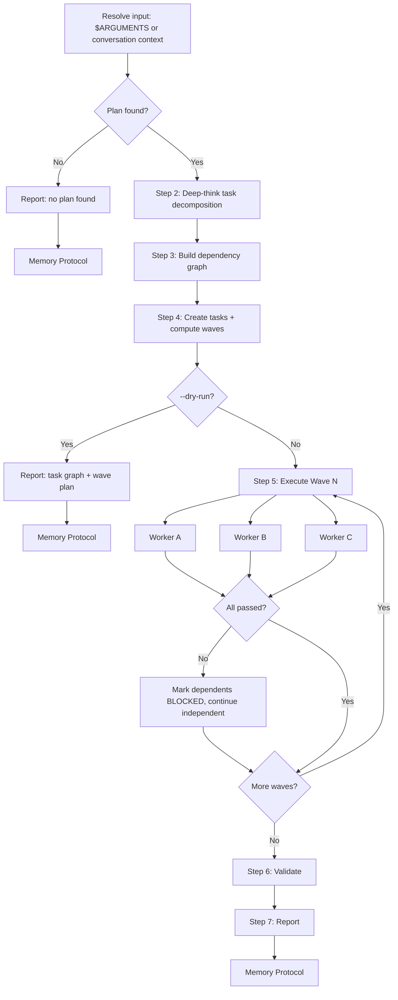

# Delegate

Parallel execution coordinator. Read a plan or conversation context, decompose it into
a dependency-ordered task graph, and spawn worker sub-agents in parallel waves. Each wave
completes before the next begins. Results are collected, validated, and reported.

**Core principle: maximize parallelism while respecting dependencies absolutely.**

## Worker model and thinking policy

Apply this policy to every worker:

1. **Inherit the parent/session model by default.** Omit the Agent tool's `model`
   argument. Do not route routine or simple work to a weaker model tier.
2. Set the Agent tool's `thinking` parameter from task complexity:
   **simple/mechanical → `low`**, **standard → `medium`**, **complex → `high`**,
   and **architecture or debugging with substantial uncertainty → `xhigh`**.
   Supported levels are `off`, `minimal`, `low`, `medium`, `high`, and `xhigh`;
   never use `max`.
3. If the selected thinking level is unsupported by the inherited model/provider,
   use the nearest supported level. Do not switch models merely to obtain a thinking
   level.
4. Override `model` only with an explicit task-specific reason: an operator request,
   an unavailable required capability/context, a strict latency or budget constraint,
   or local benchmark evidence. Record that reason in the task graph and pass the
   override only for that worker.

## Decision Flow



## Instructions

### 1. Resolve input

Arguments received: `$ARGUMENTS`

- If `--plan <path>` is provided, read that file
- If no arguments, use the current conversation context (the plan should be visible
  from a prior `/prd`, plan discussion, or issue triage output)
- If `--dry-run` is present, set DRY_RUN=true

If no plan is found in either source, report:
> No plan found. Provide a plan file path with `--plan <path>` or discuss the plan first, then run `/delegate`.

Run Memory Protocol and stop.

### 2. Decompose into tasks (reason according to complexity)

Analyze the plan deeply and produce a structured task list. For each task, determine:

| Field | Description |
|-------|-------------|
| **ID** | Sequential: T1, T2, T3, ... |
| **Title** | Short imperative description |
| **Description** | What the worker agent needs to do (2-3 sentences, include file paths) |
| **Depends On** | Task IDs this requires first, or "none" |
| **Files** | Key files the worker will read or modify |
| **Complexity** | `simple/mechanical`, `standard`, `complex`, or `architecture/debugging with substantial uncertainty` |
| **Model override** | `none (inherit)` by default; otherwise the exact model plus one allowed explicit reason |
| **Thinking** | `low`, `medium`, `high`, or `xhigh`, derived from Complexity and passed as the Agent `thinking` parameter |
| **Acceptance** | How to verify the task is done (objectively checkable) |

**Decomposition rules:**
- Each task must be completable by a single sub-agent in one session
- Prefer more smaller tasks over fewer larger ones
- Schema/infrastructure before backend, backend before frontend
- Tasks that touch different files with no shared state CAN be parallel
- Tasks that modify the same file or depend on another's output MUST be sequential
- Every task must have at least one verifiable acceptance criterion
- Each task must have a **distinct, non-overlapping scope** — do not spawn redundant workers for the same files
- A task that is itself multi-step and parallelizable MAY recursively delegate via the `Agent` tool — but only if the worker's task description includes explicit `Max depth: N` and `Step budget: N` fields (see `.oh/agents/advisor.md`). Absent those fields, workers stay flat.

### 3. Build dependency graph and compute waves

Arrange tasks into parallel execution waves using topological ordering:

1. **Wave 1**: All tasks with `Depends On: none` -- run first, in parallel
2. **Wave 2**: All tasks whose dependencies are entirely within Wave 1
3. **Wave N**: All tasks whose dependencies are entirely within Waves 1..N-1

Output the wave plan:

| Wave | Tasks | Parallelism | Complexity |
|------|-------|-------------|------------|
| 1 | T1, T2, T3 | 3 agents | S + S + M |
| 2 | T4, T5 | 2 agents | M + S |
| 3 | T6 | 1 agent | L |

**Validation:**
- No circular dependencies (if found, report error and stop)
- Max 5 concurrent agents per wave (split larger waves into sub-waves)

### 4. Create tasks and track dependencies

Use `TaskCreate` for each task. Then use `TaskUpdate` with `addBlockedBy` to wire dependencies.

If `--dry-run`, output the full task graph and wave plan, then skip to **Step 9**.

### 5. Execute waves

For each wave, starting from Wave 1:

**a) Spawn worker agents in ONE message (parallel)**

Launch N `Agent` tool calls **in a single message** for parallel execution. Each worker receives:
- Task ID, title, description, files, and acceptance criteria
- Summaries of completed prior-wave results (not full output)
- Instruction: report what was done, what files changed, whether acceptance criteria are met

Worker configuration:
- **Model**: omit the Agent `model` argument so the worker inherits the parent/session
  model. Include `model` only when the task graph records an allowed explicit override
  and its reason; pass that exact override unchanged.
- **Thinking**: pass `thinking` derived from Complexity (`low`, `medium`, `high`,
  or `xhigh`). Never pass `max`. If unsupported, use the nearest supported thinking
  level while keeping the inherited or explicitly overridden model unchanged.
- **run_in_background**: true (for waves with 2+ tasks)
- **subagent_type** (read-only trap): the `implementer`, `pm`, and `critic` sub-agent types are **read-only** (`tools: Read, Glob, Grep, Bash` — no `Write`/`Edit`) and will **silently make zero file changes** if a worker is told to create or edit files. For any worker that must `Write`/`Edit` files, set `subagent_type: general-purpose` (or `claude`) in the `Agent` tool call; reserve `implementer`/`pm`/`critic` for analysis-only workers.

**a.1) Recursion-authorization gate**

If any worker's task description authorizes recursive delegation (`Max depth: N` with N ≥ 2), confirm before spawning that **all three** fields are present in that worker's briefing:

- `Max depth: N`
- `Max children per level: M` (M ≤ 5)
- `Step budget: S`

If any field is missing, either add it or downgrade the task to flat execution (`Max depth: 1`). Workers without all three fields MUST stay flat — they have no authority to spawn grandchildren regardless of how the task is described in prose. See `.oh/agents/advisor.md` for the full protocol.

**b) Collect results**

After all agents in the wave complete, update each task via `TaskUpdate`:

| Task | Status | Summary | Files Changed |
|------|--------|---------|---------------|
| T1 | completed | Created schema migration | prisma/schema.prisma |
| T2 | completed | Added API route | src/app/api/... |
| T3 | FAIL | Type error in ... | -- |

**c) Handle failures**

If any task fails:
- Log the failure with details
- Check if tasks in subsequent waves depend on the failed task
- Mark dependent tasks as BLOCKED (do not execute them)
- Continue with non-dependent tasks in the next wave

**d) Advance to next wave**

Pass completed task summaries as context to the next wave's workers. Repeat until all waves complete or all remaining tasks are blocked.

### 6. Validate

After all waves complete:

1. Review acceptance criteria for every completed task.
2. Determine validation commands from the plan's acceptance criteria and the target
   repository's own instructions/configuration (for example, its `AGENTS.md`,
   `README.md`, package scripts, Makefile, or CI workflow). Run only commands relevant
   to the changed scope, from that repository's root.
3. Preserve and record each command's real exit status. Do not append `|| true`, pipe
   through a command that masks failure, or substitute hard-coded harness-wide checks.
4. If validation fails, report the command, exit status, and tasks likely responsible.

### 7. Report

Output a structured summary:

```
## Delegation Report

### Task Summary
| Task | Wave | Status | Summary |
|------|------|--------|---------|
| T1   | 1    | DONE   | ...     |
| T2   | 1    | DONE   | ...     |
| T3   | 1    | FAIL   | ...     |
| T4   | 2    | BLOCKED| Depends on T3 |

### Execution Stats
- Total tasks: N
- Completed: N
- Failed: N
- Blocked: N
- Waves executed: N
- Max parallelism: N agents

### Validation
| Command | Scope | Exit status | Result |
|---------|-------|-------------|--------|
| `<repo-specific command>` | `<changed scope>` | `<code>` | PASS/FAIL |

### Issues Requiring Attention
- [list any failures, blocked tasks, or validation errors]
```

### 8. Example

For a standard API task, record `Complexity: standard`, `Model override: none
(inherit)`, and `Thinking: medium`; call Agent with `thinking: medium` and no
`model` argument. If `medium` is unsupported, use the nearest supported thinking
level without changing models.

### 9. Memory Improvement Protocol

Run at the end of **every** execution -- op, dry-run, or error.

**a) Log** -- append to `.oh/memory/<today>/log.md` where today = `date -u +%Y-%m-%d`:

```markdown
## Delegate -- HH:MM UTC
- **Result**: OP | DRY-RUN | PARTIAL | FAIL
- **Plan**: "<plan title or source>"
- **Action**: [N tasks across M waves, P parallel max; X completed, Y failed, Z blocked]
- **Duration**: ~Xs
- **Observation**: [one sentence]
```

See `.oh/skills/retro/references/memory-protocol.md` for the canonical Memory Improvement Protocol.

## Reference

### Wave Execution Rules

| Rule | Value |
|------|-------|
| Max concurrent agents per wave | 5 (split larger waves) |
| Failure handling | Mark dependent tasks BLOCKED, continue independent ones |
| Context passing | Prior wave summaries, not full output |
| Model selection | Omit Agent `model` to inherit by default. Override only for an operator request, unavailable required capability/context, strict latency/budget, or local benchmark evidence; record the reason. Unsupported thinking falls back to the nearest supported level, never a model switch. |
| Thinking selection | Pass Agent `thinking`: simple/mechanical=`low`; standard=`medium`; complex=`high`; architecture/debugging with substantial uncertainty=`xhigh`; never `max`. |

### Key Resources

| Resource | Path |
|----------|------|
| Agent: Implementer | `.claude/agents/implementer.md` — read-only (no Write/Edit) |
| Agent: Critic | `.claude/agents/critic.md` — read-only (no Write/Edit) |
| Agent: PM | `.claude/agents/pm.md` — read-only (no Write/Edit) |
| Agent: Council | `.claude/agents/council.md` |
| Identity | `IDENTITY.md` |
| Memory | `MEMORY.md` |
| Daily Logs | `.oh/memory/YYYY-MM-DD/log.md` |

The `implementer`/`pm`/`critic` agent types above are read-only and will silently make zero file changes. For any worker that must `Write`/`Edit` files, set `subagent_type: general-purpose` (or `claude`) — both are built-in agent types with no agent-definition file, so there is no `.claude/agents/` path to reference.
