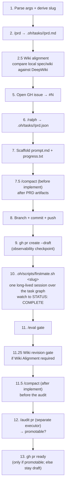

# Ship Spec

Compose the existing primitives (`/prd`, wiki synthesis per `.oh/skills/wiki/references/schema.md`, DeepWiki comparison, `/ralph`, `gh`, `git`, `/compact`, `.oh/scripts/firstmate.sh`, `/eval`, `/audit pr`) into one durable invocation that produces a fully-scaffolded task and a ready-for-review PR. The draft PR is an observability checkpoint while implementation is pending, not the terminal state. After scaffolding, the orchestrator compacts and launches **the one build executor** — `.oh/scripts/firstmate.sh <slug>`, a single long-lived First-Mate session over the whole task graph — then revises required wiki entries from implementation evidence and undrafts the PR through a `/audit pr` promotable gate. Each stage produces an inspectable artifact; the pipeline is resumable from any stage.

**Core principle: the approved plan is the commitment gate.** The PRD is reviewed by the operator before the issue is opened, the branch created, or anything is pushed. The cheapest thing to revise is the spec itself — make that the gate. There is no separate critic node (`AGENTS.md § The Workflow`).

## Pipeline (stages 1–13, with two `/compact` checkpoints)



**Stage ordering rationale**: no GitHub-side state changes until the PRD is written and approved (Stages 1–2.5 produce only local artifacts). Stage numbering is kept stable across the pipeline; Stages 3–4 were the retired critic/approve gate and no longer exist.

## Stages

### Stage 1 — Parse args + derive slug

Arguments received: `$ARGUMENTS`

Extract:
- **`<feature-description>`** (required) — the first positional arg, free text
- **`--plan <path>`** (optional) — if provided, use the file content as comprehensive input to `/prd` and skip clarifying questions
- **`--prefix <type>`** (optional, default `feat`) — branch + issue prefix per `.claude/skills/git/SKILL.md` (`feat | bug | task | audit | skill | agent`)
- **`--issue <N>`** (optional) — link an EXISTING GitHub issue instead of creating one. When present, set `ISSUE_NUM=<N>` and skip Stage 5's `gh issue create`; `<N>` flows into the branch (`<prefix>/<N>-<slug>`), `/ralph --issue <N>`, `prompt.md`, and the PR `Closes #<N>` link, exactly as a freshly-created issue number would
- **`--repo <owner/name>`** (optional, default `mifunedev/openharness`) — GitHub repository for issue/PR operations.
- **`--remote <name>`** (optional, default resolved from `--repo`) — git remote to fetch/push work branches.
- **`--base <branch>`** (optional, default `development`) — PR base and branch start point.

There is **no executor argument**. Stage 10 has exactly one build path:
`.oh/scripts/firstmate.sh <slug>` — ONE long-lived First-Mate session over the
whole task graph, launched through the herdr → tmux → foreground runner ladder
(see `/firstmate`). Its terminal interface is the whole line `STATUS: COMPLETE`
in `.oh/tasks/<slug>/progress.txt`.

```bash
SHIP_SPEC_REPO="${SHIP_SPEC_REPO:-mifunedev/openharness}"
SHIP_SPEC_BASE="${SHIP_SPEC_BASE:-development}"
case "${ARGUMENTS:-}" in *--repo*) SHIP_SPEC_REPO=$(printf '%s\n' "$ARGUMENTS" | sed -n 's/.*--repo[ =]\([^ ]*\).*/\1/p') ;; esac
case "${ARGUMENTS:-}" in *--base*) SHIP_SPEC_BASE=$(printf '%s\n' "$ARGUMENTS" | sed -n 's/.*--base[ =]\([^ ]*\).*/\1/p') ;; esac
resolve_ship_spec_remote() {
  git remote -v | awk -v repo="$SHIP_SPEC_REPO" '
    BEGIN { want=tolower(repo) }
    $3 == "(fetch)" {
      url=$2
      sub(/\.git$/, "", url)
      sub(/^.*github.com[:\/]/, "", url)
      if (tolower(url) == want) { print $1; exit }
    }'
}
case "${ARGUMENTS:-}" in *--remote*) SHIP_SPEC_REMOTE=$(printf '%s\n' "$ARGUMENTS" | sed -n 's/.*--remote[ =]\([^ ]*\).*/\1/p') ;; esac
SHIP_SPEC_REMOTE="${SHIP_SPEC_REMOTE:-$(resolve_ship_spec_remote)}"
[ -n "$SHIP_SPEC_REMOTE" ] || { echo "ERROR: no local git remote for $SHIP_SPEC_REPO"; exit 1; }
echo "ship-spec target: repo=$SHIP_SPEC_REPO remote=$SHIP_SPEC_REMOTE base=$SHIP_SPEC_BASE"
```

Derive `<slug>` per `/prd` rules: lowercase, kebab-case, `[a-z0-9-]+`, **≤5 words**, not `archive`. Reject and ask for a shorter name if invalid.

The slug is the universal key — it's the task directory, tmux session name, second segment of the branch, and embedded in the PR title. Choose once; never re-derive.

### Stage 2 — `/prd` → `.oh/tasks/<slug>/prd.md`

Invoke the `prd` skill via the Skill tool:

```
Skill: prd
args: <feature-description> + optional plan-file content
```

If `--plan <path>` was provided, pass the plan content with explicit instruction to skip clarifying questions (the plan answers them). Otherwise allow the skill to ask its standard 3-5 clarifying questions before generating.

Verify output exists at `.oh/tasks/<slug>/prd.md` before proceeding.

### Stage 2.5 — Wiki alignment + DeepWiki comparison

Make the PRD explicit about wiki impact. Read `.oh/skills/wiki/references/schema.md` and compare the spec's topic against the public DeepWiki for this repository (`https://deepwiki.com/mifunedev/openharness`), opening the most relevant DeepWiki page(s) when the topic maps to an existing subsystem. Record the result in `.oh/tasks/<slug>/prd.md` as a `## Wiki Alignment` section:

```markdown
## Wiki Alignment

- **Impact**: REQUIRED | NOT-APPLICABLE
- **Local entries**: `.oh/skills/wiki/corpus/<slug>.md` to create/update, or `none`
- **Spec alignment**: <how the wiki entry must reflect this PRD's goals, non-goals, and acceptance criteria>
- **DeepWiki comparison**: <source-file/page-shape/terminology gaps found against https://deepwiki.com/mifunedev/openharness, or "no relevant DeepWiki page found">
- **Acceptance criteria**: <wiki update checks to add to the relevant story when REQUIRED>
```

`Impact: REQUIRED` when the task changes harness architecture, skill behavior, agent roles, runtime flow, conceptual vocabulary, or public prose that introduces a reusable mechanism. `Impact: NOT-APPLICABLE` is allowed for narrow code/test chores, but it must say why.

When impact is required, revise the PRD so at least one story includes acceptance criteria for:
- local wiki entry creation/update aligned with the PRD's goals, non-goals, and final behavior;
- DeepWiki-style body shape: relevant source files, line-cited claims, system relationships when applicable, and `## See Also`;
- explicit comparison against the relevant DeepWiki page(s), naming any source-file coverage or terminology differences;
- `.oh/skills/wiki/corpus/README.md` index freshness via `/wiki lint` or `bash .oh/evals/probes/wiki-readme-index.sh`.

### Stage 5 — Open GH issue → `#N`

**If `--issue <N>` was provided**: skip issue creation entirely — set `N=<N>`, print `Using existing issue #<N> (--issue); skipping creation.`, optionally confirm it exists with `gh issue view <N> --repo "$SHIP_SPEC_REPO"`, and continue to Stage 6. Everything below in this stage applies ONLY when creating a fresh issue (no `--issue` flag).

Compose issue body from the prd.md introduction + goals sections. Title format per `.claude/skills/git/SKILL.md`:

```bash
gh issue create \
  --repo "$SHIP_SPEC_REPO" \
  --title "<prefix>: <slug-as-prose>" \
  --label "<prefix>" \
  --body-file <(printf '%s\n' \
    "## Summary" \
    "<from prd.md introduction>" \
    "" \
    "## Goals" \
    "<from prd.md goals>" \
    "" \
    "## PRD" \
    "- .oh/tasks/<slug>/prd.md (this branch)" \
    "" \
    "## Wiki Alignment" \
    "- Impact: <REQUIRED | NOT-APPLICABLE from prd.md>" \
    "- DeepWiki comparison: <one-line summary from prd.md>" \
    "" \
    "## Critique" \
    "- High: <count>, Medium: <count>, Low: <count>" \
    "- Recommendation: PROCEED" \
    "" \
    "## Tracking" \
    "Scaffolded by /ship-spec. Critics ran clean (or with mitigated findings) before this issue was opened. Draft PR to follow.")
```

Capture the returned issue URL; extract `<N>` (issue number) for downstream use.

If `gh label create <prefix> --repo "$SHIP_SPEC_REPO"` is needed (label doesn't exist), create it first with a sensible color. Heredoc bodies are safe — the `deny-env-dump.sh` hook strips heredoc bodies before pattern-scanning, so `--body "$(cat <<'EOF' ... EOF)"` is fine.

### Stage 6 — `/ralph` → `.oh/tasks/<slug>/prd.json`

Invoke the `ralph` skill:

```
Skill: ralph
args: .oh/tasks/<slug>/ --issue <N> --prefix <prefix>
```

The skill produces `.oh/tasks/<slug>/prd.json` with `branchName: <prefix>/<N>-<slug>`. Verify it exists and parses (use `node -e "require('./.oh/tasks/<slug>/prd.json')"`).

### Stage 7 — Scaffold `prompt.md` + `progress.txt`

There is one prompt template — the executor's own:
`.oh/skills/firstmate/templates/session-prompt.md`. Render it into
`.oh/tasks/<slug>/prompt.md` with the same closed three-placeholder
substitution `render_session_prompt` in `.oh/scripts/firstmate.sh` performs:

- `<slug>` → this task's slug
- `<branch>` → `prd.json`'s `branchName` (`<prefix>/<N>-<slug>`)
- `<issue>` → the tracking issue number, **bare digits** (the body writes `#<issue>` itself)

Strip the template's contract header (everything through the
`END CONTRACT HEADER -->` line) and confirm no `<placeholder>` token survives
the render.

Write `.oh/tasks/<slug>/progress.txt` with header only:

```
# progress

```

Verify the four-file contract exists:

```bash
for f in prd.md prd.json prompt.md progress.txt; do
  [ -f ".oh/tasks/<slug>/$f" ] || { echo "MISSING: $f"; exit 1; }
done
```

### Stage 7.5 — `/compact` before implement (after PRD artifacts)

This is the first of two compacts that bracket the implement phase. The PRD artifacts now exist on disk and the heaviest planning context — the `/prd` pass — is already spent. Run `/compact` to reclaim that context before the commit/PR and the implementation handoff. Preserve only the handoff keys:

```text
Preserve /ship-spec handoff context: slug <slug>, prefix <prefix>, issue #<N>, branch <prefix>/<N>-<slug>, four-file contract path .oh/tasks/<slug>/. Stages 8–9 re-read prd.md/prd.json from disk.
```

Stages 8–9 re-read the files from disk, so a post-compact context is sufficient. `/compact` is an optimization, not a gate — if it is unavailable or errors, log a warning and continue.

### Stage 8 — Branch + commit + push

```bash
# Resume-safe: checkout existing branch or create new
git fetch "$SHIP_SPEC_REMOTE" "$SHIP_SPEC_BASE"
git checkout -b "<prefix>/<N>-<slug>" "$SHIP_SPEC_REMOTE/$SHIP_SPEC_BASE" 2>/dev/null \
  || git checkout "<prefix>/<N>-<slug>"

git add ".oh/tasks/<slug>/"
git commit -m "$(cat <<'EOF'
<prefix>: scaffold <slug> task

Four-file contract per SPEC v0.7 §tasks/:
- prd.md: <N> user stories
- prd.json: schemaVersion 1, branchName <prefix>/<N>-<slug>
- prompt.md: the rendered build-session prompt
- progress.txt: empty header

Tracks #<N>. PRD generated by /prd; converted by /ralph.

Submitted-by: <active submitter>
EOF
)"

git push -u "$SHIP_SPEC_REMOTE" "<prefix>/<N>-<slug>"
```

`Submitted-by:` is mandatory and must name the model/agent that actually
submits the commit (for example `Submitted-by: Claude`, `Submitted-by: Codex`,
or `Submitted-by: Pi`). Do not hard-code Claude when the active submitter is a
fallback harness.

Pre-commit hook runs lint + tests; do not bypass.

### Stage 9 — `gh pr create --draft`

```bash
gh pr create \
  --repo "$SHIP_SPEC_REPO" \
  --draft \
  --base "$SHIP_SPEC_BASE" \
  --head "<prefix>/<N>-<slug>" \
  --title "FROM <prefix>/<N>-<slug> TO $SHIP_SPEC_BASE" \
  --body "$(cat <<'EOF'
Closes #<N>.

**Status: DRAFT — implementation, /eval, and /audit pr promotable gates are still pending.**

## Summary
<from prd.md introduction, 2-3 lines>

## Stories
<numbered list from prd.json — title only>

## Next steps (automated)
1. Launch the expert `/worktrees` Advisor in tmux session `agent-ship-<slug>` via `/goal` (the pre-implement `/compact` already ran in Stage 7.5).
2. Advisor: run `.oh/scripts/firstmate.sh <slug>` in an isolated worktree; watch to `STATUS: COMPLETE`; run `/eval`; revise required wiki entries against the spec and DeepWiki comparison; then `/compact` before the audit.
3. A separate executor runs `/audit pr` immediately before any undraft; this PR is marked ready (`gh pr ready`) only when that fresh audit classifies it promotable (CI green + mergeable + clean). Heartbeat stale-draft watchdog output — including draft-age and draft-cap/backlog warnings — is only a resume/investigation hint, never an undraft signal.

🤖 Generated with [Claude Code](https://claude.com/claude-code) via /ship-spec
EOF
)"
```

Capture the PR URL and PR number `<PR>`. This is an observability checkpoint, not the final pipeline output.

### Stage 10 — Launch the expert `/worktrees` Advisor (tmux + `/goal`)

The orchestrator does not implement inline. It launches an **expert Advisor on `/worktrees`** — the per-task orchestrator that runs **the one build executor**, `.oh/scripts/firstmate.sh <slug>`, and watches it to completion — in its own detached tmux session, driven by a `/goal`-prefixed prompt so goal-mode persists the run to completion. Session name `agent-ship-<slug>` (sanitize slashes/space → `-`), distinct from the `agent-firstmate-<slug>` session the executor's tmux rung creates.

**Build worktree — reuse vs. create.** When `$CRON_WORKTREE` is set (autopilot's default), this run is ALREADY inside an isolated worktree that Stage 8 put on the feature branch, so the Advisor **reuses it** — it does NOT create a second worktree (a second `git worktree add` for the same branch would nest under the cron worktree via the relative path, or fail with `branch already checked out`). Standalone (no `$CRON_WORKTREE`) the Advisor creates `.oh/worktrees/<prefix>/<N>-<slug>` as before. Start the Advisor session **in the build worktree** with `-c`, and bake the worktree path into the prompt — a new tmux session does not inherit `$CRON_WORKTREE` from the launching client, so passing it via env is unreliable:

```bash
SESSION="agent-ship-<slug>"   # e.g. printf %s "<slug>" | tr '/:[:space:]' '-'
WT="${CRON_WORKTREE:-}"       # set by the cron runtime in worktree mode; empty standalone
tmux new-session -d -s "$SESSION" -c "${WT:-$PWD}" \
  '<harness> "/goal <advisor-prompt>" 2>&1 | tee /tmp/'"$SESSION"'.log'
# <harness> = the active agent CLI (pi | claude | codex); pi matches the cron default
```

**Advisor `/goal` prompt** (one line; fill the placeholders — when `$CRON_WORKTREE` is set, substitute its actual path for `<worktree>` and use the "reuse" branch of step 1):

> `/goal` As an **expert Advisor on `/worktrees`**, implement `.oh/tasks/<slug>/prd.json` for PR `#<PR>` on branch `<prefix>/<N>-<slug>`. (1) **If `<worktree>` is already provided** (autopilot's `$CRON_WORKTREE`, already on branch `<prefix>/<N>-<slug>`): `cd <worktree>` and do NOT create another worktree. **Otherwise** create an isolated worktree at `.oh/worktrees/<prefix>/<N>-<slug>` via `/worktrees` and `cd` into it. (2) **Run the build executor**: `.oh/scripts/firstmate.sh <slug>` from the build worktree, and **own the `STATUS: COMPLETE` watch yourself** (poll `.oh/tasks/<slug>/progress.txt` plus the session's liveness; never delegate the watch to a sub-agent that returns early). Do NOT launch herdr from inside the build session; inner fan-out is `/delegate` only, and `/delegate` never replaces the story cycle. (3) Run the `/eval` gate (Stage 11). (4) If `.oh/tasks/<slug>/prd.md` has `## Wiki Alignment` with `Impact: REQUIRED`, revise the named `.oh/skills/wiki/corpus/*.md` entries after implementation so they match the spec's final behavior and acceptance criteria, include DeepWiki-style relevant source files/line citations/system relationships, preserve the recorded DeepWiki comparison, and refresh `.oh/skills/wiki/corpus/README.md`; verify with `bash .oh/evals/probes/wiki-readme-index.sh`. (5) Run `/compact` (Stage 11.5) to clear the implementation context before the audit. (6) In a **separate executor**, run `/audit pr` for PR `#<PR>` and run `gh pr ready <PR> --repo "$SHIP_SPEC_REPO"` **only if it is classified promotable** (CI green + mergeable + clean); otherwise `gh pr comment` the blocking gate and leave it draft. Never `gh pr merge`. Leave this tmux session alive for attach.

The Advisor owns Stages 11–13 inside its session. The orchestrator's turn ends after launching it and reporting the session name; the ready-for-review PR is produced asynchronously by the Advisor. The build session commits each story on `<prefix>/<N>-<slug>` with a `Submitted-by:` trailer; worktree isolation keeps concurrent work off the shared checkout (avoiding the autopilot shared-checkout contamination class). If `tmux` is unavailable, the executor's own ladder degrades to foreground — continue to Stage 11 there. Stage 13 still requires a fresh Stage 12 `/audit pr` immediately before `gh pr ready`; stale-draft watchdog/heartbeat output cannot substitute for that audit.

#### The build executor

`.oh/scripts/firstmate.sh <slug>` runs **ONE long-lived First-Mate session over the whole `.oh/tasks/<slug>/prd.json` task graph**. The script resolves the runner itself through the **herdr → tmux → foreground ladder** (herdr only when installed, healthy, non-nested, and proven same-environment by the fingerprint gate; anything else degrades down the ladder with the reason logged), renders the session prompt, claims `/tmp/firstmate-<slug>.lock`, and watches to the sentinel. Full contract, ladder, watch matrix, recovery matrix, and per-mode kill procedure live in `/firstmate` (`.oh/skills/firstmate/SKILL.md`) — this subsection is the ship-spec seam only.

**Launch + watch path:**

```bash
# from the build worktree (${CRON_WORKTREE:-$PWD}), same reuse-vs-create rule as above
.oh/scripts/firstmate.sh <slug>            # launches + watches to the sentinel
.oh/scripts/firstmate.sh --runner tmux <slug>   # pin the runner; unavailable choice = HARD ERROR
.oh/scripts/firstmate.sh --kill <slug>     # operator escape hatch: teardown + clear lock + record
```

The launch banner prints the resolved runner mode, the session handle, the harness, the log path, the budget, and the watch command. Watch handles by mode:

| Mode | Session handle | Log | Watch command |
|---|---|---|---|
| herdr | `firstmate-<slug>` | `/tmp/firstmate-<slug>.log` | `herdr agent read firstmate-<slug> --lines 80` |
| tmux | `agent-firstmate-<slug>` | `/tmp/agent-firstmate-<slug>.log` | `tmux attach -t agent-firstmate-<slug>` |
| foreground | the child pid | `/tmp/firstmate-<slug>.log` | `tail -f /tmp/firstmate-<slug>.log` |

**`.oh/tasks/<slug>/progress.txt` is the authority in every runner mode** — the whole line `STATUS: COMPLETE` is the terminal interface, so Stages 11–13 are reached identically in all three. The session is **wall-clock bounded** by `FIRSTMATE_TIMEOUT_MS` (default `14400000` = 4h); on expiry, launch failure, or operator abort the executor tears down, removes the lock, and appends `FIRSTMATE-INCOMPLETE` to `progress.txt` — the PR then **stays draft** with a resume comment (Failure mode 10). Mid-run herdr loss degrades the watch to file-polling the same `progress.txt`; the herdr **server is never stopped or restarted**.

### Stage 11 — `/eval` gate

Run `/eval` (the Advisor runs this inside its session) while still on the work branch. If it updates `.oh/evals/RESULTS.md`, commit the benchmark refresh on the branch. Treat only a NEW green→red probe regression or a non-zero eval runner exit as blocking; a pre-existing red with an unchanged delta is non-gating but should be disclosed in the PR.

### Stage 11.25 — Wiki revision gate

If `.oh/tasks/<slug>/prd.md` has `## Wiki Alignment` with `Impact: REQUIRED`, the Advisor must revise the named `.oh/skills/wiki/corpus/*.md` entries after implementation and before `/audit pr`. The revision must align with:
- the PRD's goals, non-goals, acceptance criteria, and completed behavior;
- the DeepWiki comparison captured in Stage 2.5;
- `.oh/skills/wiki/references/schema.md`'s DeepWiki-style standard: relevant source files, line-cited claims, system relationships for pipelines/runtime/architecture topics, and `## See Also` navigation.

Refresh `.oh/skills/wiki/corpus/README.md` via `/wiki lint` or the atomic fallback in `/wiki ingest`, then run:

```bash
bash .oh/evals/probes/wiki-readme-index.sh
```

Commit wiki changes with the implementation branch. If the wiki impact was `REQUIRED` and the named entries were not updated or the index probe fails, leave the PR draft and comment the missing wiki gate.

### Stage 11.5 — `/compact` after implement (before the audit)

The second of the two compacts that bracket the implement phase. The build session and `/eval` have spent significant context in the Advisor's session; run `/compact` so the `/audit pr` audit and the undraft decision start clean. Preserve the finalize keys:

```text
Preserve /ship-spec finalize context: slug <slug>, branch <prefix>/<N>-<slug>, issue #<N>, PR #<PR>, implementation complete (STATUS: COMPLETE), /eval result, wiki alignment gate result (REQUIRED updated or NOT-APPLICABLE), undraft gate (/audit pr promotable → gh pr ready, else comment + stay draft), no auto-merge, tmux session agent-ship-<slug> left alive.
```

Non-blocking — if `/compact` is unavailable or errors, log a warning and continue to Stage 12.

### Stage 12 — `/audit pr` promotable gate (separate executor)

Push the branch so CI runs (`git push "$SHIP_SPEC_REMOTE" HEAD`). The Advisor then hands off to a **separate executor** (a `/delegate` worker or `Agent` call — "another executor") whose sole job is to run `/audit pr` focused on PR `#<PR>` in `$SHIP_SPEC_REPO` immediately before any undraft attempt and report its draft sub-status. `/audit pr` is read-only: it classifies the draft as **promotable** only when CI is green AND the PR is mergeable AND clean (it reads the `statusCheckRollup`, so it subsumes a bare `/ci-status` check). The executor returns `promotable` / `still-WIP` / `limbo`. Do not infer green from silence — a no-run CI status is not promotable. Do not treat heartbeat stale-draft watchdog output as promotable evidence; it is only a signal to investigate or resume the draft.

### Stage 13 — `gh pr ready` (undraft only if promotable)

When implementation is complete, `/eval` has no new green→red regression, and an immediately preceding Stage 12 `/audit pr` classified the PR **promotable**, the executor undrafts it. Do not undraft from stale-draft watchdog output, age, draft backlog/cap saturation, or heartbeat nudges alone:

```bash
gh pr ready <PR> --repo "$SHIP_SPEC_REPO"
```

Otherwise (not promotable: red/pending CI, conflicts, or a new eval regression) keep the PR draft and add a comment naming the blocking gate plus resume/fix instructions:

```bash
gh pr comment <PR> --repo "$SHIP_SPEC_REPO" --body "ship-spec: PR left draft — <blocking gate>. Resume: <command>."
```

Never auto-merge. The `agent-ship-<slug>` tmux session is left alive for attach/continue (per `.oh/skills/t3/references/sandbox-processes.md`). Print the PR URL and terminal status (`READY` or `DRAFT-BLOCKED`) as the final pipeline output.

## Halt conditions

| Stage | Halt trigger | Recovery |
|---|---|---|
| 1 | Slug invalid (>5 words, contains `/`, equals `archive`) | Ask user for shorter name; re-invoke |
| 2 | `/prd` fails or produces empty file | Inspect skill error; user revises feature description |
| 2.5 | Wiki alignment cannot be assessed because DeepWiki is unreachable | Continue only if the PRD records the failure and adds a follow-up comparison AC when wiki impact is REQUIRED |
| 5 | `gh issue create` fails (auth, label, repo perms) | Diagnose; manual issue creation; re-run from stage 6 with `--issue <N>` |
| 6 | `/ralph` hard-fails (missing `--issue`, malformed prd.md) | Inspect skill error; revise inputs; re-run from stage 6 |
| 7 | Four-file contract incomplete | Print missing files; abort; user investigates |
| 7.5 | `/compact` unavailable or errors | Non-blocking; log a warning and continue (stages 8–9 re-read from disk) |
| 8 | Pre-commit hook fails (lint, tests) | Fix issue; re-run from stage 8 |
| 9 | `gh pr create` fails (no remote, branch missing on target remote) | Verify push from stage 8; re-run from stage 9 |
| 10 | The build session stalls, times out, or leaves acceptance criteria incomplete | Leave PR draft and comment the resume command (`.oh/scripts/firstmate.sh <slug>` / attach `agent-ship-<slug>`). A missing `tmux` is not a failure here — the executor's ladder degrades to foreground on its own |
| 11 | `/eval` reports a NEW green→red regression or exits non-zero | Leave PR draft; fix or document the regression, then re-run `/eval` |
| 11.25 | Wiki impact REQUIRED but entries are missing, stale against the implemented behavior, not compared against DeepWiki, or README index probe fails | Leave PR draft; fix wiki entries/index, then re-run the wiki gate |
| 11.5 | `/compact` unavailable or errors | Non-blocking; log a warning and continue to the audit |
| 12 | `/audit pr` cannot classify (gh/API error), or CI is red/pending so the PR is not promotable | Leave PR draft; fix CI and re-run the audit executor |
| 13 | PR not promotable, or `gh pr ready` fails | Leave draft + comment the blocking gate; diagnose PR state/permissions; never merge |

## Idempotency

Every stage checks for prior state and resumes rather than duplicating:

| Stage | Resume check | Behavior |
|---|---|---|
| 2 | `.oh/tasks/<slug>/prd.md` exists | `/prd` runs in update mode (existing skill behavior) |
| 2.5 | `## Wiki Alignment` exists and still matches the PRD goals/stories | Reuse; otherwise update the section |
| 5 | `--issue <N>` provided, or issue with matching title/label exists | If `--issue <N>`: skip creation, reuse `<N>`. Else reuse the matching issue; never create a duplicate |
| 6 | `.oh/tasks/<slug>/prd.json` exists | `/ralph` archives prior + regenerates (existing skill behavior) |
| 7 | `prompt.md` / `progress.txt` exist | Skip if present |
| 7.5 | (no resume — context optimization) | Always safe to run; skip silently if `/compact` is unavailable |
| 8 | Branch exists on target remote | Checkout + commit on top |
| 9 | Draft PR exists for this branch | Update body + comment-update; don't create duplicate |
| 10 | `progress.txt` already says `STATUS: COMPLETE`; or the `agent-ship-<slug>` / `agent-firstmate-<slug>` session is already running | Skip relaunch — attach/monitor the existing session (the executor refuses a second launch while `/tmp/firstmate-<slug>.lock` is held); worktree present → reuse |
| 11 | `.oh/evals/RESULTS.md` already reflects the current probe set and no new regression exists | Continue to the audit step; otherwise re-run `/eval` |
| 11.25 | Wiki impact NOT-APPLICABLE, or required entries already match implementation and index probe passes | Continue to compact/audit |
| 11.5 | (no resume — context optimization) | Always safe to run; skip silently if `/compact` is unavailable |
| 12 | `/audit pr` already classified this PR promotable | Continue to the undraft step |
| 13 | PR is already ready-for-review | Print terminal status; do not mutate |

The whole pipeline can be re-invoked safely. Failed stage = fix + re-run; resume happens automatically.

## Finalization contract

`/ship-spec` opens a draft PR early so reviewers can observe the scaffold, but a successful run does not stop there. After scaffolding it compacts and hands off to an expert `/worktrees` Advisor (launched in a tmux session via `/goal`) that runs the one build executor, `.oh/scripts/firstmate.sh <slug>`. The terminal successful state is a ready-for-review PR, reached only after implementation completes, `/eval` shows no new green→red regression, required wiki entries are updated against the spec and DeepWiki comparison, and a separate `/audit pr` executor immediately classifies the PR **promotable** (CI green + mergeable + clean) before `gh pr ready`. Draft is reserved for blocked states: incomplete executor, new eval regression, missing/stale wiki alignment, not-promotable PR (red/pending CI or conflicts), or an explicit user stop. Heartbeat stale-draft watchdog output may trigger investigation/resume work, but it never authorizes `gh pr ready`. Never auto-merge.

## Reference

### Slug rules (from `/prd` skill)

- Lowercase kebab-case, matches `[a-z0-9-]+`
- ≤5 hyphen-separated words
- Not `archive` (reserved)
- Examples: `slack-thread-replies`, `install-prereq-detection`, `architecture-cleanup-pass-1`

### Branch + commit conventions (from `.claude/skills/git/SKILL.md`)

- Branch: `<prefix>/<issue#>-<slug>`
- Commit: `<type>: <description>` (where `<type>` matches `<prefix>` for scaffold commits)
- PR title: `FROM <branch> TO <target>` (literal)
- PR body: `Closes #<N>` link required

### Existing primitives this composes

| Primitive | Path | Role |
|---|---|---|
| `/prd` skill | `.claude/skills/prd/SKILL.md` | Stage 2 — markdown PRD generation |
| `/ralph` skill | `.claude/skills/ralph/SKILL.md` | Stage 6 — markdown → JSON conversion |
| Wiki rules | `.oh/skills/wiki/references/schema.md` | Stages 2.5 & 11.25 — DeepWiki-style source-backed wiki alignment |
| `/compact` | (built-in) | Stages 7.5 & 11.5 — bracket the implement phase (before implement after PRD artifacts; after implement before the audit) |
| `/worktrees` skill | `.claude/skills/worktrees/SKILL.md` | Stage 10 — isolated `.oh/worktrees/<branch>` for the implementation |
| `/delegate` skill | `.claude/skills/delegate/SKILL.md` | Stage 10 — optional within-story fan-out inside the build session |
| `/goal` (Pi extension) | `.pi/settings.json` (`@narumitw/pi-goal`) | Stage 10 — persists the Advisor run to completion |
| `.oh/scripts/firstmate.sh` | `.oh/scripts/firstmate.sh` | Stage 10 — the one build executor: one long-lived session over the whole task graph, run inside the worktree |
| `/eval` skill | `.claude/skills/eval/SKILL.md` | Stage 11 — probe regression gate |
| `/audit pr` skill | `.claude/skills/audit/SKILL.md` | Stage 12 — promotable classification (gates the undraft) |
| `/ci-status` skill | `.claude/skills/ci-status/SKILL.md` | CI verification (subsumed by `/audit pr`'s promotable check) |
| advisor-model rule | `.oh/agents/advisor.md` | Advisor handoff |
| sandbox-processes rule | `.oh/skills/t3/references/sandbox-processes.md` | Stage 10 — tmux session naming for the Advisor |
| Protected-paths list | `.claude/protected-paths.txt` | Stage 2 — load-bearing items the PRD must not propose deleting |
| Session-prompt template | `.oh/skills/firstmate/templates/session-prompt.md` | Stage 7 — the one prompt.md template |
