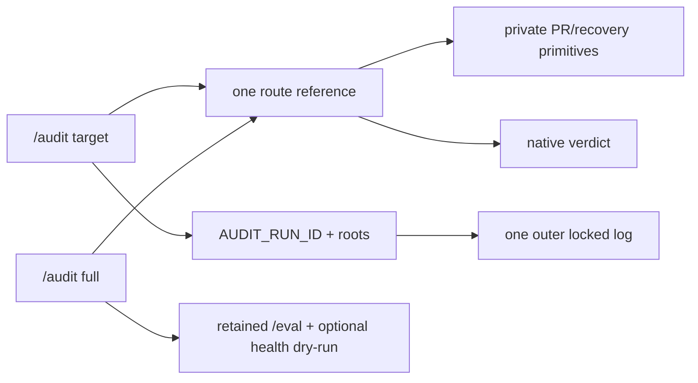

# Audit Architecture

## Relevant Source Files
- `.oh/skills/audit/SKILL.md:20` — public dispatcher, route ownership, effects, and run roots.
- `.oh/skills/audit/scripts/audit-run.sh:1` — executable validation, immutable-root, run-ID, cleanup, and locked-log lifecycle.
- `.oh/skills/audit/scripts/pr-classify.sh:1` — frozen real-GitHub CI evidence/readiness model.
- `.oh/skills/audit/scripts/implementation-gates.sh:1` — rooted task, focused PR, and non-mutating browser gates.
- `.oh/skills/audit/references/full.md:1` — campaign composition and synthesis.
- `.oh/scripts/ablate.sh:1` — shared context/eval recovery state machine.

## Summary
`/audit` is one explicit namespace over nine audit targets. It routes to specialized protocols without flattening their native verdicts, while private PR and recovery primitives provide deterministic evidence shared by workflow callers.

## Detail
The public targets are `implementation`, `pr`, `prs`, `harness`, `context`, `skills`, `eval-quality`, `drift`, and `full` (`.oh/skills/audit/SKILL.md:25`). `/eval`, `/benchmark`, `/ci-status`, `/health-check`, `/watchdog`, and `/wiki lint` remain independent instruments because they execute floors, ceilings, polling, readiness, remediation, or corpus maintenance rather than owning audit targets.

PR acquisition is network-facing but classification is pure JSON-in/JSON-out. Real GitHub CheckRun shapes may carry `status: COMPLETED` alongside a terminal conclusion; failure conclusion takes precedence, pending status follows, and unknown/malformed combinations fail evidence closed. Readiness is intentionally split: `readyForReview` applies only to a green/mergeable/clean draft, `readyToMerge` only to a corresponding non-draft with approved or explicitly review-free state, and `promotable` is their union (`.oh/skills/audit/references/pr-classification.md:5`). Audit never undrafts or merges.

Default execution is report-only except disclosed scoreboards, remote fetches, temporary/recovery state, and one outer log. The executable lifecycle creates invocation-scoped temp state only after usage validation, cleans it on exit/signals, and serializes the single terminal record. Implementation Gate 1 returns nonzero for unfinished stories or missing/root-escaping artifacts; focused PR checks require an explicit repository; browser preflight uses an isolated temporary profile and may neither repair dependencies nor mutate the repository. Comments, labels, closes, external issues, durable context baselines, and wiki ingest are explicit opt-ins. `AUDIT_ROOT` fixes source and scoreboard paths to the invoking checkout; `AUDIT_LOG_ROOT` selects the configured shared log checkout; one immutable `AUDIT_RUN_ID` correlates children and suppresses child logging (`.oh/skills/audit/SKILL.md:61`).

`full` preserves provenance and native verdicts, correlates duplicate root causes, then ranks Tier 1/2/3 findings and concrete Recommended Next 3 Actions. Missing nested fan-out yields a visibly partial campaign with exact reruns, never silent success (`.oh/skills/audit/references/full.md:11`).

The migration is clean-breaking: former standalone audit-family commands and the routing agent are removed, not aliased. Rollback therefore reverts the consolidation atomically and coordinates protected-path restoration; a mixed vocabulary is not a safe rollback.

## System Relationships

## See Also
- [[oh-cli-portable-lifecycle]]
