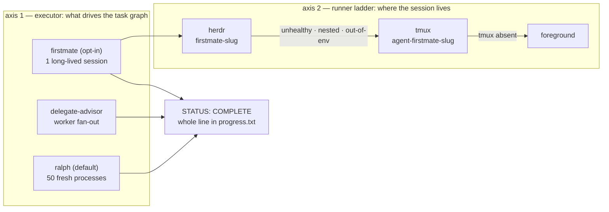

# Build Executor Ladder

## Relevant Source Files
- `.oh/scripts/firstmate.sh:1` — the `firstmate` executor entrypoint: contract validation, sentinel short-circuit, atomic launch-claim lock, prompt render, sentinel watch.
- `.oh/scripts/lib/session-runner.sh:1` — the runner ladder itself: detection gates, session budget, liveness oracle, teardown.
- `.claude/skills/ship-spec/SKILL.md:59` — the `--executor` toggle; Stage 10's "Opt-in (`firstmate`)" subsection at `:379` is the seam.
- `.oh/skills/t3/references/sandbox-processes.md:13` — the process-management norm the ladder was *added* to.
- `.oh/skills/firstmate/SKILL.md:1` — the operator-facing executor contract, watch/recovery matrices, per-mode kill procedure.

## Summary
Open Harness builds a planned `.oh/tasks/<slug>/` folder along **two orthogonal axes**: which *executor* drives the task graph, and which *runner* hosts the session that executor creates. Conflating them is the common mistake — `firstmate` is an executor, `herdr` is a runner, and either varies without the other. `ralph` remains the default executor; the runner ladder is herdr → tmux → foreground.

> **Name disambiguation.** `firstmate` (lowercase, this page) is the **build executor** — `--executor=firstmate`, the `firstmate-<slug>` session, `.oh/scripts/firstmate.sh`. **First Mate** is the **supervisory role charter** at `.oh/context/rules/first-mate.md`, consumed by `.oh/prompts/advisor/*`. The overload is intentional: the executor runs the role's workflow, because its session prompt derives from that pack's step order (`.oh/skills/firstmate/SKILL.md:21`). Never leave which one is meant implicit.

## Detail
**Axis 1 — executor.** `ralph` (default) runs `.oh/scripts/ralph.sh`: up to 50 **fresh single-story processes**, context hygiene by process death. `delegate-advisor` is the legacy `/delegate --plan .oh/tasks/<slug>/prd.json` worker fan-out. `firstmate` (opt-in) is the third — **ONE long-lived session over the whole `prd.json` task graph** (`.claude/skills/ship-spec/SKILL.md:381`), replacing process death with a mandated `/compact` at every story boundary. `ralph` is the **default and is retained indefinitely**; nothing here deprecates it, and any default flip is a separate follow-up gated on a real-build comparison.

**The invariant interface.** All three executors terminate identically: the whole line `STATUS: COMPLETE` in `.oh/tasks/<slug>/progress.txt`. `firstmate.sh` short-circuits to exit 0 when that line is already present (`.oh/scripts/firstmate.sh:430`), and `/ship-spec`, `/autopilot`, and `/spec execute` reconcile the outcome the same way in every arm. Nothing downstream of the sentinel needs to know which executor ran.

**Axis 2 — runner ladder.** `runner_detect` (`.oh/scripts/lib/session-runner.sh:370`) resolves the host top rung first. herdr is eligible only under four conjuncts: the binary exists; `herdr status` reports both literals `status: running` **and** `compatible: yes` (`:337`); the caller is not itself inside a herdr pane (`HERDR_ENV`, `:323` — the zeroth check, so the detection path can never nest); and a short-lived **probe pane's environment fingerprint** (hostname, `/.dockerenv`, worktree resolution) matches the caller's own (`:277`). Any failure degrades to a tmux `agent-firstmate-<slug>` session, then to foreground, with the reason logged — `PROVISIONAL PENDING US-010`, since that degrade path is asserted by unit tests, not yet by a live run.

**Why the fingerprint gate exists.** herdr panes in this deployment are **host** processes driven over a mounted socket, while `AGENTS.md` requires all building and testing to happen **inside** the sandbox. An installed, healthy, but out-of-environment herdr is therefore refused rather than used — `PROVISIONAL PENDING US-010`, the observed refusal being US-010's deliverable for the herdr arm. An explicit `--runner herdr` / `OH_RUNNER=herdr` in that state is a **hard error naming the mismatch**, never a silent host-side run.

**Bounds and exits.** Wall clock is the firstmate ceiling where 50 iterations is ralph's. `resolve_timeout_ms` (`:171`) is the single budget source: `FIRSTMATE_TIMEOUT_MS` defaults to `14400000` (4 h), and `0`, negative, non-numeric, and empty values are rejected back to that default. Expiry, launch failure, and operator abort all run `runner_teardown` (`:587` — `herdr pane close`, or `tmux kill-session`), delete `/tmp/firstmate-<slug>.lock`, and append `FIRSTMATE-INCOMPLETE`; the PR stays draft with a resume comment. The lock is an atomic `mkdir` launch-claim (`.oh/scripts/firstmate.sh:342`), because the read-only liveness oracles cannot close the check-then-start window alone. Whether a mode actually reaches `STATUS: COMPLETE` end to end is `PROVISIONAL PENDING US-010`.

**Process norms.** The ladder was **added** to `.oh/skills/t3/references/sandbox-processes.md:13`, not substituted for the tmux rule: managed/headless processes (cron, gateways, watchdogs, dev servers, tunnels) stay tmux; only agentic build sessions climb the ladder.

## System Relationships

## See Also
- [[audit-architecture]]
