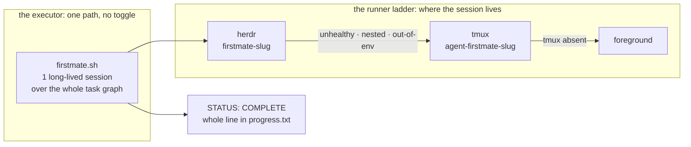

# Build Executor Ladder

## Relevant Source Files
- `.oh/scripts/firstmate.sh:1` — the build-executor entrypoint: contract validation, sentinel short-circuit, atomic launch-claim lock, prompt render, sentinel watch.
- `.oh/scripts/lib/session-runner.sh:1` — the runner ladder itself: detection gates, session budget, liveness oracle, teardown.
- `.claude/skills/spec/references/execute.md:70` — the statement that there is no executor argument; step 4 is the build seam.
- `.oh/skills/t3/references/sandbox-processes.md:13` — the process-management norm the ladder was *added* to.
- `.oh/skills/firstmate/SKILL.md:1` — the operator-facing executor contract, watch/recovery matrices, per-mode teardown procedure.

## Summary
Open Harness builds a planned `.oh/tasks/<slug>/` folder along **one variable axis**. The *executor* — what drives the task graph — is fixed: `.oh/scripts/firstmate.sh` runs ONE long-lived First-Mate session over the whole `prd.json`. Only the *runner* — which session manager hosts that session — varies, along the ladder herdr → tmux → foreground. The common mistake is conflating the two: `firstmate` is the executor, `herdr` is a runner.

> **Name disambiguation — and the overload is now resolved (2026-08-23, spec-simplification US-004).** `firstmate` is the **build executor**: `.oh/scripts/firstmate.sh`, the `firstmate-<slug>` session. The separate **First Mate role charter** (`.oh/context/rules/first-mate.md`) and the `.oh/prompts/advisor/` pack that consumed it were **deleted** — a second, discoverable description of the same workflow is a route an agent can be pulled onto mid-task. The build workflow the child session runs now lives in exactly one place: `.oh/skills/firstmate/templates/session-prompt.md`. That template was a zero-diff derivative of the deleted pack, so the derivative became the source and no step order was lost.

## Detail
**The executor.** There is exactly one, reached by every build path — `/spec execute`. (Until 0.3.0 an `/autopilot` run also deferred its whole build to it; that runner was removed.) It runs **ONE long-lived session over the whole `prd.json` task graph**, with context hygiene supplied by a mandated `/compact` at every story boundary rather than by process death.

**The toggles are gone (2026-08-23, spec-simplification US-002).** Until then three executor arms coexisted — a 50-fresh-process loop as the default, a `/delegate` worker fan-out, and this session as an opt-in third — selected by `--executor` / `SHIP_SPEC_EXECUTOR` / `AUTOPILOT_EXECUTOR`. All three toggles and both other arms were **removed rather than reduced to a single accepted value**, so a reader of any build doc meets one path and no arm-selection question. The stated cost: removing every alternative removes the fallback, so **recovery from a misbehaving ladder or child session is fix-forward only** — leave the PR draft, keep the resumable `.oh/tasks/<slug>/` state, fix the executor.

**The invariant interface.** The build terminates on the whole line `STATUS: COMPLETE` in `.oh/tasks/<slug>/progress.txt`, dual-channelled with the same line as the session's sole final output line. `firstmate.sh` short-circuits to exit 0 when that line is already present, and `/spec execute` reconciles that one outcome.

**The runner ladder.** `runner_detect` (`.oh/scripts/lib/session-runner.sh`) resolves the host top rung first. herdr is eligible only under four conjuncts: the binary exists; `herdr status` reports both literals `status: running` **and** `compatible: yes`; the caller is not itself inside a herdr pane (`HERDR_ENV` — the zeroth check, so detection can never nest); and a short-lived **probe pane's environment fingerprint** (hostname, `/.dockerenv`, worktree resolution) matches the caller's own. Any failure degrades to a tmux `agent-firstmate-<slug>` session, then to foreground, with the reason logged. All three rungs run the same workflow over the same task graph — degrading the runner never changes what is built. **Live-verified** (US-010, 2026-08-12): with herdr masked off `PATH`, `runner_detect` logged `herdr is not installed (command -v herdr failed); degrading to tmux` and the run completed on the tmux rung.

**Why the fingerprint gate exists.** herdr panes in this deployment are **host** processes driven over a mounted socket, while `AGENTS.md` requires all building and testing to happen **inside** the sandbox. An installed, healthy, but out-of-environment herdr is therefore refused rather than used. **Live-verified** (US-010): against a healthy 0.7.4 server the probe pane reported `host=legion-laptop docker=no worktree=no` versus the caller's `host=34263ba23a57 docker=yes worktree=yes`, and `agent start` ignored `--cwd` to land in the host home `/home/ryaneggz` — so herdr was ruled ineligible and the ladder resolved to tmux. **In this deployment the herdr rung is therefore unreachable**, and it stays so until a herdr server runs inside the container. An explicit `--runner herdr` / `OH_RUNNER=herdr` in that state is a **hard error naming the mismatch**, never a silent host-side run.

**The child session is interactive, and nothing may take its TTY.** The launched command carries **no `--print`** and is **never piped or redirected** — the prompt reaches the harness as initial argv read back from `$FIRSTMATE_PROMPT_FILE` inside the launched shell. Both rules are load-bearing (observed 2026-08-23): `--print` makes the harness answer once and exit, and a stdin pipe or a `| tee` on stdout leaves the child without a terminal, so it starts, prints startup warnings, and never advances. Logging that preserves the TTY: tmux mode attaches `tmux pipe-pane` *after* the pane exists, herdr mode uses herdr's own pane capture, and foreground mode inherits the caller's stdio and keeps no session log.

**Bounds and exits.** Wall clock is the ceiling. `resolve_timeout_ms` is the single budget source: `FIRSTMATE_TIMEOUT_MS` defaults to `14400000` (4 h), and `0`, negative, non-numeric, and empty values are rejected back to that default. Expiry, launch failure, and operator abort all run `runner_teardown` (`herdr pane close`, or `tmux kill-session`), delete `/tmp/firstmate-<slug>.lock`, and append `FIRSTMATE-INCOMPLETE`; the PR stays draft with a resume comment. Teardown must never abort on its first branch: the herdr pane lookup is best-effort and returns 0 when no such agent exists, or `--kill` exits silently leaving the session running and the lock claimed (observed and fixed 2026-08-23). The lock is an atomic `mkdir` launch-claim, because the read-only liveness oracles cannot close the check-then-start window alone. **Live-verified for tmux mode** (US-010): one session walked a two-story graph to the whole-line sentinel in 2 m 51 s, which the watch loop observed before tearing the session down and clearing the lock. herdr mode has **not** been run end to end here — the gate refuses it. One caveat the run exposed: the session appends the sentinel *before* its final bookkeeping commit, so a 5-second-poll teardown can cut that commit off.

**Process norms.** The ladder was **added** to `.oh/skills/t3/references/sandbox-processes.md:13`, not substituted for the tmux rule: managed/headless processes (cron, gateways, watchdogs, dev servers, tunnels) stay tmux; only agentic build sessions climb the ladder.

**DeepWiki is not a source here.** A 2026-08-24 read still named the deleted `scripts/ralph.sh` and gave no ladder. That staleness is why `/spec plan` and `/spec execute` dropped the DeepWiki comparison the same day: it regenerates on no schedule a gate can depend on. This page is authoritative.

## System Relationships

## See Also
- [[audit-architecture]]
