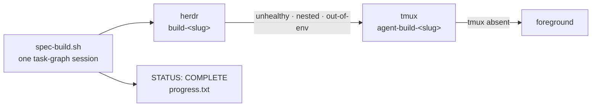

# Build Session Runner Ladder

## Relevant Source Files
- `.oh/scripts/spec-build.sh:1` — task-contract validation, prompt rendering, launch claim, and completion watch.
- `.oh/scripts/lib/session-runner.sh:1` — runner detection, context gate, timeout, liveness, and teardown.
- `.oh/skills/spec/references/execute.md:64` — the single build seam owned by `/spec execute`.
- `.oh/skills/t3/references/sandbox-processes.md:13` — the process-management norm for agentic build sessions.
- `.oh/skills/spec/templates/session-prompt.md:1` — the prompt contract for the long-lived task-graph session.

## Summary
Open Harness builds a planned `.oh/tasks/<slug>/` folder through one `/spec execute` build session. The build session drives the complete `prd.json` graph. Only its host varies: `runner_detect` selects herdr, tmux, or foreground through a downward-only ladder. A runner change does not change the task workflow.

## Detail
**Build session.** `.oh/scripts/spec-build.sh` validates the four-file task contract, renders the prompt, claims a per-slug lock, launches one interactive session, and watches `progress.txt` for the whole-line `STATUS: COMPLETE` marker. `/spec execute` owns the surrounding audit, eval, evidence, retro, and ready-for-review gates.

**Runner ladder.** `runner_detect` tries herdr first. Herdr is eligible only when the binary exists, `herdr status` reports both `status: running` and `compatible: yes`, the caller is not already in a herdr pane, and a probe pane's environment fingerprint matches the caller. An ineligible herdr degrades to tmux with a logged reason. If tmux is unavailable, the session runs in the foreground. Explicit runner choices that cannot be honored fail instead of degrading silently.

**Interactive sessions.** The harness receives the rendered prompt as an argument. Launch paths do not use `--print`, pipe stdin, or redirect the child. Tmux logging attaches with `tmux pipe-pane` after the pane exists; herdr uses pane capture; foreground mode inherits the caller's terminal.

**Bounds and recovery.** `BUILD_SESSION_TIMEOUT_MS` is validated by `resolve_timeout_ms`; the default is `14400000` ms. Expiry, launch failure, and operator abort tear down the runner, remove `/tmp/build-<slug>.lock`, and append `BUILD-SESSION-INCOMPLETE` to `progress.txt`. The herdr server is never stopped or restarted. A stale lock is reclaimable when its runner is not alive.

**Process boundary.** Managed services stay in named tmux sessions. Only agentic build sessions use this ladder. The source snapshot in `raw/` records the prior implementation; current behavior is defined by the source files above.

## System Relationships

## See Also
- [[audit-architecture]]
