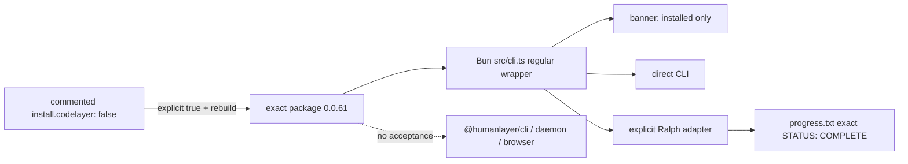

# CodeLayer Bounded Local Coding Harness

## Relevant Source Files
- `harness.yaml.example:30-35` and `.oh/templates/harness.yaml:21-25` — commented default-off operator surface.
- `.devcontainer/Dockerfile:140-152` — exact package pin, path verification, and regular-wrapper replacement.
- `.oh/install/codelayer-wrapper.sh:1-2` — exact Bun source dispatch.
- `.oh/install/codelayer-status.sh:3-12` — installed-only banner semantics.
- `.oh/scripts/ralph.sh:246-301` — safe explicit adapter and completion authority.
- `.oh/scripts/codelayer-image-smoke.sh:1-92` — build-only enabled/default no-egress proof and cleanup.
- `.oh/docs/rfcs/rfc-codelayer-remote-daemon.md` — bounded acceptance and Draft daemon appendix.
- [Issue #635](https://github.com/mifunedev/openharness/issues/635), [core PR #636](https://github.com/mifunedev/openharness/pull/636), and [web PR #21](https://github.com/mifunedev/openharness-web/pull/21) — final cross-repository alignment artifacts.

## Summary

Open Harness supports exactly `@humanlayer/codelayer@0.0.61` as a default-off local coding harness. Real enabled/default images prove the harness-owned Bun source wrapper and explicit Ralph argv parser; installation is not provider authentication, and every remote-daemon surface remains Draft/deferred/unsupported.

## Detail

The pinned package declares `dist/cli.js` but omits it while publishing `src/cli.ts` and JS bundles ([pinned package](https://unpkg.com/@humanlayer/codelayer@0.0.61/package.json)). When and only when `install.codelayer: true` maps to exact `INSTALL_CODELAYER=true`, the image installs under `/usr/local`, verifies Bun and published source, unconditionally removes `/usr/local/bin/codelayer`, and creates a `root:root 0755` regular non-symlink wrapper (`.devcontainer/Dockerfile:140-152`). It dispatches exactly to Bun with preserved argv (`.oh/install/codelayer-wrapper.sh:1-2`) and vendors no upstream source.

The banner derives installation from `command -v` plus local help and explicitly says authentication is unverified (`.oh/install/codelayer-status.sh:3-12`). Provider/API-key/model behavior is operator configuration from pinned source, not authenticated evidence: options are defined in [`src/command.ts`](https://unpkg.com/@humanlayer/codelayer@0.0.61/src/command.ts), and provider credential/default behavior in [`src/providers.ts`](https://unpkg.com/@humanlayer/codelayer@0.0.61/src/providers.ts).

Ralph selects CodeLayer only explicitly. Its simple extra-flags contract rejects quotes, backslashes, shell metacharacters, globs, and all prompt/provider collisions, then uses a Bash array with globbing disabled and no `eval` (`.oh/scripts/ralph.sh:246-287`). Ralph owns long `--prompt`; optional provider shape is exactly `--provider VALUE`. CodeLayer output is diagnostic; only exact-line `STATUS: COMPLETE` in `progress.txt` completes (`.oh/scripts/ralph.sh:289-301,389-408`).

A long-lived tmux server normally contributes its preexisting environment even with `new-session -E`; unrelated variables remain normal Ralph/tmux inheritance, not a clean-server requirement. CodeLayer launches use tmux 3.3a per-session `-e NAME=value` arguments to override only `RALPH_CODELAYER_PROVIDER`, `RALPH_CODELAYER_FLAGS`, the pinned-source credentials `OPENAI_API_KEY`, `ANTHROPIC_API_KEY`, `FIREWORKS_API_KEY`, `EXA_API_KEY`, and documented AgentLayer path overrides `AGENTLAYER_AUTH_PATH`, `AGENT_SDK_AUTH_PATH`, `OPENCODE_AUTH_PATH`. Values never enter the pane command/log, set-empty is preserved, and absent allowlisted names are explicitly unset so stale copies do not win. Sources: [CodeLayer README](https://unpkg.com/@humanlayer/codelayer@0.0.61/README.md), [`providers.ts`](https://unpkg.com/@humanlayer/codelayer@0.0.61/src/providers.ts), and [AgentLayer auth README](https://unpkg.com/@humanlayer/agentlayer-provider-auth@0.0.61/README.md).

The 2026-07-12 internal-network smoke proved real help, regular wrapper/source uniqueness, and exact adapter-shaped parsing to exit `1` with pinned `src/providers.ts:42`'s missing-`OPENAI_API_KEY` message. Default image absence also passed. This establishes local executable/parser compatibility only—not authentication, provider connectivity, model availability, or remote E2E.

Final alignment is bounded and cross-linked through [issue #635](https://github.com/mifunedev/openharness/issues/635), [core PR #636](https://github.com/mifunedev/openharness/pull/636), and [openharness-web PR #21](https://github.com/mifunedev/openharness-web/pull/21).

`@humanlayer/cli`, daemon lifecycle, login, launch tokens, browser control, ports, remote workspaces, credential storage, and control-plane behavior remain Draft, deferred, and unsupported.

## System Relationships

## See Also
- [[sandbox-dependency-installs]]
