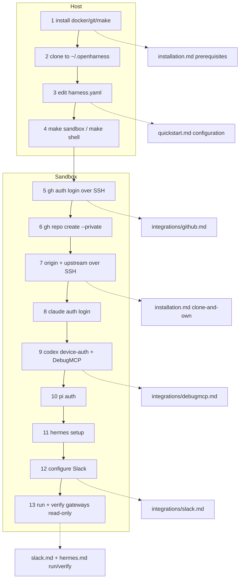

# Fresh-Machine Setup Flow

## Relevant Source Files
- `.oh/docs/quickstart.md` — the **canonical human walkthrough** (13 ordered steps, commands inlined). This entry is a synthesis + doc-handoff map only; keep it in sync with quickstart's step list.
- `.oh/docs/installation.md` — host prerequisites (incl. `make`) and the clone-and-own private-origin + upstream pattern.
- `.oh/docs/integrations/github.md` — SSH auth (interactive + entrypoint auto-keygen).
- `.oh/docs/integrations/debugmcp.md` — DebugMCP extension runbook.
- `.oh/docs/integrations/slack.md`, `.oh/docs/harnesses/hermes.md` — Slack config + gateway run/verify.
- `.devcontainer/entrypoint.sh:275-309` — auto SSH keygen + pubkey upload when `GH_TOKEN` carries `admin:public_key`.
- `.oh/scripts/gateway.sh` — sandbox-only lifecycle for the sibling `client-slack-pi` / `client-slack-hermes` sessions.

## Summary
Validated 2026-07-01 on a bare OVHcloud host: the path from a fresh Linux machine to an
authenticated multi-agent Open Harness sandbox is 13 ordered steps. Steps 1–4 run on the
**host** (install deps, clone, edit `harness.yaml`, bring the sandbox up); steps 5–13 run
**inside the sandbox** (GitHub SSH auth, private origin + upstream, per-harness auth, Slack,
gateway run/verify). Each fact has one canonical doc home, and `quickstart.md` is the single
self-sufficient human walkthrough.

## Detail
Host prerequisites are Docker (+ Compose), Git, and **make** — the `make sandbox` / `make
shell` wrappers make `make` non-optional (a long-standing "Docker + Git only" doc gap, now
fixed). Configuration lives in `harness.yaml` (`sandbox.*`, `git.user_name` /
`git.user_email`, optional installs); secrets stay in the gitignored devcontainer env file,
never in `harness.yaml`.

The recommended repo topology is **clone-and-own**: clone upstream, create a *private* repo
as `origin`, keep `mifunedev/openharness` as `upstream`. Both remotes use SSH URLs so pushes
ride the key generated in-sandbox. GitHub auth has two SSH paths: interactive (pick SSH
during login, generate a key, paste a token) or automatic (the entrypoint generates an
ed25519 key and uploads the public key when `GH_TOKEN` carries `admin:public_key`;
idempotent).

Per-harness auth, in order: Claude (verified against v2.1.198), Codex via device-auth plus
the `microsoft/DebugMCP` VS Code extension installed on the machine running the IDE and
attach-to-container, Pi (provider OAuth), and Hermes (opt-in via `install.hermes`).

Slack + gateways: the `pi-messenger-bridge` package bridges Slack to Pi; Hermes uses its
native gateway. Both gateways are managed by the **same** `.oh/scripts/gateway.sh` lifecycle
in **sibling** tmux sessions (`client-slack-pi`, `client-slack-hermes`), each holding its own
Slack app. Run commands are **sandbox-only** (they need `pi` / `hermes` on `PATH`). Verify a
live gateway **read-only** (`tmux attach -r`), detaching with `Ctrl-b d`, so the session is
never accidentally killed; logs mirror to `/tmp/client-slack-{pi,hermes}.log`.

`confidence: provisional` — the Claude auth command and the `gateway status` / `tmux -r`
mechanics are live-verified in the running sandbox; Pi/Hermes/Slack auth were not re-run
live for this entry. Commands themselves live in `quickstart.md`, not here.

## System Relationships

## See Also
- [[sandbox-dependency-installs]]
