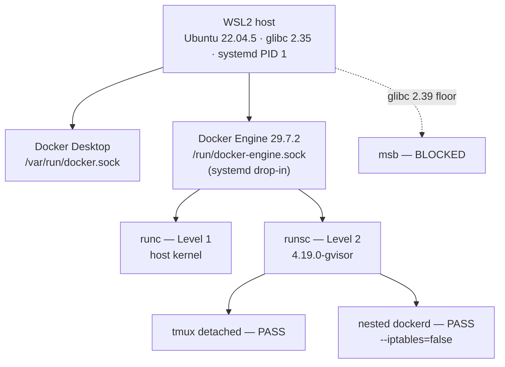

# gVisor as a WSL2 Substrate (measured)

## Relevant Source Files
- `raw/2026-08-19-gvisor-wsl2-spike.md` — the immutable capture of every command and its output.
- `.oh/docs/rfcs/rfc-gvisor-support.md` — the RFC that this measurement backs.
- `.oh/docs/rfcs/rfc-runtime-support.md` — the parent A1/A2/A3 contract and fit matrix.

## Summary
An operator measured two isolation tiers on a WSL2 host on 2026-08-19. gVisor
(`runsc`) returned GREEN on a round trip, and MicroSandbox (`msb`) returned BLOCKED
on a glibc floor. The load-bearing result is that **a detached tmux session survives
under `runsc`**, because the Open Harness process model makes tmux normative and no
upstream gVisor document states how `runsc` handles PTYs.

## Detail

**The tmux result decides the tier.** Cron, the Slack gateway, the watchdog, and
every `agent-` build session run in named tmux sessions
(`.oh/skills/t3/references/sandbox-processes.md`). A substrate that drops a detached
session cannot host the workspace, whatever its isolation depth. Under `runsc`,
`tmux new-session -d` followed by `tmux ls` listed the session, and `tmux
has-session` exited 0.

**Isolation is real and visible in one command.** `uname -r` returns
`4.19.0-gvisor` inside `runsc` and `6.18.33.2-microsoft-standard-WSL2` under `runc`.
A userspace kernel serves the syscalls.

**The cost has two numbers, and only one flatters the tier.** An `npm ci` over 1055
dependencies cost 1.15x on wall-clock and 2.05x on CPU. `npm ci` waits on the
network and on disk, and that wait hides most of the userspace-kernel cost inside
`real`. A CPU-bound workload pays the 2.05x. Never publish an upstream percentage
here: the upstream performance guide measures the `ptrace` platform, and the default
platform is `systrap`.

**Nested Docker works, with two flag costs.** Nested `dockerd` starts inside gVisor
and runs containers. Nested `dockerd` needs `--iptables=false`, and that flag breaks
`docker run -p` and `docker run --expose`, so nested containers need
`--network=host`. The outer container needs `--privileged`, which returns part of
the isolation that `runsc` provides.

**A glibc floor blocks MicroSandbox, not `/dev/kvm`.** The installer requires
glibc 2.39 or newer. The WSL2 host reports 2.35, and the devcontainer reports 2.36.
Both harness machines fall below the floor. The WSL2 host does expose `/dev/kvm`, so
a reader who blames the KVM device would expect the host to unblock the tier. The
host does not. glibc 2.39 needs Ubuntu 24.04 or newer.

**Two host facts contradict the plan's runbook.** The measured host runs `systemd`
as PID 1, against a runbook that states WSL2 Ubuntu 22.04 ships no systemd. Docker
Engine and Docker Desktop also contend for `/var/run/docker.sock`, because one
socket path holds one listener; the runbook presents `docker context use
desktop-linux` as a free switch back, and the switch back is not free.

**The IPv6 failure is not a gVisor limit.** A nested registry pull failed on an
absent IPv6 route. The same test under `runc` reports zero global IPv6 addresses, so
the cause is host network configuration. Label the failure policy/config.

## System Relationships

The two daemons need separate socket paths. `docker.socket` stays disabled, because
that unit re-binds the contested path.

| Tier | Level | Verdict | Gate |
|---|---|---|---|
| `runc` | 1 | default | shares the host kernel |
| `runsc` | 2 | GREEN | opt-in, measured |
| `msb` | 3 | BLOCKED | glibc 2.39 |

## See Also
- [[runtime-isolation-landscape]]
- [[crabbox-remote-exec-control-plane]]
- [[build-executor-ladder]]
