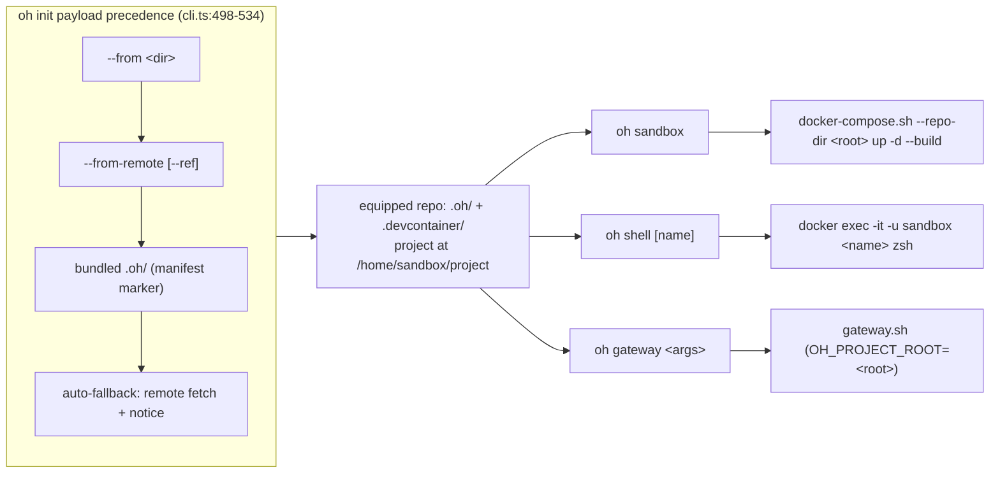

# oh CLI Portable Lifecycle

## Relevant Source Files
- `.oh/cli/src/cli.ts` — arg parsing, `resolveInitSource` (payload precedence + auto-fallback), `runWithRemoteSource` (temp checkout + version-skew line), verb dispatch.
- `.oh/cli/src/lib/remote.ts` — `fetchRemoteSource`: shallow clone, `GIT_TERMINAL_PROMPT=0`, bounded timeout.
- `.oh/cli/src/commands/lifecycle.ts` — `oh sandbox` / `oh shell` / `oh gateway` thin wrappers.
- `.oh/cli/src/lib/project.ts` — equipped-root walk-up resolver.
- `.oh/cli/src/commands/init.ts` — scaffold + `/home/sandbox/project` compose rewrite.
- `.oh/cli/src/commands/update.ts` — `.oh/`-only upgrade.
- `.oh/scripts/docker-compose.sh`, `gateway.sh`, `harness-config.sh` — the vendored scripts the verbs delegate to.

## Summary
Issue #564 gives a consumer repo a standalone lifecycle that needs no OpenHarness checkout kept around: `oh init --from-remote` equips the repo by fetching the payload from the public repo, then `oh sandbox`, `oh shell`, and `oh gateway` drive the sandbox by wrapping the vendored `.oh/scripts/` — the same scripts the source repo's Makefile drives. Bundling the payload into a published binary is a stated non-goal, gated on the npm publish decision.

## Detail
**Payload sourcing (`oh init`)** — precedence `--from <dir>` > `--from-remote` > the CLI's own bundled payload (`cli.ts:139-141`; the two flags conflict, `cli.ts:305-308`). With no source flag and no bundled payload — the installed-binary case, detected via the `manifest.json` marker (`cli.ts:464-469`) — `resolveInitSource` auto-falls back to a remote fetch with a one-line notice naming URL and ref (`cli.ts:498-534`). `--from` sets only the payload source; `--from-remote` sets BOTH payload and templates from the fetched checkout (`cli.ts:478-484`). `oh update` never falls back: it requires `--from` or `--from-remote` (`cli.ts:383-388`) and upgrades only `.oh/` (`cli.ts:110-111`).

**Remote fetch** — `git clone --depth 1 [--branch <ref>] -- <url> <tmp>` of `https://github.com/mifunedev/openharness` (`remote.ts:13,101-103`) with `GIT_TERMINAL_PROMPT=0` and a 120 s timeout (`remote.ts:14,106`). `runWithRemoteSource` makes the temp checkout, wraps the whole run in try/finally cleanup, and prints `fetched payload vX (installed CLI vY)` so version skew is visible (`cli.ts:577-594`).

**Lifecycle verbs** — deliberately thin wrappers; no compose-argv or harness.yaml parsing is re-implemented in TypeScript (`lifecycle.ts:10-16`). Each resolves the equipped root by walking up from cwd to the nearest `.oh/` directory (`project.ts:20-32`).
- `oh sandbox` — seeds `harness.yaml` from `harness.yaml.example` when missing (its only writer, `lifecycle.ts:116-123`), then runs `bash .oh/scripts/docker-compose.sh --repo-dir <root> up -d --build` (`lifecycle.ts:136`).
- `oh shell [container]` — `docker exec -it -u sandbox <name> zsh`; name precedence: positional arg > `harness-config.sh get sandbox.name <root>/harness.yaml` > `openharness` (`lifecycle.ts:78,156,172-173`).
- `oh gateway <args…>` — verbatim pass-through to `bash .oh/scripts/gateway.sh` with `OH_PROJECT_ROOT=<root>` (`lifecycle.ts:196-198`; `gateway.sh:29`).

Equipped consumer repos mount the project at `/home/sandbox/project`: init rewrites the compose paths (`init.ts:503`) and writes that `workspaceFolder` (`init.ts:515`).

**Troubleshooting / limits**
- Host prerequisites: Node.js ≥ 18 (the bundle targets `node20` syntax, `build.mjs:19`, so 20+ is safest), git, docker. No `make` on this path.
- Private/auth remotes unsupported: `GIT_TERMINAL_PROMPT=0` makes them fail fast with a `--from <dir>` offline-fallback hint (`remote.ts:106,128-135`). Public HTTPS only.
- Version skew: default ref is the clone's default branch; the printed skew line plus `--ref <branch|tag>` pinning are the guard (`cli.ts:589`; `remote.ts:102`).
- Retrofit gap: repos equipped before `a4d3282` keep `/home/sandbox/harness` in their compose; `oh update` touches only `.oh/` and performs no project-file migration.
- Bundling non-goal: shipping the payload inside a published package is gated on publishing (`cli.ts:492-493`; `.oh/cli/package.json` stays `"private": true`); the bundled-payload branch only fires for source-checkout builds.

DeepWiki comparison (2026-07-03): no public DeepWiki page covers the `oh` CLI consumer lifecycle — the public wiki tracks the pre-#531 layout; this entry fills that gap.

## System Relationships

## See Also
- [[fresh-machine-setup]]
