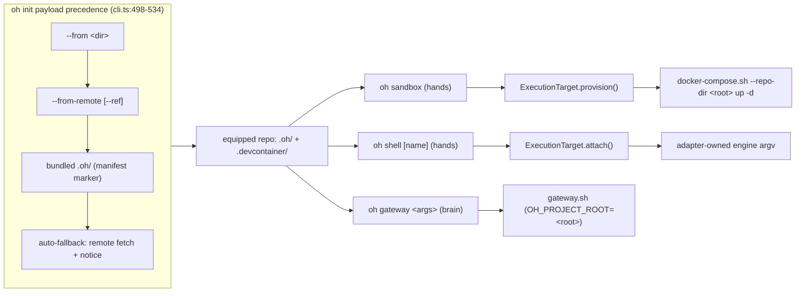

# oh CLI Portable Lifecycle

## Relevant Source Files
- `.oh/cli/src/lib/execution/target.ts` — the provider-neutral `ExecutionTarget` contract: types and interface only, no engine nouns.
- `.oh/cli/src/lib/execution/docker-compose-target.ts` — the first (and, in Phase-0, only) adapter; owns the substrate argv.
- `.oh/cli/src/commands/lifecycle.ts` — `oh sandbox` / `oh shell` / `oh gateway`; thin wrappers over the contract and the vendored scripts.
- `.oh/cli/src/cli.ts` — arg parsing, `resolveInitSource` (payload precedence + auto-fallback), `runWithRemoteSource` (temp checkout + version-skew line), verb dispatch.
- `.oh/cli/src/lib/remote.ts` — `fetchRemoteSource`: shallow clone, `GIT_TERMINAL_PROMPT=0`, bounded timeout.
- `.oh/cli/src/lib/project.ts` — equipped-root walk-up resolver.
- `.oh/cli/src/commands/init.ts` — scaffold + devcontainer generation.
- `.oh/cli/src/commands/update.ts` — `.oh/`-only upgrade.
- `.oh/scripts/docker-compose.sh`, `gateway.sh`, `harness-config.sh` — the vendored scripts the verbs delegate to.

## Summary
Issue #564 gives a consumer repo a standalone lifecycle that needs no OpenHarness checkout kept around: `oh init --from-remote` equips the repo by fetching the payload from the public repo, then `oh sandbox`, `oh shell`, and `oh gateway` drive the sandbox by wrapping the vendored `.oh/scripts/` — the same scripts the source repo's Makefile drives. Bundling the payload into a published binary is a stated non-goal, gated on the npm publish decision.

Issue #738 adds `docs/**` to the `.oh/manifest.json` include list. `oh init` and `oh update` now deliver `.oh/docs/` markdown, while the manifest still excludes `.oh/patches/`.

## Detail
**Payload sourcing (`oh init`)** — precedence `--from <dir>` > `--from-remote` > the CLI's own bundled payload (`cli.ts:139-141`; the two flags conflict, `cli.ts:305-308`). With no source flag and no bundled payload — the installed-binary case, detected via the `manifest.json` marker (`cli.ts:464-469`) — `resolveInitSource` auto-falls back to a remote fetch with a one-line notice naming URL and ref (`cli.ts:498-534`). `--from` sets only the payload source; `--from-remote` sets BOTH payload and templates from the fetched checkout (`cli.ts:478-484`). `oh update` never falls back: it requires `--from` or `--from-remote` (`cli.ts:383-388`) and upgrades only `.oh/` (`cli.ts:110-111`).

**Manifest delivery** — `.oh/manifest.json` defines POSIX globs relative to `.oh/` (`manifest.ts:4-8`). `shouldShip()` requires an include match and rejects an exclude match (`manifest.ts:59-70`). The source manifest includes `docs/**` and omits `patches/**` (`.oh/manifest.json:2-23`).

`copyOhPayload()` applies this decision during both `oh init` and `oh update` (`vendor.ts:76-85`). The function copies the cited `.oh/docs/rfcs/rfc-brain-hands-boundary.md`. The path guard rejects writes outside the target `.oh/` (`vendor.ts:17-21,119-120`). This entry cites the RFC and does not restate its decisions.

**Remote fetch** — `git clone --depth 1 [--branch <ref>] -- <url> <tmp>` of `https://github.com/mifunedev/openharness` (`remote.ts:13,101-103`) with `GIT_TERMINAL_PROMPT=0` and a 120 s timeout (`remote.ts:14,106`). `runWithRemoteSource` makes the temp checkout, wraps the whole run in try/finally cleanup, and prints `fetched payload vX (installed CLI vY)` so version skew is visible (`cli.ts:577-594`).

**Lifecycle verbs** — deliberately thin wrappers; no compose-argv or harness.yaml parsing is re-implemented in TypeScript (`lifecycle.ts:22-25`). Each resolves the equipped root by walking up from cwd to the nearest `.oh/` directory (`project.ts:20`). Since #733 the two hands-side verbs reach their environment through the `ExecutionTarget` contract instead of naming an engine themselves; `resolveExecutionTarget()` is internal — no harness.yaml key, CLI flag, or env var selects a target.

| Verb | Side | Route | Delegates to |
| --- | --- | --- | --- |
| `oh sandbox` | hands | `provision()` (`lifecycle.ts:239-246`) | `bash .oh/scripts/docker-compose.sh --repo-dir <root> up -d --build\|--no-build` |
| `oh shell [name]` | hands | `attach({argv:["zsh"], user:"sandbox"})` (`lifecycle.ts:294-297`) | the adapter's engine argv (`docker-compose-target.ts:194-214`) |
| `oh gateway <args…>` | brain | none — deliberately not routed | `bash .oh/scripts/gateway.sh` with `OH_PROJECT_ROOT=<root>` (`gateway.sh:29`) |

Brain-side policy stays in `lifecycle.ts` and the target decides none of it: the `harness.yaml` seed — its only writer (`:115`) — the default-off Docker-socket opt-in prompt, `--image` ref resolution (`--image=<ref>` > harness.yaml `sandbox.image` > `ghcr.io/mifunedev/openharness:latest`), and `oh shell`'s container-name precedence: positional arg > `harness-config.sh get sandbox.name <root>/harness.yaml` > `openharness` (`:293`). `oh gateway` is orchestration rather than execution, so it stays brain-side by design and is unchanged. The rationale for that split, the four state classes, and why `attach()` is synchronous in `contractVersion: 1` live in `.oh/docs/rfcs/rfc-brain-hands-boundary.md` — cite it, do not restate it.

Equipped repos mount the project at `/home/sandbox/harness`, the `workspaceFolder` `oh init` writes (`init.ts:503`); `oh update` touches only `.oh/` and performs no project-file migration.

**Troubleshooting / limits**
- Host prerequisites: Node.js ≥ 18 (the bundle targets `node20` syntax, `build.mjs:19`, so 20+ is safest), git, docker. No `make` on this path.
- Private/auth remotes unsupported: `GIT_TERMINAL_PROMPT=0` makes them fail fast with a `--from <dir>` offline-fallback hint (`remote.ts:106,128-135`). Public HTTPS only.
- Version skew: default ref is the clone's default branch; the printed skew line plus `--ref <branch|tag>` pinning are the guard (`cli.ts:589`; `remote.ts:102`).
- Bundling non-goal: shipping the payload inside a published package is gated on publishing (`cli.ts:492-493`; `.oh/cli/package.json` stays `"private": true`); the bundled-payload branch only fires for source-checkout builds.

DeepWiki comparison (2026-08-13, when the workflow still required one — the step was removed 2026-08-24): that comparison used source snapshot `8e145e31`. DeepWiki lists public `docs/` pages but does not describe `.oh/manifest.json`, `oh init`, `oh update`, or `.oh/docs/` delivery. Local sources define those contracts. The comparison found a local coverage gap and does not change the `docs/**` decision.

## System Relationships

```mermaid
flowchart LR
  subgraph SRC["oh init payload precedence (cli.ts:498-534)"]
    direction TB
    A["--from &lt;dir&gt;"] --> B["--from-remote [--ref]"]
    B --> C["bundled .oh/ (manifest marker)"]
    C --> D["auto-fallback: remote fetch + notice"]
  end
  SRC --> INIT["equipped repo: .oh/ + .devcontainer/"]
  INIT --> SB["oh sandbox (hands)"] --> PV["ExecutionTarget.provision()"] --> DC["docker-compose.sh --repo-dir &lt;root&gt; up -d"]
  INIT --> SH["oh shell [name] (hands)"] --> AT["ExecutionTarget.attach()"] --> DE["adapter-owned engine argv"]
  INIT --> GW["oh gateway &lt;args&gt; (brain)"] --> GS["gateway.sh (OH_PROJECT_ROOT=&lt;root&gt;)"]
```

## See Also
- [[fresh-machine-setup]]
- [[release-versioning]] — the harness release version; the `@mifune/openharness` npm version is independent of it.
- `.oh/docs/rfcs/rfc-brain-hands-boundary.md` — authority for the brain/hands split this entry routes through.
