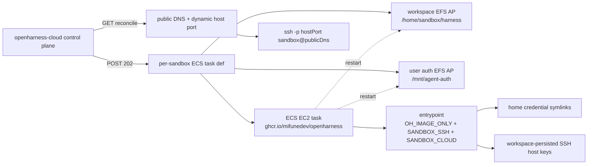

# OpenHarness Cloud MVP Architecture

## Relevant Source Files
- `raw/2026-07-07-openharness-cloud-mvp.md` — captured plan-of-record for the #341 cloud MVP ADRs, functional requirements, non-goals, and wiki alignment.
- `.devcontainer/entrypoint.sh` — implemented base-image cloud wiring: `SANDBOX_CLOUD` auth symlinks and persisted SSH host keys.
- `.oh/docs/integrations/sshd.md` — human-facing ECS consumption contract for the base image.
- `.oh/evals/probes/sandbox-cloud-ssh-readiness.sh` — Tier-A guard that keeps the cloud branch and SSH regression floor present.

## Summary
The cloud MVP treats an OpenHarness sandbox as one ECS-EC2 task backed by two EFS Access Points: a per-sandbox workspace and a per-user auth mount. It deliberately uses the normal `ghcr.io/mifunedev/openharness:<tag>` image, with `SANDBOX_SSH=true` for the PR #599 SSH overlay and `SANDBOX_CLOUD=true` for cloud-only persistence wiring, while the customer-facing control plane lives in the separate `mifunedev/openharness-cloud` repo.

## Detail
**Image and auth boundary.** There is no separate cloud image: ECS deploys `ghcr.io/mifunedev/openharness:<tag>` directly (`raw/2026-07-07-openharness-cloud-mvp.md:64-80`). The base SSH overlay remains independently gated by `SANDBOX_SSH=true`, which starts `sshd`, seeds `authorized_keys` from `SANDBOX_SSH_AUTHORIZED_KEYS`, and keeps password auth off unless explicitly enabled (`.devcontainer/entrypoint.sh:382-431`). The cloud additions are a separate `SANDBOX_CLOUD` branch, documented as independent from `SANDBOX_SSH` so local boots remain unaffected (`.devcontainer/entrypoint.sh:181-185`). In cloud mode, the entrypoint creates `/mnt/agent-auth/{claude,codex,pi,gh,ssh}` as the `sandbox` user and symlinks `~/.claude`, `~/.codex`, `~/.pi`, `~/.config/gh`, and `~/.ssh` there (`.devcontainer/entrypoint.sh:193-216`). It also persists host keys under `$OH_PROJECT_ROOT/.oh/.ssh-hostkeys` and symlinks `/etc/ssh/ssh_host_*` to that workspace-backed directory (`.devcontainer/entrypoint.sh:221-267`). The SSH docs define the ECS env contract and the two mount points (`.oh/docs/integrations/sshd.md:116-155`).

**ECS/EFS model.** Each sandbox gets its own task-definition family and two EFS APs: workspace at `/home/sandbox/harness`, auth at `/mnt/agent-auth` (`raw/2026-07-07-openharness-cloud-mvp.md:101-109`). This is forced by ECS constraints: `RunTask` cannot override volumes/mount points, ECS has no Kubernetes-style `subPath`, and EFS AP `CreationInfo` gives uid/gid 1000 writeability without a privileged initializer (`raw/2026-07-07-openharness-cloud-mvp.md:111-122`). The plan intentionally uses 2 APs plus symlinks instead of six credential mounts, preserving the same persistence contract with fewer AWS resources (`raw/2026-07-07-openharness-cloud-mvp.md:124-128`). A shared EFS root is rejected because the sandbox user has sudo and would otherwise be able to read other users' credentials (`raw/2026-07-07-openharness-cloud-mvp.md:130-132`).

**Provisioning and access.** `POST /api/provision/sandbox` is async: register APs/task def, call `RunTask`, write DB rows, and return `202` immediately; `GET` is the reconciler because Netlify timeout is shorter than cold ECS startup (`raw/2026-07-07-openharness-cloud-mvp.md:195-199`). SSH exposure uses ECS bridge mode with `containerPort: 22` and dynamic host ports; status resolves public DNS and host port and returns `ssh -p <hostPort> sandbox@<publicDns>` (`raw/2026-07-07-openharness-cloud-mvp.md:136-144`, `raw/2026-07-07-openharness-cloud-mvp.md:371-378`). Non-goals are explicit: no Fargate/EKS, real user auth/RBAC, dashboard, multi-cloud, billing, per-sandbox cloudflared, Terraform, sshd supervision, or cloud image fork in this MVP (`raw/2026-07-07-openharness-cloud-mvp.md:380-392`).

DeepWiki comparison (2026-07-07): the PRD expects no relevant public DeepWiki page for this ECS provisioning flow; the closest existing concepts are the sandbox entrypoint and image lifecycle, while this entry names the new sandbox-as-ECS-task vocabulary (`raw/2026-07-07-openharness-cloud-mvp.md:433-450`).

## System Relationships

## See Also
- [[fresh-machine-setup]]
- [[sandbox-dependency-installs]]
