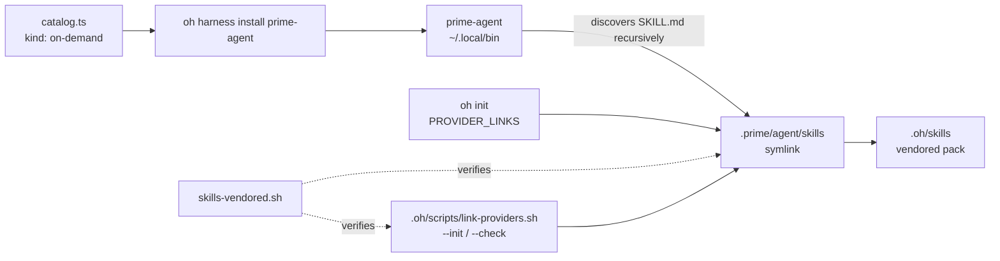

# Prime Agent Harness Surface

## Relevant Source Files

- `.oh/scripts/link-providers.sh` — the runtime wiring: `provider_links` (`:39`–`:47`) and the `--check` verifier.
- `.oh/cli/src/commands/init.ts` — the second, independent copy of that list, `PROVIDER_LINKS` (`:540`–`:549`), used when scaffolding a fresh project.
- `.oh/cli/src/lib/harnesses/catalog.ts` — the harness catalog; the `prime-agent` entry at `:209`–`:220`.
- `.oh/cli/src/__tests__/harness-catalog.test.ts` — the drift test that constrains what a catalog entry may declare.
- `.oh/evals/probes/skills-vendored.sh` — the parity oracle; resolve loop at `:37`, clean-clone assert at `:59`.
- `.prime/agent/settings.json`, `.prime/agent/APPEND_SYSTEM.md`, `.prime/agent/.gitignore` — the committed config surface.
- `.oh/docs/harnesses/prime-agent.md` — the human-facing doc the catalog's `docsPath` requires to exist.

## Summary

**Harness** and **provider surface** are two different things in this repo, wired by two
different mechanisms. A harness is an agent CLI the `oh` CLI knows how to install; a
provider surface is a directory that exposes the vendored `.oh/skills` pack to one of them.
Prime Intellect's `prime-agent` is both: a harness installed on demand, and the fifth
provider surface at `.prime/agent/skills`. It is its own harness — its config, auth, and
session model are its own, and none of Pi's settings apply to it.

## Detail

**Two wiring mechanisms, deliberately duplicated.** The symlink list exists twice:
`link-providers.sh:39-47` repairs a live checkout, and `init.ts:540-549` scaffolds a fresh
one. Neither reads the other; a surface added to only one silently drifts. The prime row
targets `../../.oh/skills` rather than `../.oh/skills` because it nests one level deeper
than the other four. No special case was needed for that depth — `link_provider()` already
runs `mkdir -p` on the link's parent (`link-providers.sh:97`), and `linkReport()` already
calls `mkdirSync(..., { recursive: true })` — which is why the opt-in Hermes link's special
casing (`link-providers.sh:48-49`) is about being opt-in, not about being nested.

**`kind: "on-demand"` is a claim about the image, not about support.** The catalog's three
kinds are `default` (in the image's `AGENTS` build-arg list), `optional` (behind an
`INSTALL_*` build arg), and `on-demand` (never baked in, fetched at use time). `t3code` was
the only prior `on-demand` entry. Choosing it for `prime-agent` is what keeps
`.devcontainer/Dockerfile`, `docker-compose.yml`, and both `.example.env` files out of the
change: `harness-catalog.test.ts` requires `harnessKey` and `buildArg` to appear together
and forbids either on a non-`optional` kind, and it pins the flagged-harness list to exactly
four ids. Declaring neither satisfies all three.

**The installer's prompts read `/dev/tty`, not stdin.** `install.sh` confirms twice before
installing, and its prompt helper opens the controlling terminal directly, so `< /dev/null`
does not silence it. `setsid --wait` removes the controlling terminal, the helper reports
"no terminal", and both prompts proceed on their own. The same argv sets
`npm_config_prefix=/home/sandbox/.local` — without it the global install targets root-owned
`/usr/lib/node_modules` and fails `EACCES` for the `sandbox` user. This is the same prefix
`pi` uses, and it is what lets `prime-agent update` run without sudo.

**No context-file alias is needed.** `prime-agent` reads `AGENTS.md` and `CLAUDE.md`
natively (`--no-context-files` disables it), so the `writeClaudeAlias()` machinery other
providers need does not apply.

## System Relationships

The catalog installs the binary; the symlink feeds it skills. The two are independent —
installing the harness without the surface yields an agent with no Open Harness skills, and
the surface without the harness is an inert symlink. `skills-vendored.sh` is the only thing
that fails when either half of the symlink wiring is dropped.

## See Also

- [[oh-cli-portable-lifecycle]]
- [[sandbox-dependency-installs]]
