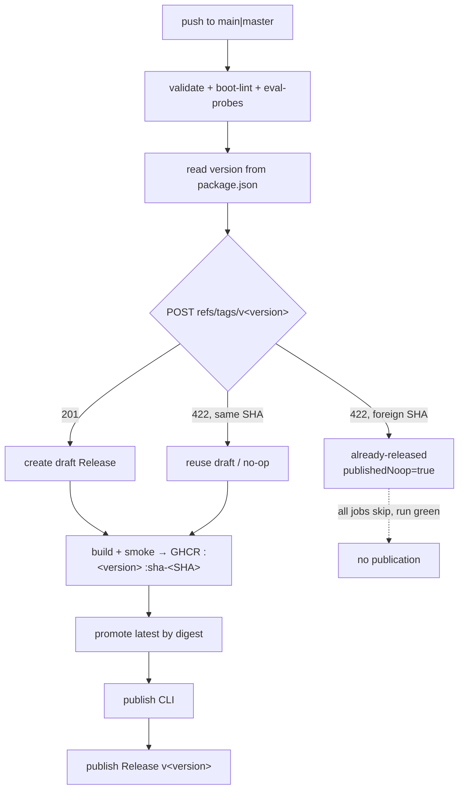

# Release Versioning

## Relevant Source Files
- `package.json:3` — the single source of truth for the release version.
- `.github/workflows/release.yml:120` — the `reserve` job: reads the version, then reserves the tag.
- `.oh/scripts/release-reservation.mjs:20` — `SEMVER_PATTERN`; the pure state machine, no I/O and no clock.
- `.oh/scripts/reserve-github-release.mjs:15` — `releaseTagName`, the only site that adds the `v` prefix.
- `.oh/scripts/promote-release-latest.sh:85` — SemVer validation before digest-based `latest` promotion.

## Summary
Open Harness versions releases with **SemVer** (`MAJOR.MINOR.PATCH`). Root `package.json` holds the version. An operator cuts a release with a deliberate bump, not as a side effect of pushing. The workflow publishes the version that file names, and publishes nothing when the version is unchanged. Creating `refs/tags/v<version>` is the **atomic reservation** — the act that claims the version. The `v` prefix reaches the git tag and the GitHub Release name only. The step output, the GHCR image tags, and the concurrency group all stay bare.

Before `v0.1.0` the scheme was UTC CalVer: `YYYY.M.D`, then `-1` and `-2` on same-day collisions, derived from `github.event.repository.pushed_at`. No file held the version. The 42 CalVer tags from that era stay as history, and no process rewrites them. `v0.0.0` is a hand-cut annotated tag that marks the end of that era. The tag carries no GitHub Release and no GHCR image, so it never enters the workflow path.

## Detail

**Trigger.** Only a push to `main` or `master` releases (`release.yml:5-9`). The workflow declares no `push: tags:` trigger — a tag cannot start a release, because the workflow *creates* the tag. `validate`, `boot-lint`, and `eval-probes` must all pass before `reserve` runs (`release.yml:122`). An unvalidated commit therefore mutates no tag, no release, and no package.

**Version resolution.** `reserve` runs `node -p "require('./package.json').version"` on the checked-out commit (`release.yml:141-146`). A committed file replaces a clock reading, so every retry of the same commit resolves the same version. The old scheme bought that same property with an immutable push timestamp.

**Reservation.** `reserveGitHubRelease` calls `attemptCreate` exactly once (`release-reservation.mjs:37`). It POSTs `refs/tags/v<version>` to `/git/refs` (`reserve-github-release.mjs:205-208`); `201` reserves the version, `422` means the ref exists. On `422` the bridge peels the tag and compares its commit to the release SHA. Four outcomes result:

| Situation | `reservationKind` | `publishedNoop` | Downstream |
| --- | --- | --- | --- |
| version bumped, tag absent | `created` | `false` | build, GHCR, CLI, publish |
| same SHA, draft exists | `reused-draft` | `false` | resumes |
| same SHA, already published | `published-no-op` | `true` | all skipped |
| tag on a **different** SHA | `already-released` | `true` | all skipped, run stays green |

The last row is where SemVer diverges from CalVer. CalVer advanced a `-N` suffix on a foreign collision. Under SemVer the version is a deliberate input, so the state machine reports that the version already shipped (`release-reservation.mjs:55-59`). That result sets `publishedNoop`, which the pre-existing guards on `publish-image`, `publish-cli`, and `finalize` already read. **An unbumped push to `main` is therefore a clean, green no-op**, not a failure.

**Prefix boundary.** `releaseTagName` is the one function that adds the `v` (`reserve-github-release.mjs:15-17`), so the create path and the recovery path cannot drift. The workflow pushes `openharness:<version>` and `openharness:sha-<SHA>` to GHCR, both bare (`release.yml:217-218`), and names the GitHub Release `v${releaseVersion}` (`release.yml:304`).

**Caveat.** A bare `2026.8.7` is well-formed SemVer, so `parseSemVer` accepts it. `parseSemVer` cannot tell a date from a version. The *source of truth* prevents a CalVer release, not the pattern. `parseSemVer` does reject the CalVer forms that are not valid SemVer: the `-N` same-day suffix (a prerelease identifier) and zero-padded dates.

## System Relationships

Ownership: `package.json` owns the number. `release.yml` owns the pipeline. `release-reservation.mjs` owns the decision and holds no I/O, so it stays testable. `reserve-github-release.mjs` owns every GitHub call and the prefix. `promote-release-latest.sh` owns the canonical `main`-else-`master` check and the `latest` digest. The CLI package (`.oh/cli/package.json`) versions independently on npm and is not this version — see [[oh-cli-portable-lifecycle]].

## See Also
- [[oh-cli-portable-lifecycle]]
- [[audit-architecture]]
