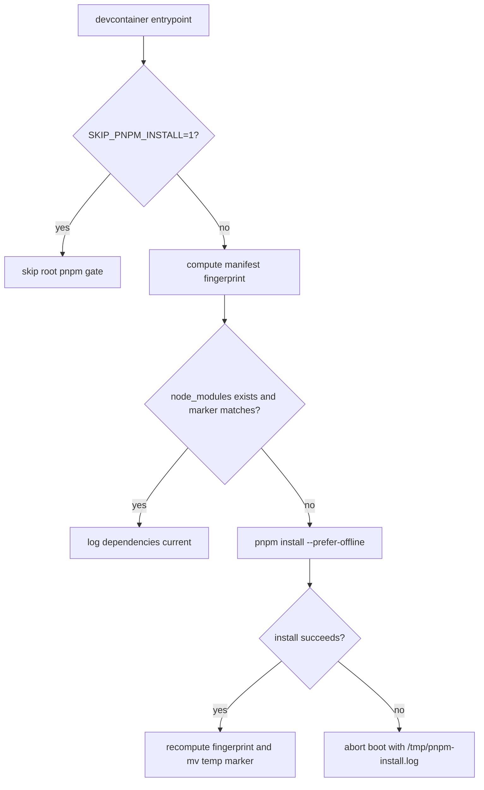

# Sandbox Dependency Installs

## Relevant Source Files
- `.devcontainer/entrypoint.sh` — owns devcontainer boot, root dependency install decisions, marker refresh, and skip/failure behavior.
- `.devcontainer/docker-compose.yml` — passes the root install skip flag into the container environment.
- `.oh/scripts/__tests__/entrypoint-pnpm-install.test.ts` — Vitest contract coverage for the install gate.
- `.oh/evals/probes/entrypoint-pnpm-manifest-fingerprint.sh` — Tier-A eval probe guarding the same boot-path contract.
- `.github/workflows/sandbox-boot-guard.yml` — CI boot guard path that may preseed dependencies while using `SKIP_PNPM_INSTALL=1`.

## Summary
The devcontainer root `pnpm install` gate is manifest-aware: it keeps the fast boot path when the installed tree matches current package manifests, but reinstalls when the marker under `node_modules` is missing or stale. The marker exists because the harness checkout is bind-mounted at runtime, so Dockerfile-time installs can be shadowed and a long-lived `node_modules` directory is not enough evidence by itself.

## Detail
The root install block explains the runtime shadowing problem and uses `SKIP_PNPM_INSTALL=1` as the explicit opt-out for externally managed or air-gapped dependency state (`.devcontainer/entrypoint.sh:312`, `.devcontainer/entrypoint.sh:320`). Compose passes that flag into the sandbox container, which lets CI and operators actually activate the entrypoint bypass (`.devcontainer/docker-compose.yml:52`, `.devcontainer/docker-compose.yml:53`). The entrypoint derives workspace package patterns from `pnpm-workspace.yaml`, ignores negated patterns, and does not include undeclared package-local manifests (`.devcontainer/entrypoint.sh:322`, `.devcontainer/entrypoint.sh:338`). Manifest discovery excludes dependency and runtime/vendor paths such as `.git`, `.oh/worktrees`, `node_modules`, `.pi/npm/node_modules`, `.oh/cli/node_modules`, and `.hermes/lsp/node_modules` via the broad `*/node_modules/*` guard (`.devcontainer/entrypoint.sh:367`, `.devcontainer/entrypoint.sh:369`).

The fingerprint helper includes existing root `package.json`, `pnpm-lock.yaml`, and `pnpm-workspace.yaml`, plus package manifests from declared workspace package patterns, sorts normalized relative paths bytewise, hashes each file with `sha256sum`, and hashes the ordered manifest list into one final digest (`.devcontainer/entrypoint.sh:410`, `.devcontainer/entrypoint.sh:414`, `.devcontainer/entrypoint.sh:418`, `.devcontainer/entrypoint.sh:420`). The install marker is `.openharness-root-pnpm-manifest.sha256` stored under `$HARNESS/node_modules`, tying the digest to the dependency tree it validates (`.devcontainer/entrypoint.sh:424`, `.devcontainer/entrypoint.sh:425`, `.devcontainer/entrypoint.sh:426`).

There are three boot states. Missing `node_modules` runs `pnpm install --prefer-offline`; a missing or mismatched marker logs `manifest drift detected; reinstalling`; a matching marker logs `dependencies current` and skips install (`.devcontainer/entrypoint.sh:430`, `.devcontainer/entrypoint.sh:433`, `.devcontainer/entrypoint.sh:437`, `.devcontainer/entrypoint.sh:441`). After a successful install, the entrypoint recomputes the fingerprint, writes a temp marker beside the final marker, and atomically moves it into place; marker-refresh or install failures still abort boot with `/tmp/pnpm-install.log` diagnostics (`.devcontainer/entrypoint.sh:442`, `.devcontainer/entrypoint.sh:443`, `.devcontainer/entrypoint.sh:444`, `.devcontainer/entrypoint.sh:447`, `.devcontainer/entrypoint.sh:451`).

The Vitest file asserts the compose skip-env pass-through, marker filename and location, the `pnpm_manifest_fingerprint` helper shape, drift reinstall branch, current-dependencies skip branch, atomic refresh, and install-failure abort behavior (`.oh/scripts/__tests__/entrypoint-pnpm-install.test.ts:21`, `.oh/scripts/__tests__/entrypoint-pnpm-install.test.ts:25`, `.oh/scripts/__tests__/entrypoint-pnpm-install.test.ts:30`, `.oh/scripts/__tests__/entrypoint-pnpm-install.test.ts:38`, `.oh/scripts/__tests__/entrypoint-pnpm-install.test.ts:44`, `.oh/scripts/__tests__/entrypoint-pnpm-install.test.ts:49`). The Tier-A probe checks the same contract from the eval suite and returns a regression if any expected source, compose, or test signal disappears (`.oh/evals/probes/entrypoint-pnpm-manifest-fingerprint.sh:37`, `.oh/evals/probes/entrypoint-pnpm-manifest-fingerprint.sh:45`, `.oh/evals/probes/entrypoint-pnpm-manifest-fingerprint.sh:46`, `.oh/evals/probes/entrypoint-pnpm-manifest-fingerprint.sh:59`).

Non-goals remain explicit: this does not change global package installs, delete or prune `node_modules`, alter optional agent-browser installs, change `.oh/cli` package-local installation, or migrate away from pnpm. Safe manual recovery is to remove only the marker file, run root `pnpm install --prefer-offline`, or set `SKIP_PNPM_INSTALL=1` while diagnosing.

## System Relationships

## See Also
- [[recursive-language-models]]
