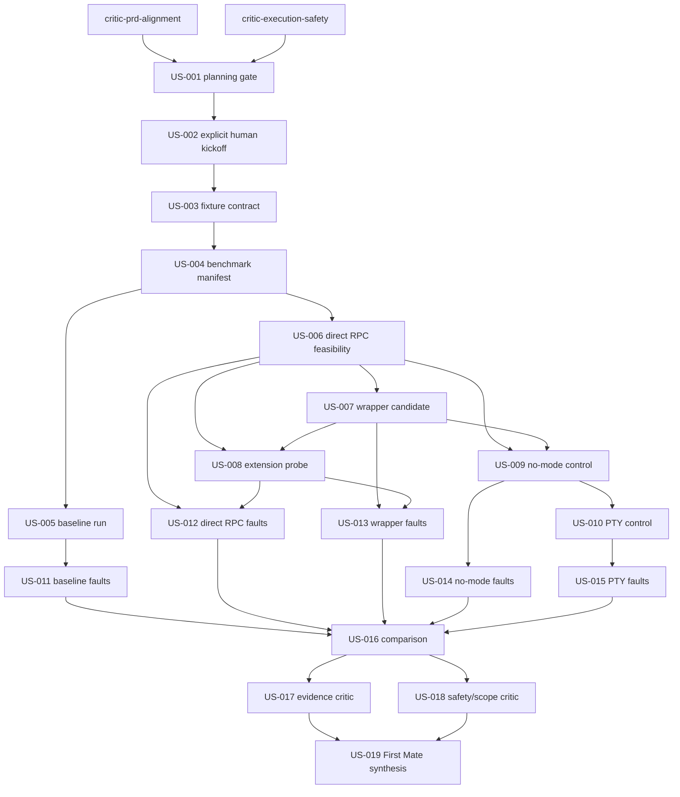

# PRD: PM2 Pi Supervision Study

## 1. Purpose and decision boundary

GitHub issue [#677](https://github.com/mifunedev/openharness/issues/677) asks for evidence about PM2 7.0.3 lifecycle and observability behavior around Pi. The current production path uses tmux for a PTY and a custom shell supervisor for crash and live-but-stale-context recovery.

This is a credentialless, disposable study, not an adoption or migration. Planning is docs-only and pre-kickoff. US-001 closes planning by obtaining the two current critic re-reviews, remediating findings, validating the exact artifacts, and creating an artifact-only commit, push, and draft PR to `development`. A distinct US-002 explicit-human-kickoff gate follows US-001. No implementation story, install, fixture execution, process launch, fault injection, or benchmark may begin until US-002 passes from a separately supplied human authorization; authorization is never inferred.

The terminal output is evidence, uncertainty, blockers, and residual responsibilities only. It must not use `adopt`, `recommended`, or `winner`; authorize a migration; propose production configuration; or modify production state. Any architecture decision requires a separate human-approved issue or ADR after this task.

## 2. Goals

- Measure a purpose-built disposable baseline and separately named PM2 7.0.3 candidates with one preregistered protocol.
- Establish whether a direct PM2-to-Pi RPC topology has a lossless bidirectional channel; if it does not, record it as `NOT RUN` rather than silently substituting a wrapper.
- Treat a PM2-managed RPC-host wrapper as a distinct conditional candidate with separately measured responsibilities.
- Probe mode-independent extension APIs only through a deterministic local fake provider; perform no live/provider-backed model turn.
- Separate exited-process recovery from synthetic live-but-unhealthy semantic recovery.
- Produce an evidence ordering without adoption, recommendation, rollout, or production configuration.

## 3. Mandatory execution contract

### 3.1 Immutable production boundary

Every implementation story is confined to `.oh/tasks/pm2-pi-supervision/` plus a runtime root created by `mktemp -d` and proven to be outside production paths. Delegates may inspect repository source read-only. They must not execute or load the production Slack bridge, recovery extension, settings, scripts, config, state, locks, logs, tmux sessions, or gateway runtime. They must not edit production scripts/config, Docker/devcontainer files, manifests, lockfiles, settings, images, sessions, or runtime; replace/remove tmux; use PM2 cluster/modules/startup/save/resurrect; install globally; add dependencies; or create a persistent PM2 dump/service/daemon.

Pre/post production checks are metadata-only: `git status --porcelain=v1` and `git diff --name-only` for tracked-path mutation, `tmux list-sessions -F '#{session_name}\t#{session_id}\t#{session_created}\t#{session_attached}'` for session identity, and `ps -eo pid=,ppid=,lstart=,comm=` for process identity. The fixture must not read production log/config/state/lock contents. Current behavior comparisons come only from cited source and the purpose-built disposable baseline.

### 3.2 Credentialless and network-isolated child environment

All benchmark, process-launch, fault-injection, and PM2 commands use cwd inside the runtime root and an `env -i` child environment containing only `PATH`, `HOME`, `XDG_CONFIG_HOME`, `XDG_STATE_HOME`, `XDG_CACHE_HOME`, `TMPDIR`, `LANG=C.UTF-8`, `LC_ALL=C.UTF-8`, `TZ=UTC`, and fixture-owned non-secret variables explicitly listed in the manifest. `HOME`, all XDG directories, `TMPDIR`, and `PM2_HOME` are fresh children of the runtime root; `PM2_HOME` is mode `0700`. No ambient environment values, provider settings, credential helpers, SSH/GitHub/cloud/Slack/model auth stores, or host home paths may be read, copied, inventoried, or mounted. The evidence records only the allowlisted child key names.

A negative preflight inspects the constructed child environment and disposable auth/config paths, never ambient values. It fails before launch if a key matches `TOKEN|SECRET|PASSWORD|PASSWD|API_KEY|APIKEY|AUTH|CREDENTIAL|COOKIE|PRIVATE_KEY|PI_SLACK|OPENAI|ANTHROPIC|GOOGLE|AWS|AZURE|GITHUB|GH_TOKEN`, if an allowlisted value escapes the runtime root except `PATH` and locale/time values, or if a disposable auth/config path is non-empty before fixture setup.

Outbound network is denied for every run. If the isolation mechanism cannot prove denial, the affected candidate is `NOT RUN`. The only setup exception is an exact HTTPS fetch of `https://registry.npmjs.org/pm2/-/pm2-7.0.3.tgz` when the pinned tarball is absent, from the same allowlisted/disposable environment, with no npm auth/config and with integrity `sha512-zRJOdburpb9OEPB0uqoNT8C1Gp7hPJPVy4Kr67XJNuT9UlMQcOt1WXrYQUmwqKPHk8FyauvP1CPhqoCrCaPw0Q==`; dependency resolution is offline, and a cache miss is `NOT RUN`. No other package or network fetch is permitted.

Extension probing uses synthetic prompts and a deterministic local fake/test provider inside the denied-network fixture. If Pi cannot run that provider without discovering external auth or making a live/provider-backed model turn, the probe and dependent RPC evidence are `NOT RUN`.

### 3.3 Owned processes and idempotent cleanup

The fixture writes `$FIXTURE_ROOT/run/owned-pids.jsonl`. Each spawn is registered immediately with exact PID, parent PID, Linux `/proc/<pid>/stat` start-time field, role, candidate, and namespace. Before any signal, the fixture must match PID plus start time and prove the process is a registered descendant or the isolated PM2 daemon/process reported under the exact `PM2_HOME`. Faults target only the exact registered PID intended by the manifest.

The runner installs idempotent `EXIT`, `INT`, `TERM`, and `HUP` traps and applies an outer timeout. Cleanup addresses exact registered PIDs in reverse dependency order: bounded `TERM`, five-second wait, then bounded `KILL` only after PID/start-time ownership is revalidated. An isolated PM2 process may be deleted only by its exact unique process name with the explicit fixture `PM2_HOME`; the isolated daemon is terminated by its exact registered PID. `pkill`, `killall`, name-pattern signals, `tmux kill-server`, existing tmux targets, `pm2 delete all`, `pm2 kill`, and every PM2 command lacking the explicit fixture environment are prohibited.

Cleanup must be repeatable, prove all owned PIDs dead, isolated PM2 sockets/metadata gone, runtime-root residue removed except sanitized evidence copied into the task folder, and pre/post production metadata unchanged. Cleanup failure stops the graph, records `FAIL`, and requires human inspection before rerun.

### 3.4 RPC candidate definitions

- **Direct PM2-to-Pi RPC candidate:** PM2's exact `script` target is the Pi executable and args include `--mode rpc`. Pi is the PM2 child. Feasibility must identify the owner and consumer of Pi stdin/stdout, ready signal, LF-JSONL command path, EOF behavior, exit propagation, and a byte/frame loss check. PM2 logs are never treated as an RPC transport. If a writable retained stdin and lossless stdout consumer cannot be proven, this candidate is safely `NOT RUN`.
- **PM2 RPC-host wrapper candidate:** conditional and separately named. PM2's exact `script` target is a fixture-owned RPC-host wrapper; the wrapper owns a Pi `--mode rpc` child and its byte pipes, exposes only a mode-`0600` Unix socket beneath the runtime root, and losslessly relays LF-delimited JSONL. Evidence separately reports PM2/wrapper/Pi PIDs, exits, restarts, ready state, transport, and cleanup. It is not substituted for the direct candidate. If direct transport is feasible, the wrapper is `NOT RUN (not required by protocol)` unless a later separately approved scope change says otherwise.

JSONL handling is lossless and fail-closed: UTF-8 LF framing, maximum 64 KiB per line, 10,000 frames and 8 MiB total per repetition, frame sequence/type/count plus SHA-256 evidence, explicit `extension_ui_request` handling, escaped control characters, and sanitized diagnostics for malformed/oversized input. Raw ambient/model/Slack/provider output is never retained.

### 3.5 Preregistered benchmark and evidence policy

Before any measurement, `.oh/tasks/pm2-pi-supervision/evidence/benchmark-manifest.json` records its SHA-256, candidate definitions, fake provider, ready signals, network proof, fault schedule, and these immutable rules:

- Three measured independent repetitions per runnable candidate/fault, with no selective retries; each repetition recreates the runtime root and owned registry. No warmup is counted.
- Monotonic nanosecond timestamps for durations and UTC timestamps for audit. Ready deadline: 15 seconds; idle window: 30 seconds; fault-detection deadline: 10 seconds; recovery deadline: 30 seconds; cleanup deadline: 10 seconds; total repetition deadline: 120 seconds.
- Fault order: clean exit, non-zero exit, rapid crash loop, SIGTERM, synthetic live-unhealthy sentinel. Rapid loop is three forced non-zero exits within 15 seconds. Timeouts are censored failures at the deadline, not omitted.
- Raw per-run rows are retained as bounded sanitized JSONL. Aggregate each metric by median and inclusive min-max range; report success counts as `n/3`. No imputation. `NOT RUN` and failed/censored data sort as not comparable rather than zero.
- Evidence ordering is lexicographic and preregistered: safety/cleanup gate; required-run completeness; lifecycle success count; semantic-health success count; observability field completeness; median recovery latency; then declared operational-responsibility count. Ties remain ties. The ordering is not a recommendation.
- A protocol change after any observation requires a dated amendment with reason, a new manifest hash, invalidation of prior comparisons, and a complete rerun of every affected candidate.

The synthetic sentinel is a simulation, not proof of Slack stale-context recovery. The child PID stays alive and externally `running`, emits exact synthetic stderr symptom `SYNTHETIC_STALE_CONTEXT`, and blocks a synthetic ordinary-work probe until an externally observable recovery action. Detection may use only that common public stderr/health surface; no candidate-specific hidden signal is allowed. Evidence attributes detection/recovery to PM2, wrapper, retained watchdog, or none. PM2 receives credit only if it detects and recovers while the same child remains alive.

Durable evidence stays under `.oh/tasks/pm2-pi-supervision/evidence/US-<id>/`. Use synthetic data only; cap each retained log at 1 MiB; store structured summaries/hashes instead of raw frames when raw content is unnecessary; scrub disposable home/worktree paths; escape control characters; and run the fixture's deterministic credential/personal-data scanner before staging. Any secret-scan finding fails the story and blocks commit/push.

### 3.6 Exact verification command convention

Unless a story says otherwise, commands run from the worktree root. Implementation stories use the exact commands named in their criteria; no `|| true`, ignored exit, or unbounded command is pass evidence. The shared code gates are:

```sh
timeout 180s node --test .oh/tasks/pm2-pi-supervision/fixture/tests/*.test.mjs
find .oh/tasks/pm2-pi-supervision/fixture -type f -name '*.mjs' -print0 | sort -z | xargs -0 -r -n1 node --check
timeout 180s node .oh/tasks/pm2-pi-supervision/fixture/secret-scan.mjs .oh/tasks/pm2-pi-supervision/evidence
```

Every command must exit `0`, and its stdout/stderr, UTC start/end, and exit code go to that story's `verification.jsonl`.

## 4. Ralph-sized user stories

### US-001: Close the artifact-only planning gate

**Description:** As the First Mate, I want the current critics, remediation, exact validation, and an artifact-only draft PR completed before any authorization to implement is considered.

**Acceptance Criteria:**

1. `critic-prd-alignment` writes only `.oh/tasks/pm2-pi-supervision/critique-prd.md`, and `critic-execution-safety` writes only `.oh/tasks/pm2-pi-supervision/critique-safety.md`; each re-review has a dated verdict/count and no unresolved H or M finding. The First Mate alone synthesizes both into `assessment.md` and `progress.txt`.
2. Every finding is resolved consistently in `prd.md`, `prd.json`, `prompt.md`, `assessment.md`, and `progress.txt`; semantic parity covers every story ID/title/description/criterion/dependency/priority/delegate, and the terminal critic nodes.
3. From the worktree root, `test "$(git branch --show-current)" = feat/677-pm2-pi-supervision`; `for f in prd.md prd.json prompt.md assessment.md progress.txt critique-prd.md critique-safety.md; do test -f ".oh/tasks/pm2-pi-supervision/$f"; done`; `jq empty .oh/tasks/pm2-pi-supervision/prd.json`; and `jq -e '.schemaVersion == 1 and .branchName == "feat/677-pm2-pi-supervision" and ([.userStories[].passes] | all(. == false)) and ([.userStories[].notes] | all(. == "")) and ([.userStories[].priority] == ([.userStories[].priority] | sort))' .oh/tasks/pm2-pi-supervision/prd.json` all exit `0`, with output recorded in `progress.txt`.
4. The First Mate intentionally stages only approved task files using `git add -f -- .oh/tasks/pm2-pi-supervision`, verifies `test -n "$(git diff --cached --name-only)"`, `! git diff --cached --name-only | grep -Ev '^\.oh/tasks/pm2-pi-supervision/'`, and `git diff --cached --check -- .oh/tasks/pm2-pi-supervision` all exit `0`, records the staged check in `progress.txt`, commits with `git commit -m 'task: plan PM2 Pi supervision study'`, and pushes only branch `feat/677-pm2-pi-supervision`.
5. The First Mate creates a draft PR with `gh pr create --draft --base development --head feat/677-pm2-pi-supervision`, then verifies via `gh pr view --json url,number,baseRefName,headRefName,isDraft,files` that base/head/draft are exact, the file list is non-empty, and every changed path starts `.oh/tasks/pm2-pi-supervision/`; PR URL/number, commit, and exact changed paths are appended to `progress.txt`.
6. Typecheck passes: `timeout 180s pnpm typecheck` exits `0` from the worktree root, with stdout/stderr, UTC start/end, and exit code recorded in the story's declared evidence path.

**Depends on:** `critic-prd-alignment`, `critic-execution-safety`
**Assigned delegate:** `first-mate-gate`
**Evidence:** `critique-prd.md`, `critique-safety.md`, `assessment.md#first-mate-critic-synthesis`, `progress.txt`

### US-002: Record the explicit human kickoff

**Description:** As a maintainer, I want implementation blocked on a distinct, auditable human authorization after planning closes.

**Acceptance Criteria:**

1. US-001 is validated `passes: true`, and its draft PR remains open, draft, based on `development`, and task-folder-only.
2. A human supplies a new explicit statement authorizing implementation for issue #677 after US-001 completion; issue creation, prior conversation, critic approval, commit, push, draft PR creation, review, or merge is never inferred as authorization.
3. `first-mate-kickoff-recorder` appends the exact authorization quote, source, author, and UTC timestamp to `progress.txt` as one line beginning `KICKOFF issue=#677`; absent or ambiguous authorization leaves this story false and all later stories blocked.
4. No install, fixture execution, process launch, fault injection, or benchmark occurs while recording this gate.
5. After human validation of the source and quote, `grep -Eq '^KICKOFF issue=#677 author=.+ utc=[0-9]{4}-[0-9]{2}-[0-9]{2}T[0-9]{2}:[0-9]{2}:[0-9]{2}Z source=.+ quote=.+$' .oh/tasks/pm2-pi-supervision/progress.txt` exits `0`; the command and exit are appended to `progress.txt`.
6. Typecheck passes: `timeout 180s pnpm typecheck` exits `0` from the worktree root, with stdout/stderr, UTC start/end, and exit code recorded in the story's declared evidence path.

**Depends on:** `US-001`
**Assigned delegate:** `first-mate-kickoff-recorder`
**Evidence:** `progress.txt`

### US-003: Build the baseline fixture contract

**Description:** As an investigator, I want the isolated fixture, fake workload, ownership registry, and cleanup contract implemented before any measurement.

**Acceptance Criteria:**

1. Fixture-owned files under `.oh/tasks/pm2-pi-supervision/fixture/` implement the immutable boundary, allowlisted `env -i`, disposable HOME/XDG/TMP, mode-`0700` `PM2_HOME`, denied-network proof or safe `NOT RUN`, exact PID/start-time registry, traps, deadlines, idempotent cleanup, metadata-only production snapshots, bounded evidence, and deterministic secret scan from Section 3.
2. The baseline executable is purpose-built and credentialless, reproduces only launch/ready/idle/exit/restart/log/semantic-sentinel lifecycle surfaces, and never executes or loads a production bridge, supervisor, extension, config, state, lock, log, or tmux asset.
3. Fixture tests include successful cleanup, assertion failure, `INT`, `TERM`, timeout, PID-reuse mismatch, denied global/default PM2 commands, network-denial failure, malformed/oversized JSONL, and secret-scan rejection.
4. The shared code gates and `timeout 180s node .oh/tasks/pm2-pi-supervision/fixture/verify.mjs --story US-003 --evidence .oh/tasks/pm2-pi-supervision/evidence/US-003` exit `0` with evidence in `evidence/US-003/verification.jsonl`; no benchmark candidate is launched.
5. Typecheck passes: `timeout 180s pnpm typecheck` exits `0` from the worktree root, with stdout/stderr, UTC start/end, and exit code recorded in the story's declared evidence path.

**Depends on:** `US-002`
**Assigned delegate:** `fixture-contract-implementer`
**Evidence:** `fixture/`, `evidence/US-003/`

### US-004: Preregister the benchmark manifest

**Description:** As an investigator, I want measurement and ordering rules frozen before observing candidates.

**Acceptance Criteria:**

1. `evidence/benchmark-manifest.json` encodes all Section 3.5 candidates, at least three measured repetitions, clocks, signals, deadlines, idle window, recreation policy, fault order, censor/failure handling, median/min-max and `n/3` aggregation, lexicographic ordering, tie/`NOT RUN` treatment, and amendment/full-rerun rule.
2. The manifest defines the exact synthetic sentinel and credits detection/recovery only to the component observing the common public symptom while the child remains alive; it labels the result a simulation.
3. The manifest defines evidence caps/redaction, synthetic-only payloads, prohibited raw output, secret scan, and immutable production/environment/process constraints.
4. The shared code gates and `timeout 180s node .oh/tasks/pm2-pi-supervision/fixture/verify.mjs --story US-004 --manifest .oh/tasks/pm2-pi-supervision/evidence/benchmark-manifest.json --evidence .oh/tasks/pm2-pi-supervision/evidence/US-004` exit `0`; `evidence/US-004/manifest.sha256` records the pre-observation hash.
5. Typecheck passes: `timeout 180s pnpm typecheck` exits `0` from the worktree root, with stdout/stderr, UTC start/end, and exit code recorded in the story's declared evidence path.

**Depends on:** `US-003`
**Assigned delegate:** `benchmark-protocol-implementer`
**Evidence:** `evidence/benchmark-manifest.json`, `evidence/US-004/`

### US-005: Run the disposable baseline

**Description:** As an investigator, I want baseline measurements from the purpose-built fixture without touching current runtime surfaces.

**Acceptance Criteria:**

1. The baseline run uses only source-derived expectations and the disposable baseline executable; it does not read or execute production sessions, process content, logs, config, state, locks, scripts, bridge, or extensions.
2. Exactly three independent baseline repetitions record launch-to-ready, 30-second idle survival, clean exit, non-zero recovery, status/restarts, bounded log access, and cleanup under the frozen manifest.
3. `timeout 420s node .oh/tasks/pm2-pi-supervision/fixture/run.mjs --story US-005 --candidate baseline --manifest .oh/tasks/pm2-pi-supervision/evidence/benchmark-manifest.json --output .oh/tasks/pm2-pi-supervision/evidence/US-005` plus the shared code gates exit `0`.
4. `evidence/US-005/verification.jsonl`, sanitized run JSONL, aggregate JSON, production metadata delta, and cleanup proof are complete; any safety/cleanup failure stops the graph.
5. Typecheck passes: `timeout 180s pnpm typecheck` exits `0` from the worktree root, with stdout/stderr, UTC start/end, and exit code recorded in the story's declared evidence path.

**Depends on:** `US-004`
**Assigned delegate:** `baseline-runner`
**Evidence:** `evidence/US-005/`

### US-006: Prove direct PM2-to-Pi RPC topology feasibility

**Description:** As an investigator, I want direct PM2-to-Pi transport proven before it is treated as a runnable candidate.

**Acceptance Criteria:**

1. Setup resolves exactly PM2 7.0.3 with the pinned integrity under the Section 3.2 fetch/offline rule and records package/version evidence; any other required network fetch is refused and yields safe `NOT RUN`.
2. PM2's exact script target is Pi with explicit `--mode rpc`; evidence maps PM2 daemon and Pi PIDs, stdin owner/writer, stdout consumer, ready signal, command path, retained-open-stdin behavior, EOF shutdown, and exit-code propagation.
3. Three synthetic request/response sequences prove UTF-8 LF-delimited JSONL byte/frame count, order, type, and SHA-256 equality within bounds; PM2 logs are not used as transport. Inability to prove a writable stdin and lossless stdout marks direct RPC `NOT RUN` without fallback substitution.
4. `timeout 420s node .oh/tasks/pm2-pi-supervision/fixture/run.mjs --story US-006 --candidate pm2-direct-rpc-topology --manifest .oh/tasks/pm2-pi-supervision/evidence/benchmark-manifest.json --output .oh/tasks/pm2-pi-supervision/evidence/US-006` plus the shared code gates exit `0` for either a verified runnable result or a verified safe `NOT RUN` result.
5. Evidence in `evidence/US-006/` includes topology, version/integrity, transport, production metadata delta, and cleanup proof.
6. Typecheck passes: `timeout 180s pnpm typecheck` exits `0` from the worktree root, with stdout/stderr, UTC start/end, and exit code recorded in the story's declared evidence path.

**Depends on:** `US-004`
**Assigned delegate:** `direct-rpc-topology-implementer`
**Evidence:** `evidence/US-006/`

### US-007: Evaluate the separately named RPC-host wrapper topology

**Description:** As an investigator, I want any wrapper required for RPC transport measured as a different candidate rather than attributed to direct PM2 supervision of Pi.

**Acceptance Criteria:**

1. If US-006 is runnable, record `NOT RUN (not required by protocol)` without executing a wrapper. If US-006 is `NOT RUN` only for direct transport infeasibility, implement the separately named `PM2 7.0.3 + RPC-host wrapper + Pi RPC` candidate exactly as Section 3.4.
2. For a runnable wrapper, PM2 targets the fixture wrapper, the wrapper owns Pi's byte pipes and mode-`0600` runtime-root Unix socket, and three sequences prove lossless bounded LF-JSONL relay plus ready/EOF/exit propagation; PM2, wrapper, and Pi responsibilities/PIDs are distinct.
3. The wrapper performs no semantic-watchdog or provider/network function, is not production configuration, and is never reported as the direct candidate.
4. `timeout 420s node .oh/tasks/pm2-pi-supervision/fixture/run.mjs --story US-007 --candidate pm2-rpc-host-wrapper --manifest .oh/tasks/pm2-pi-supervision/evidence/benchmark-manifest.json --output .oh/tasks/pm2-pi-supervision/evidence/US-007` plus the shared code gates exit `0` for a verified runnable or safe `NOT RUN` result, with topology/transport/cleanup evidence in `evidence/US-007/`.
5. Typecheck passes: `timeout 180s pnpm typecheck` exits `0` from the worktree root, with stdout/stderr, UTC start/end, and exit code recorded in the story's declared evidence path.

**Depends on:** `US-006`
**Assigned delegate:** `rpc-host-wrapper-implementer`
**Evidence:** `evidence/US-007/`

### US-008: Probe extension APIs with a deterministic fake provider

**Description:** As an investigator, I want mode-independent API behavior checked without credentials, network, Slack, or a live model turn.

**Acceptance Criteria:**

1. Each runnable RPC topology uses only a disposable probe extension, synthetic prompt, deterministic local fake/test provider, denied network, and allowlisted empty auth homes; production bridge/recovery extension/settings are never loaded.
2. The probe attempts extension-injected `sendUserMessage()` and observes corresponding `turn_end` plus bounded frame-type handling including `extension_ui_request`; it performs no live/provider-backed model turn. If the fake provider contract cannot be proven, record `NOT RUN`.
3. Lossless JSONL checks, sanitized frame counts/hashes, no-secret evidence, topology attribution, and cleanup are recorded separately per runnable RPC candidate.
4. `timeout 420s node .oh/tasks/pm2-pi-supervision/fixture/run.mjs --story US-008 --candidate rpc-extension-probe --manifest .oh/tasks/pm2-pi-supervision/evidence/benchmark-manifest.json --output .oh/tasks/pm2-pi-supervision/evidence/US-008` plus the shared code gates exit `0`, with evidence in `evidence/US-008/`.
5. Typecheck passes: `timeout 180s pnpm typecheck` exits `0` from the worktree root, with stdout/stderr, UTC start/end, and exit code recorded in the story's declared evidence path.

**Depends on:** `US-006`, `US-007`
**Assigned delegate:** `extension-api-probe-implementer`
**Evidence:** `evidence/US-008/`

### US-009: Run the direct no-mode control

**Description:** As an investigator, I want a direct PM2 control without explicit mode to isolate Pi mode selection.

**Acceptance Criteria:**

1. Exactly PM2 7.0.3 launches Pi directly without `--mode rpc` under the same isolated contract and records stdin/stdout TTY state, resolved mode, ready/idle/exit/restart behavior for three repetitions.
2. The control uses no RPC wrapper, PTY wrapper, production asset, credential, network, or live model turn; expected print-mode behavior is observation, not assumption.
3. `timeout 420s node .oh/tasks/pm2-pi-supervision/fixture/run.mjs --story US-009 --candidate pm2-direct-no-mode --manifest .oh/tasks/pm2-pi-supervision/evidence/benchmark-manifest.json --output .oh/tasks/pm2-pi-supervision/evidence/US-009` plus the shared code gates exit `0` for runnable or safe `NOT RUN`.
4. `evidence/US-009/` contains mode, lifecycle, metadata-only delta, and cleanup proof.
5. Typecheck passes: `timeout 180s pnpm typecheck` exits `0` from the worktree root, with stdout/stderr, UTC start/end, and exit code recorded in the story's declared evidence path.

**Depends on:** `US-006`, `US-007`
**Assigned delegate:** `no-mode-control-runner`
**Evidence:** `evidence/US-009/`

### US-010: Run the optional PTY control

**Description:** As an investigator, I want an optional PTY control without installing another dependency.

**Acceptance Criteria:**

1. If a compatible PTY utility is already present, exactly PM2 7.0.3 launches the disposable baseline/Pi control through it for three repetitions and records utility version, TTY/mode, lifecycle, and responsibility boundary; otherwise record `NOT RUN` with the missing prerequisite and install nothing.
2. The control uses no production asset, credential, network, live model turn, manifest edit, lockfile edit, or global install.
3. `timeout 420s node .oh/tasks/pm2-pi-supervision/fixture/run.mjs --story US-010 --candidate pm2-pty-control --manifest .oh/tasks/pm2-pi-supervision/evidence/benchmark-manifest.json --output .oh/tasks/pm2-pi-supervision/evidence/US-010` plus the shared code gates exit `0` for runnable or safe `NOT RUN`.
4. `evidence/US-010/` contains prerequisite, mode/lifecycle, metadata-only delta, and cleanup proof.
5. Typecheck passes: `timeout 180s pnpm typecheck` exits `0` from the worktree root, with stdout/stderr, UTC start/end, and exit code recorded in the story's declared evidence path.

**Depends on:** `US-009`
**Assigned delegate:** `pty-control-runner`
**Evidence:** `evidence/US-010/`

### US-011: Run bounded baseline faults

**Description:** As an investigator, I want the frozen five-fault sequence applied to the baseline candidate in one bounded iteration.

**Acceptance Criteria:**

1. Run three independent repetitions of each frozen fault against only the baseline; the sentinel keeps the child alive/running, blocks ordinary synthetic work, emits the common symptom, and attributes recovery to the baseline watchdog or none.
2. Every row records detection source/action, monotonic latency, restart count, PID/exit/final status, bounded logs, outcome, censoring, production metadata delta, and cleanup; no selective retry occurs.
3. `timeout 2100s node .oh/tasks/pm2-pi-supervision/fixture/run-faults.mjs --story US-011 --candidate baseline --manifest .oh/tasks/pm2-pi-supervision/evidence/benchmark-manifest.json --output .oh/tasks/pm2-pi-supervision/evidence/US-011` plus the shared code gates exit `0`.
4. Complete sanitized raw/aggregate/verification/cleanup evidence exists in `evidence/US-011/`; a cleanup/safety failure stops the graph.
5. Typecheck passes: `timeout 180s pnpm typecheck` exits `0` from the worktree root, with stdout/stderr, UTC start/end, and exit code recorded in the story's declared evidence path.

**Depends on:** `US-005`
**Assigned delegate:** `baseline-fault-runner`
**Evidence:** `evidence/US-011/`

### US-012: Run bounded direct-RPC faults

**Description:** As an investigator, I want the frozen faults applied only if direct RPC is runnable.

**Acceptance Criteria:**

1. If direct RPC is runnable, run three repetitions of each fault and attribute semantic detection/recovery only to observed components while the child remains alive; otherwise propagate verified `NOT RUN` without starting a substitute.
2. Every runnable row records all manifest fields, lossless protocol evidence where applicable, and exact cleanup; no PM2-only semantic recovery claim is allowed without same-child live recovery evidence.
3. `timeout 2100s node .oh/tasks/pm2-pi-supervision/fixture/run-faults.mjs --story US-012 --candidate pm2-direct-rpc --manifest .oh/tasks/pm2-pi-supervision/evidence/benchmark-manifest.json --output .oh/tasks/pm2-pi-supervision/evidence/US-012` plus the shared code gates exit `0` for complete runs or safe `NOT RUN`.
4. Complete evidence exists in `evidence/US-012/`; a cleanup/safety failure stops the graph.
5. Typecheck passes: `timeout 180s pnpm typecheck` exits `0` from the worktree root, with stdout/stderr, UTC start/end, and exit code recorded in the story's declared evidence path.

**Depends on:** `US-006`, `US-008`
**Assigned delegate:** `direct-rpc-fault-runner`
**Evidence:** `evidence/US-012/`

### US-013: Run bounded RPC-host-wrapper faults

**Description:** As an investigator, I want wrapper topology faults measured separately when that candidate is runnable.

**Acceptance Criteria:**

1. If the RPC-host wrapper is runnable, run three repetitions of each fault and separately attribute PM2, wrapper, Pi, transport, and semantic behavior; otherwise propagate verified `NOT RUN`.
2. The wrapper receives no hidden sentinel knowledge, and wrapper/PM2 restarts are not reported as direct Pi supervision or semantic recovery without same-child evidence.
3. `timeout 2100s node .oh/tasks/pm2-pi-supervision/fixture/run-faults.mjs --story US-013 --candidate pm2-rpc-host-wrapper --manifest .oh/tasks/pm2-pi-supervision/evidence/benchmark-manifest.json --output .oh/tasks/pm2-pi-supervision/evidence/US-013` plus the shared code gates exit `0` for complete runs or safe `NOT RUN`.
4. Complete sanitized raw/aggregate/verification/cleanup evidence exists in `evidence/US-013/`; a cleanup/safety failure stops the graph.
5. Typecheck passes: `timeout 180s pnpm typecheck` exits `0` from the worktree root, with stdout/stderr, UTC start/end, and exit code recorded in the story's declared evidence path.

**Depends on:** `US-007`, `US-008`
**Assigned delegate:** `rpc-host-fault-runner`
**Evidence:** `evidence/US-013/`

### US-014: Run bounded no-mode-control faults

**Description:** As an investigator, I want the no-mode control fault behavior measured independently.

**Acceptance Criteria:**

1. If the no-mode control is runnable, run three repetitions of each fault with resolved-mode evidence and no semantic credit absent same-child detection/recovery; otherwise propagate verified `NOT RUN`.
2. Every row follows the frozen timing, aggregation, bounds, attribution, metadata-only, and cleanup contract.
3. `timeout 2100s node .oh/tasks/pm2-pi-supervision/fixture/run-faults.mjs --story US-014 --candidate pm2-direct-no-mode --manifest .oh/tasks/pm2-pi-supervision/evidence/benchmark-manifest.json --output .oh/tasks/pm2-pi-supervision/evidence/US-014` plus the shared code gates exit `0` for complete runs or safe `NOT RUN`.
4. Complete evidence exists in `evidence/US-014/`; a cleanup/safety failure stops the graph.
5. Typecheck passes: `timeout 180s pnpm typecheck` exits `0` from the worktree root, with stdout/stderr, UTC start/end, and exit code recorded in the story's declared evidence path.

**Depends on:** `US-009`
**Assigned delegate:** `no-mode-fault-runner`
**Evidence:** `evidence/US-014/`

### US-015: Run bounded PTY-control faults

**Description:** As an investigator, I want optional PTY fault behavior measured independently when available.

**Acceptance Criteria:**

1. If the PTY control is runnable, run three repetitions of each fault and distinguish PTY utility, PM2, Pi, and semantic responsibilities; otherwise propagate verified `NOT RUN`.
2. Every row follows the frozen timing, aggregation, bounds, attribution, metadata-only, and cleanup contract.
3. `timeout 2100s node .oh/tasks/pm2-pi-supervision/fixture/run-faults.mjs --story US-015 --candidate pm2-pty-control --manifest .oh/tasks/pm2-pi-supervision/evidence/benchmark-manifest.json --output .oh/tasks/pm2-pi-supervision/evidence/US-015` plus the shared code gates exit `0` for complete runs or safe `NOT RUN`.
4. Complete evidence exists in `evidence/US-015/`; a cleanup/safety failure stops the graph.
5. Typecheck passes: `timeout 180s pnpm typecheck` exits `0` from the worktree root, with stdout/stderr, UTC start/end, and exit code recorded in the story's declared evidence path.

**Depends on:** `US-010`
**Assigned delegate:** `pty-fault-runner`
**Evidence:** `evidence/US-015/`

### US-016: Compare and order evidence without recommendation

**Description:** As an analyst, I want the preregistered comparison applied without turning it into an adoption decision.

**Acceptance Criteria:**

1. `assessment.md` links every claim to bounded evidence and labels it `SOURCE-VERIFIED`, `LIVE-VERIFIED`, `LIVE-UNVERIFIED`, or `NOT RUN`; source/disposable-baseline comparisons never claim inspection of production runtime content.
2. The frozen aggregation and lexicographic rules produce scores, ties, uncertainty, blockers, retained custom-supervisor responsibilities, and operational-responsibility counts; no post-observation weighting or imputation occurs.
3. The report contains none of `adopt`, `recommended`, or `winner` as an output label, provides no migration authorization/rollout/default architecture/production PM2 configuration, and states that a separate human-approved issue or ADR is required for selection.
4. `timeout 180s node .oh/tasks/pm2-pi-supervision/fixture/compare.mjs --story US-016 --manifest .oh/tasks/pm2-pi-supervision/evidence/benchmark-manifest.json --evidence-root .oh/tasks/pm2-pi-supervision/evidence --output .oh/tasks/pm2-pi-supervision/evidence/US-016` plus the shared code gates exit `0`; comparison, traceability, policy scan, and verification evidence exists in `evidence/US-016/`.
5. Typecheck passes: `timeout 180s pnpm typecheck` exits `0` from the worktree root, with stdout/stderr, UTC start/end, and exit code recorded in the story's declared evidence path.

**Depends on:** `US-011`, `US-012`, `US-013`, `US-014`, `US-015`
**Assigned delegate:** `comparison-analyst`
**Evidence:** `assessment.md`, `evidence/US-016/`

### US-017: Run the terminal evidence critic

**Description:** As the First Mate, I want an independent critic to check traceability and preregistered comparison after analysis.

**Acceptance Criteria:**

1. `critic-final-evidence` receives read-only scope for task artifacts/evidence and writes its full bounded report only to `.oh/tasks/pm2-pi-supervision/critique-final-evidence.md` plus a concise dated completion entry in `progress.txt`.
2. The critic verifies repetitions, manifest hash/amendments, raw-to-aggregate calculations, censored/`NOT RUN` handling, claim links/labels, ordering rules, RPC topology attribution, and absence of unsupported semantic-recovery claims.
3. The report records exact commands/evidence, severity counts, and PASS only with no unresolved H or M; it ends with exact footer `Final verdict: PASS (H0 / M0 / L<n>).`; the critic does not edit PRD, JSON, assessment, evidence, or pass state.
4. `test -s .oh/tasks/pm2-pi-supervision/critique-final-evidence.md && grep -Eq '^Final verdict: PASS \(H0 / M0 / L[0-9]+\)\.$' .oh/tasks/pm2-pi-supervision/critique-final-evidence.md` exits `0`, and the First Mate records the command/exit in `progress.txt`.
5. Typecheck passes: `timeout 180s pnpm typecheck` exits `0` from the worktree root, with stdout/stderr, UTC start/end, and exit code recorded in the story's declared evidence path.

**Depends on:** `US-016`
**Assigned delegate:** `critic-final-evidence`
**Evidence:** `critique-final-evidence.md`, `progress.txt`

### US-018: Run the terminal safety/scope critic

**Description:** As the First Mate, I want an independent critic to check isolation, cleanup, confidentiality, and decision boundaries after analysis.

**Acceptance Criteria:**

1. `critic-final-safety-scope` receives read-only scope for task artifacts/evidence plus metadata-only repository/runtime checks and writes its full bounded report only to `.oh/tasks/pm2-pi-supervision/critique-final-safety-scope.md` plus a concise dated completion entry in `progress.txt`.
2. The critic verifies allowlisted credentialless execution, denied network, no live model turn, exact owned-PID cleanup, unchanged production metadata, evidence bounds/redaction/secret scan, no production config, and no adoption/recommendation output.
3. The report records exact commands/evidence, severity counts, and PASS only with no unresolved H or M; it ends with exact footer `Final verdict: PASS (H0 / M0 / L<n>).`; the critic does not edit PRD, JSON, assessment, evidence, or pass state.
4. `test -s .oh/tasks/pm2-pi-supervision/critique-final-safety-scope.md && grep -Eq '^Final verdict: PASS \(H0 / M0 / L[0-9]+\)\.$' .oh/tasks/pm2-pi-supervision/critique-final-safety-scope.md` exits `0`, and the First Mate records the command/exit in `progress.txt`.
5. Typecheck passes: `timeout 180s pnpm typecheck` exits `0` from the worktree root, with stdout/stderr, UTC start/end, and exit code recorded in the story's declared evidence path.

**Depends on:** `US-016`
**Assigned delegate:** `critic-final-safety-scope`
**Evidence:** `critique-final-safety-scope.md`, `progress.txt`

### US-019: Synthesize terminal critics and close the study

**Description:** As the First Mate, I want terminal findings resolved and validated without delegates self-certifying completion.

**Acceptance Criteria:**

1. The First Mate reads both bounded terminal reports, resolves every H and M in the owning story/artifact through bounded rework and re-review, and writes synthesis only to `assessment.md#terminal-first-mate-synthesis` and `progress.txt`.
2. The First Mate validates every story criterion against its exact evidence before changing any `passes`; delegates never set passes, and all terminal stories remain false until their criteria are proven.
3. `timeout 180s node .oh/tasks/pm2-pi-supervision/fixture/verify.mjs --story US-019 --evidence .oh/tasks/pm2-pi-supervision/evidence/US-019` plus the shared code gates exit `0`, the final secret/policy scan passes, and production metadata matches the pre-study snapshot.
4. The final assessment contains evidence/uncertainty/blockers/residual responsibilities only, no production configuration or state change, and an explicit separate-human-decision boundary; `evidence/US-019/verification.jsonl` and cleanup proof are complete.
5. Typecheck passes: `timeout 180s pnpm typecheck` exits `0` from the worktree root, with stdout/stderr, UTC start/end, and exit code recorded in the story's declared evidence path.

**Depends on:** `US-017`, `US-018`
**Assigned delegate:** `first-mate-final-synthesis`
**Evidence:** `assessment.md#terminal-first-mate-synthesis`, `progress.txt`, `evidence/US-019/`

## 5. Dependency-first priorities and assigned delegates

| Priority | Story | Depends on | Assigned delegate |
|---:|---|---|---|
| 1 | US-001 | critic-prd-alignment, critic-execution-safety | first-mate-gate |
| 2 | US-002 | US-001 | first-mate-kickoff-recorder |
| 3 | US-003 | US-002 | fixture-contract-implementer |
| 4 | US-004 | US-003 | benchmark-protocol-implementer |
| 5 | US-005 | US-004 | baseline-runner |
| 6 | US-006 | US-004 | direct-rpc-topology-implementer |
| 7 | US-007 | US-006 | rpc-host-wrapper-implementer |
| 8 | US-008 | US-006, US-007 | extension-api-probe-implementer |
| 9 | US-009 | US-006, US-007 | no-mode-control-runner |
| 10 | US-010 | US-009 | pty-control-runner |
| 11 | US-011 | US-005 | baseline-fault-runner |
| 12 | US-012 | US-006, US-008 | direct-rpc-fault-runner |
| 13 | US-013 | US-007, US-008 | rpc-host-fault-runner |
| 14 | US-014 | US-009 | no-mode-fault-runner |
| 15 | US-015 | US-010 | pty-fault-runner |
| 16 | US-016 | US-011, US-012, US-013, US-014, US-015 | comparison-analyst |
| 17 | US-017 | US-016 | critic-final-evidence |
| 18 | US-018 | US-016 | critic-final-safety-scope |
| 19 | US-019 | US-017, US-018 | first-mate-final-synthesis |



Dependency-first priority is normative. Serial delegates read the latest `progress.txt`; every delegate appends its completion entry before it is done. Delegates never set `passes`. The First Mate validates every acceptance criterion and alone updates `passes` and shared synthesis. Rework uses a new bounded briefing.

## 6. Success conditions

- Planning ends only after US-001 re-review, exact artifact validation, and an artifact-only draft PR; implementation remains blocked until distinct US-002 explicit authorization.
- Every runnable candidate/fault has three bounded comparable repetitions, exact cleanup proof, and unchanged production metadata.
- Direct RPC and wrapper topology results remain separately named and attributed; unsafe or infeasible work is `NOT RUN`.
- Evidence is credentialless, denied-network, fake-provider-only, bounded, sanitized, and secret-scanned.
- Terminal critics pass after independent bounded reviews and First Mate synthesis.
- The task ends without adoption, recommendation, production configuration, or production mutation.
