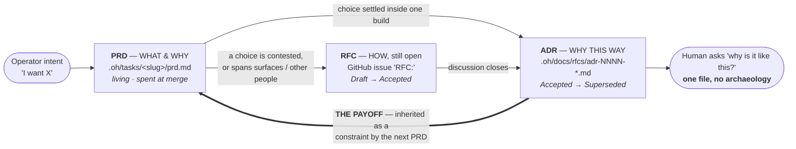
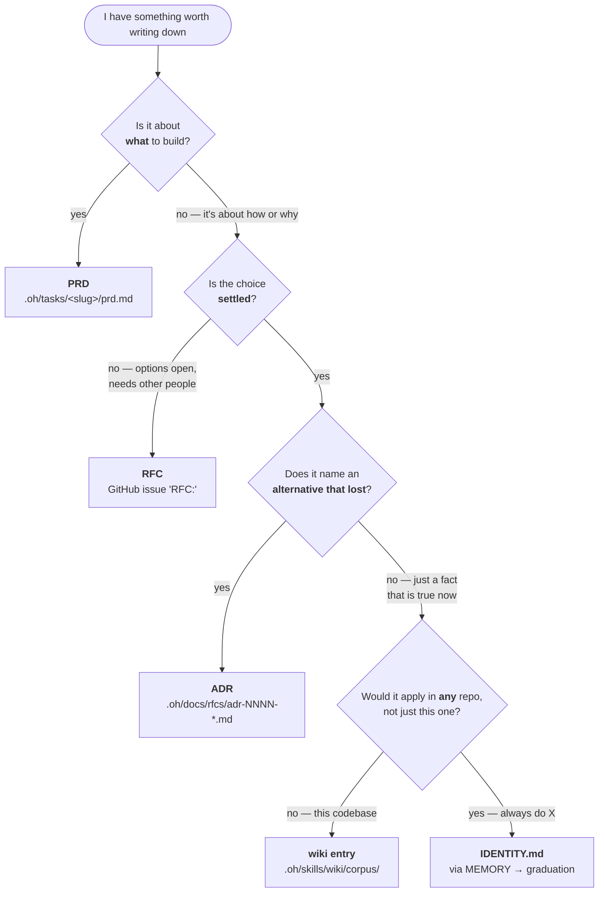

# PRD: Decision-record route and index guard for `.oh/docs/rfcs/` (#686)

## 1. Introduction/Overview

An external conversation produced a proposal to adopt a full ADR/RFC pipeline in this repo:
repo-root `docs/adr/NNNN-title.md` with YAML frontmatter, a machine-readable `0000-adr-index.json`,
`> Agent Directive:` normative blockquotes, and a GitHub Action (`rfc-to-adr.yml`) calling OpenAI
structured outputs to auto-condense merged RFCs into ADRs.

The operator asked for an assessment — pros, cons, and a council **go / no-go** on whether this
improves on the previous state — with a PRD as the deliverable regardless of verdict.

**Result: NO-GO on the machinery.** The source proposal scored 2/14 with two vetoes. A minimal
residual design scored 13/14 in synthesis, then failed adversarial review at 8/14 with a veto. This
PRD records that assessment, ships the two real defects the council found along the way, and sets an
explicit re-entry bar.

The decisive finding was not about document format. `.oh/docs/rfcs/` already exists, and ADR-0001
(Accepted 2026-07-03) already decided to keep it lightweight. The question was whether that surface
is *underspecified* or simply *unused* — and the dating evidence answers **unused**.

## 2. Goals

- Record a scored, falsifiable go/no-go assessment that a future reader can re-run and disagree with.
- Ship the two orthogonal defects the council discovered, independent of the machinery question.
- Set a concrete re-entry bar so #686 is not re-litigated without new evidence.
- Correct the public record: issue #686's body states a dormancy figure that is wrong.
- Add **zero** always-loaded context cost.

## 3. User Stories

### US-001: Record the council verdict and correct the issue

**Description:** As the operator, I want the go/no-go assessment committed alongside its evidence so
the decision is auditable without rerunning the council.

**Acceptance Criteria:**

- [ ] `.oh/tasks/rfcs-decision-route/prd.md` contains a `## Council Verdict` section with both
      scorecards (source proposal and residual), each scoring C1–C7 as 0/1/2 with a total out of 14.
- [ ] The residual scorecard shows `C2 = 0` and the verdict reads `NO-GO`.
- [ ] `.oh/tasks/rfcs-decision-route/council.md` contains the three wave-1 analyses, four First Mate
      rulings, both critics' findings in
      `[SEVERITY] [STORY] [FINDING] | [EVIDENCE] | [RECOMMENDATION]` format, and ends with
      `STATUS: SPEC-DENIED`.
- [ ] A `## Rejected from the source proposal` section names all four elements with one repo fact each.
- [ ] A `## Corrections` section records the two false claims this council made and caught.
- [ ] No shipped artifact claims `.oh/docs/rfcs/` is four months dormant. Verified in both places:
      `gh issue view 686 --repo mifunedev/openharness --json body --jq .body | grep -ciE "four months|one ADR"` → `0`,
      and the same grep over `.oh/tasks/rfcs-decision-route/*.md` → `0` outside the `## Corrections`
      section that records the error. *(Checked: the issue body never carried the stat — it appeared
      only in council drafts, so no issue edit was required. The AC originally assumed otherwise and
      is corrected here rather than reported as satisfied on a false premise.)*
- [ ] Issue #686 carries a comment stating the verdict and linking the PR, so a reader of the issue
      does not have to open the PR to learn the outcome.
- [ ] `git ls-files .oh/tasks/rfcs-decision-route` lists all five files.

### US-002: Fix the live RFC index rot

**Description:** As a maintainer, I want every file in `.oh/docs/rfcs/` reachable from the index a
human enters through, so a quarter of the corpus is not invisible.

**Acceptance Criteria:**

- [ ] `.oh/docs/README.md` § Reference gains a link to `rfcs/rfc-runtime-support.md`.
- [ ] `grep -c "rfc-runtime-support" .oh/docs/README.md` returns `≥1` (returns `0` on `development`).
- [ ] Every file matching `.oh/docs/rfcs/*.md` except `README.md` is linked from `.oh/docs/README.md`;
      verify the set difference is empty.
- [ ] CHANGELOG `## [Unreleased]` gains a `### Fixed` entry referencing #686.

### US-003: Fix the dangling `.claude/rules/` reference in the critic agent

**Description:** As an agent author, I want `critic.md` to reference only paths that exist, so its
instructions stay internally consistent.

**Acceptance Criteria:**

- [ ] `.oh/agents/critic.md:32`'s `.claude/rules/` bullet is removed or repointed to a path that
      exists; `ls -d .claude/rules` currently fails.
- [ ] `grep -c 'claude/rules' .oh/agents/critic.md` returns `0`.
- [ ] `bash .oh/scripts/link-providers.sh` is run and `diff .oh/agents/critic.md .claude/agents/critic.md`
      shows the change propagated — `.claude/agents/critic.md` is a **materialized copy, not a
      symlink**, so editing the `.oh/` original alone does not reach the Claude-facing agent.
- [ ] `bash .oh/skills/eval/run.sh` shows no probe transitioning green→red.

## 4. Functional Requirements

- **FR-1:** The assessment must score both the source proposal and the residual design against the
  same seven criteria, fixed before the council ran.
- **FR-2:** Any veto-row zero (C1, C2, C3, C6) forces `NO-GO` regardless of total.
- **FR-3:** The PRD must state which of the four operator pain points a decision-record format
  actually solves, and which it does not.
- **FR-4:** Every claim carrying "verified" must name the command that verified it.
- **FR-5:** No file in the always-loaded set may be modified:
  `git diff upstream/development...HEAD --stat -- AGENTS.md .oh/context/ .oh/memory/` must be empty.
- **FR-6:** No `SKILL.md` or agent `description:` frontmatter may change — frontmatter is
  always-injected across 40 skills and 6 agents.

## 5. Non-Goals (Out of Scope)

Explicitly **not** built, each requiring its own future issue with concrete evidence, mirroring
ADR-0001's own deferral discipline:

- Repo-root `docs/adr/`, YAML frontmatter on rfcs files, `0000-adr-index.json` or any registry.
- `> Agent Directive:` normative syntax.
- `rfc-to-adr.yml` or any CI-hosted LLM generation step; any second LLM vendor.
- A `## Decision Record` block in `.oh/skills/prd/SKILL.md`.
- Arbitration rows in `.oh/skills/wiki/references/schema.md` or
  `.oh/skills/retro/references/memory-protocol.md`.
- An index-freshness probe.
- Any numbering authority independent of GitHub issue numbers, or a 4th lifecycle state.

## 6. Design Considerations

### The PRD / RFC / ADR system — what each is for

No diagram of this system exists anywhere in the repo, and "nobody knows which document to write" is
a real share of the scatter problem. Recorded here even under a NO-GO, because the model is correct
independent of whether new machinery ships.

| | **PRD** | **RFC** | **ADR** |
|---|---|---|---|
| Answers | **WHAT** to build & why it's worth doing | **HOW** to build it — options still open | **WHY THIS WAY** — and what lost |
| Lives at | `.oh/tasks/<slug>/prd.md` | GitHub issue titled `RFC:` (+ optional `.oh/docs/rfcs/rfc-*.md`) | `.oh/docs/rfcs/adr-NNNN-*.md` |
| Written by | `/prd`, from operator intent | a human or agent opening a proposal | the author who settled the trade-off |
| Read by | builder agents, critics, operator | reviewers, operator | future agents and future humans |
| Lifespan | living — overwritten on rerun, spent at merge | `Draft → Accepted` | `Accepted → Superseded`; never edited in place |
| What it buys | scope a build can be held to | disagreement surfaces before code exists | the next task inherits the constraint |

**The thick edge is the whole system; everything else is cost.** This is why the verdict is NO-GO:
the council could design the write side, but could not show the read side is ever traversed. `git
grep 'docs/rfcs\|adr-0001'` returns references only from `.oh/docs/*` and `CHANGELOG.md` — **zero**
from any of the 40 skills, 6 agents, 5 context files, or `AGENTS.md`.

**Which document do I write?** The router below is correct and costs nothing; it is recorded for
reference, not shipped as a convention.

The discriminating test, applied without judgment: **if the sentence would become false once the
decision is reversed, it is a wiki fact; if it describes the option that lost, it is an ADR.**

## 7. Technical Considerations

- Base is `upstream/development` (mifunedev). `origin` (ryaneggz) is a stale fork.
- `.oh/tasks/*` is gitignored except `README.md` — this folder requires `git add -f`.
- Merging into `upstream/development` does not auto-close `Closes #686`; close manually.
- `.claude/agents/critic.md` is a materialized copy synced by `.oh/scripts/link-providers.sh`, not a
  symlink (US-003).
- `.oh/manifest.json` vendors `evals/**` but not `docs/**` — any future probe over `.oh/docs/`
  must `exit 2` downstream, which is part of why the probe was deferred rather than shipped.

## 8. Success Metrics

- `grep -c "rfc-runtime-support" .oh/docs/README.md` moves `0 → ≥1`.
- `grep -c 'claude/rules' .oh/agents/critic.md` moves `1 → 0`, propagated to `.claude/agents/`.
- Always-loaded token delta: **0** bytes across `AGENTS.md`, `.oh/context/`, `.oh/memory/`.
- Net new executables: **0**. Net new skills: **0**. Net new CI jobs: **0**.
- `/eval` shows no green→red transition beyond the two REGRESSIONs already on `development`
  (`cc-safety-net-wiring`, `next-dev-prod`).

## 9. Open Questions

- Does an author ever *attempt* `.oh/docs/rfcs/` and hit friction? That is the re-entry bar and it is
  currently unobserved in either direction.
- Is `.oh/tasks/` the right permanent home for decision content given the weekly archive sweep? The
  cited probe-break instance was refuted, but the hazard class is real for any task whose
  `progress.txt` genuinely ends with `STATUS: COMPLETE`.
- `## Wiki Alignment` is omitted from 7 of 8 PRDs despite being a mandatory step. Is that a
  compliance problem worth its own issue, independent of #686?

---

## Council Verdict

Seven criteria, fixed before the council ran. Veto rows: **C1, C2, C3, C6** — any zero forces NO-GO.
Thresholds: `GO ≥ 11` · `PARTIAL-GO 7–10` · `NO-GO ≤ 6 or any veto zero`.

### Source proposal, as written

| # | Criterion | Score | Basis |
|---|---|:--:|---|
| C1 | Always-loaded delta | 2 | Adds no always-loaded content — but only because nothing reads it. |
| C2 | Moves a named instrument | **0** | A CI Action moves no probe and no capability benchmark. **VETO** |
| C3 | Arbitration rows | **0** | None proposed; a 7th surface with no boundary rule. **VETO** |
| C4 | Evidence vs ADR-0001 | 0 | Cites no repo artifact. |
| C5 | Net machinery | 0 | New CI job, new vendor, new repo secret. |
| C6 | Pain-point honesty | 0 | Implicitly claims the format solves all four. |
| C7 | Reversibility | 0 | Converts 4 tracked docs to YAML; creates a competing root directory. |

**2 / 14 — two veto zeros — NO-GO.**

### Residual design, after adversarial review

| # | Criterion | Synthesis | Post-critique | Why it moved |
|---|---|:--:|:--:|---|
| C1 | Always-loaded delta | 2 | **2** | Holds — token delta genuinely 0. |
| C2 | Moves a named instrument | 1 | **0** | Circular: guards index freshness on a surface with no write traffic, and cannot detect the dominant failure (never written). **VETO** |
| C3 | Arbitration rows | 2 | **1** | Well-drafted but outside `/audit context` Dimension D's scanned set — unenforced prose. |
| C4 | Evidence vs ADR-0001 | 2 | **1** | Inverted by dating (below). One cited instance refuted. |
| C5 | Net machinery | 2 | **1** | One executable, but 6+ scattered edit points for one norm, plus an edit to the protected harness-wide `prd` skill. |
| C6 | Pain-point honesty | 2 | **1** | Analysis was honest, but shipped one false "verified" claim and one wrong stat. |
| C7 | Reversibility | 2 | **2** | Holds — purely additive. |

**8 / 14 — one veto zero (C2) — NO-GO.**

### The decisive finding

The question was never "what should an ADR look like." It was **is this surface underspecified or
unused** — and the dates answer it:

| Artifact | Created | vs. ADR-0001 (2026-07-03) |
|---|---|---|
| `.oh/tasks/cc-safety-net/decision.md` | 2026-07-19 | +16 days |
| `.oh/tasks/first-mate-charter/plan.md` | 2026-07-21 | +18 days |
| `.oh/docs/open-core.md` § Why not the alternatives | 2026-07-24 | +21 days |
| `.oh/tasks/slack-admin-command-surface/critique.md` | 2026-07-31 | +28 days |

Four of the seven hand-rolled decision records were authored **after** the formal destination already
existed. Their authors had the option and chose the ad hoc, local, zero-ceremony file anyway. That is
evidence of a surface being **routed around**, not one that is missing schema. Adding a contract, two
arbitration rows, and a probe to a surface authors avoid is
machinery-growth-without-capability-movement — `/audit eval-quality` Check 7, and precisely what
ADR-0001 pre-emptively deferred.

### Honest pain-point mapping

| Pain point | Solved by a decision-record format? | What would actually solve it |
|---|---|---|
| (a) agents re-litigate settled choices | **Partially at best** — a record nothing loads has no normative force; `git grep` finds zero references to `.oh/docs/rfcs/` from any skill, agent, or context file | A read path, which this design could specify but not demonstrate is traversed |
| (b) humans can't reconstruct *why* | **Yes, narrowly** — one question, one time | An indexed record. Measured: for "what does the manifest buy," delta is **0** (already 2 files). For "why isn't documenting enough," `grep` returns 3 mechanics files and **0** containing the rejection reasoning |
| (c) rationale scattered across 6 surfaces | **No — makes it worse** unless arbitration is enforced, and the proposed rows are unenforced prose | Enforced boundaries, which `/audit context` cannot currently provide for these paths |
| (d) in-build decisions evaporate | **No — they don't evaporate.** `git ls-files .oh/tasks` shows 35 tracked files; the decision docs are all tracked | An indexing step, not a new record type |

### Rejected from the source proposal

| Element | Repo fact that kills it |
|---|---|
| YAML frontmatter | Zero YAML delimiters exist in the rfcs corpus and nothing parses them; the wiki earns frontmatter only because `.oh/evals/probes/wiki-readme-index.sh:40` actually invokes the extraction. Converting 4 tracked files is churn for zero consumers. |
| `0000-adr-index.json` | No JSON-for-*knowledge* precedent exists under `.oh/docs/`; `prd.json` is JSON-for-*work*. A second index beside the existing markdown tables is two sources of truth with no writer/reader pair to sync them. |
| `> Agent Directive:` | Repo-wide grep returns zero hits. `.oh/manifest.json` excludes `docs/**`, nothing loads `.oh/docs/rfcs/` at session start, so the marker has no runtime carrier. `.oh/context/IDENTITY.md` is the existing carrier of "always do X". |
| `rfc-to-adr.yml` + OpenAI | Violates the harness-native constraint: new CI job, new vendor, new repo secret, and generation drift with no probe able to detect a wrong-but-plausible generated ADR. |

### Corrections

This council made two errors and caught both. Recorded rather than quietly fixed.

1. **A "verified" claim that was not verified.** The council asserted that
   `.oh/evals/probes/slack-admin-command-surface.sh` would break when the cleanup cron archived its
   task folder. It confirmed the probe hard-codes the path (`:12`) and that the cron archives — then
   asserted the break without checking whether the predicate fires. `.oh/crons/cleanup-tasks.md:76-77`
   requires `progress.txt` to *end with* a line matching exactly `STATUS: COMPLETE`; in that file the
   line is 19 of 40. **The instance is refuted.** Checking a proxy rather than the behaviour is
   `.oh/context/IDENTITY.md:8` — committed inside a document citing it.
2. **A wrong dormancy statistic.** "One ADR in four months" appears in issue #686 and early council
   drafts. `.oh/docs/rfcs/README.md` was created 2026-07-02 and ADR-0001 on 2026-07-03 — about one
   month. The corrected framing (4 of 7 records post-date the formal option) is both accurate and a
   stronger argument, in the opposite direction.

### Re-entry bar

Per ADR-0001's own discipline, a future issue reopening this should show an author or agent
**attempting** `.oh/docs/rfcs/` and hitting concrete friction — not merely bypassing it. Absent that,
the lightweight convention stands as ADR-0001 decided.
