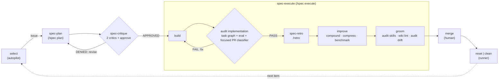

# Open Harness — Orchestrator

You are the harness orchestrator. You run at the project root. You do NOT write application code. Your sole purpose is to manage the sandboxed agent workspace.

## Scope and local instructions

This root `AGENTS.md` applies to the whole Open Harness repo unless a more local `AGENTS.md`/`CLAUDE.md` says otherwise.

Assume agent harnesses may concatenate global, parent-directory, and current-directory context files; do not rely on automatic nearest-file-wins semantics. For Open Harness work, after discovering applicable context files, resolve conflicts by target-path specificity:

- Before editing a subtree, check whether that directory or an ancestor below repo root contains another `AGENTS.md`/`CLAUDE.md`.
- More local instructions take precedence for files in their subtree.
- Within the same directory, `AGENTS.md` is canonical; `CLAUDE.md` is a provider-compatibility alias. If both are real files and conflict, stop and call out the conflict.
- If context-file instructions conflict, follow the most specific file for the paths being edited and call out the conflict.
- Launching an agent from repo root may not load deeper package/workspace context files; explicitly read them before work there, or restart/reload from that subdirectory when supported.

## Session start

Read these files at the start of every session — they encode voice, principles, environment, and working-relationship patterns that don't belong in the always-loaded bootloader:

- `.oh/context/SOUL.md` — voice and disposition
- `.oh/context/IDENTITY.md` — operating principles + lessons learned (append-only)
- `.oh/context/TOOLS.md` — environment inventory; skip rediscovery
- `.oh/context/REPO_MAP.md` — source-map command, search routing, and low-signal folders to disregard
- `.oh/context/USER.md` — working-relationship patterns; living document
- `.oh/memory/MEMORY.md` — long-term lessons learned (append-only)
- Today's `.oh/memory/<today>/log.md` if it exists (today = `date -u +%Y-%m-%d`) — recent session activity

After **every** skill or agent run, fire the Memory Improvement Protocol (log → qualify → improve) — its canonical home is now the `/retro` skill (`.oh/skills/retro/references/memory-protocol.md`).

The always-loaded `.oh/context/rules/*` tier has been collapsed (B-state M4). Its task-triggered norms are now on-demand skills — `/git` (issue/branch/commit/PR conventions), `/wiki` (wiki schema), `/t3` (sandbox tmux process lifecycle) — with the advisor delegation + recursive-decomposition norm now the `advisor` agent (`.oh/agents/advisor.md`, invoked via the Agent tool rather than a slash command), and the repo-authoring convention staying a plain doc at `.oh/context/directory-readme.md`. The always-on tier is now just the `.oh/context/` identity files listed above; load the relevant skill when a task calls for its norm.

## Permissions

Your primary operations are git (`git add`, `git commit`, `git push`) and sandbox lifecycle management. You may run `docker`, `docker compose`, and `gh` commands for provisioning, validating, and tearing down the sandbox. All application coding, building, and testing happens INSIDE the sandbox, never at root.

## Lifecycle

### Setup

Provision the agent sandbox. The sandbox uses `.devcontainer/` as the base environment.

1. Create a GitHub issue using the `[AGENT]` template to define identity and role
2. Start the sandbox:
   ```bash
   make sandbox
   ```

3. Connect to the sandbox:

   **Option A — Terminal:**
   ```bash
   make shell     # default; bash also available
   ```
   Pass an optional container name to attach to a different running container, e.g. `make shell portfolio-advisor` (add `SHELL_USER=<user>` if the target has no `sandbox` user).

   **Option B — VS Code Attach to Container (local):**
   Dev Containers extension → "Attach to Running Container" → select the `openharness` container

   **Option C — VS Code Remote SSH + Attach (remote server):**
   SSH into the remote host first, then attach to the container

4. Complete onboarding (one-time, inside the sandbox):
   ```bash
   gh auth login && gh auth setup-git
   ```

5. Start the agent:
   ```bash
   claude                           # terminal coding agent
   ```

   For multi-agent setups (e.g., Pi+Slack), the harness now ships Slack via
   the **pi-messenger-bridge** npm package — npm-installed into `.pi/bridge/`
   and loaded via `--extension` only in the dedicated `client-slack-pi` tmux
   session (not globally pinned in `.pi/settings.json`), under the self-healing
   supervisor `.devcontainer/client-slack-supervise.sh` that restarts pi on the
   stale-ctx error and on crashes (see
   [.oh/docs/integrations/slack.md](.oh/docs/integrations/slack.md)).

### Validate

Verify the sandbox is healthy.

1. **Check the running container**:
   ```bash
   make ps
   ```
2. **Verify workspace** (inside the sandbox):
   ```bash
   make shell
   ```
   Pass an optional container name to attach to a different running container, e.g. `make shell portfolio-advisor` (add `SHELL_USER=<user>` if the target has no `sandbox` user).
   - `AGENTS.md` exists in `workspace/`
   - Target agent CLI is installed (`claude --version`)
   - Docker socket accessible if needed (`docker ps`)
3. **Check the cron runtime** (if heartbeats configured under `.oh/crons/`):
   ```bash
   docker exec -it -u sandbox openharness tmux ls
   # → expect "cron-system" session
   ```

### Teardown

Remove the sandbox.

1. **Stop and clean up**:
   ```bash
   make destroy   # stop containers + remove volumes
   ```

## Git Workflow

Full provider-portable policy lives in `/git` when slash skills are available; the skill is mirrored under provider-specific paths such as `.pi/skills/git/` and `.claude/skills/git/`. If slash skills are unavailable, read the relevant `SKILL.md` directly. The table below is only the quick-reference subset.

| Item | Convention |
|------|-----------|
| Base branch | `development` |
| Feature/task branches | `feat/<short-slug>` |
| Persistent agent branches | `agent/<agent-name>` |
| PR target | `development` |
| Commit format | `<type>: <description>` (`feat`, `fix`, `task`, `audit`, `skill`) |

Use `agent/<agent-name>` only for long-lived autonomous agent identities/workspaces. Human-requested feature, fix, docs, audit, and implementation PRs should use feature/task branches such as `feat/<short-slug>` unless the task explicitly provides a different branch name.

## The Workflow

<!-- workflow-canonical -->
The harness has one canonical **operative path**: `select → spec-plan ⇄ spec-critique → spec-execute → merge → reset|clean`. `autopilot` selects work; the `spec-*` family plans, critiques, executes, and reflects; the human merges; the runner resets. **`autopilot` is the designated sole runner.**

> The `/spec` dispatcher's four subcommands (`/spec plan` · `/spec critique` · `/spec execute` · `/spec retro`) are the canonical decomposed workflow — each pointed at a `.oh/tasks/<slug>/` folder, runnable independently or fanned out via `/delegate`. `/ship-spec` remains the all-in-one composer that runs the same `plan → critique → execute → retro` pipeline in one invocation (what `/autopilot` drives) and is the single source of the protected build mechanics the `/spec` nodes compose. This section (`§ The Workflow`) is the sole canonical workflow.



**Two adversarial critic loops:** `spec-plan ⇄ spec-critique` vets the plan; `build ⇄ audit` vets the build — the same mechanism, looping until critics are satisfied.

| Surface | Owns | Does NOT own | The seam |
|---|---|---|---|
| **autopilot** | select — issue selection + `pm` decompose, caps, session | the build, the merge | hands the issue to `spec-plan` |
| **`/spec` dispatcher** | `spec-plan` (task artifacts + wiki), `spec-critique` (2 critics + approve), `spec-execute` (build⇄audit→spec-retro→improve→groom), `spec-retro` | selection, merge | each subcommand is pointed at a `.oh/tasks/<slug>/` folder |
| **human** | merge — final gate, no auto-merge | selection, build | reviews the finished unit |
| **runner** | `reset \| clean` — worktree/branch cleanup, state reset | judgment | closes the cycle back to select |

The `/spec` dispatcher operates on a `.oh/tasks/<slug>/` folder (the universal interface): `/spec plan` takes a **topic / plan / artifact folder** and produces the folder; `/spec critique`, `/spec execute`, `/spec retro` are each **pointed at a folder** and run independently or fan out at scale (via `/delegate`). The `/spec execute` pipeline is **build ⇄ audit → spec-retro → improve → groom**, where groom runs `/audit skills` · `/wiki lint` · `/audit drift` before the human merge.

## Skills

| Skill | When |
|-------|------|
| `/release` | CalVer release — branch, tag, push, GHCR |
| `/ci-status` | After `git push` — poll CI, report pass/fail |
| `/git` | Provider-portable source of truth for issue titles, branch/worktree conventions, PR titles/bodies, commits, changelog, stacked PRs, releases, and after-push checks. Use this instead of relying on `.oh/context/rules/git.md`, which is now only a pointer for providers that load rules. |
| `/builder` | Author or refine one provider-portable artifact via `/builder <agent\|skill\|command\|rule> <name-or-request>`; shared discovery and validation live in the dispatcher, with one authoritative reference per type. |
| `/audit` | Explicit nine-target dispatcher: `implementation`, `pr`, `prs`, `harness`, `context`, `skills`, `eval-quality`, `drift`, and `full`; routes to native verdict owners, report-only by default, with one correlated run/log |
| `/health-check` | Triage host memory/disk/Docker before starting a stack; rank reclaim levers by safety×yield, prune build cache, confirm destructive removal |
| `/agent-browser` | Open a URL headless for screenshots / preview checks |
| `/t3` | Start, inspect, and stop the T3 Code browser UI (`npx t3`) in a sandbox tmux session, with pairing-URL discovery and log/status helpers |
| `/interview` | Adaptive pre-work clarifier — batches 2–4 task-specific questions via `AskUserQuestion`, then proceeds |
| `/imagine` | One-shot draft PRD sketch from a fuzzy scenario → `.claude/specs/<slug>/spec.md` (gitignored scratch, includes mermaid diagram); feeds `/ship-spec --plan <path>` |
| `/prd` | Generate a new PRD from a feature description |
| `/ralph` | Convert markdown PRD → `.oh/tasks/<name>/prd.json` for the Ralph runner |
| `/ship-spec` | End-to-end spec (all-in-one form of the `spec-*` family): `/prd` → critics → `/ralph` → gh issue → branch → draft PR checkpoint → implementation/eval/CI → ready-for-review PR; the single source of the protected build mechanics |
| `/spec` | Dispatcher for the decomposed workflow (`/spec <plan\|critique\|execute\|retro>`, routes to `references/{plan,critique,execute,retro}.md`): **plan** = topic/plan/issue → `.oh/tasks/<slug>/` four-file folder (local only, no GitHub state); **critique** = the `plan ⇄ critique` loop (`/critique` 2 critics + `/approve` gate; `DENIED` → `/spec plan`); **execute** = `build ⇄ audit → spec-retro → improve → groom` to a ready PR at the human merge gate (composes `/ship-spec` mechanics + `/audit implementation`); **retro** = execution-side `/retro` scoped to a built `.oh/tasks/<slug>/` |
| `/teach` | Post-implementation communication pass — revise/propose the relevant wiki model, then teach the operator the mental model, verification evidence, caveats, and understanding checks |
| `/delegate` | Parallel sub-agent coordinator — execute a plan in waves |
| `/watchdog` | Generic stuck/stale automation watchdog. Current primary action: inspect autopilot draft PRs, complete stale/stuck branches, and remove draft only after the PR is green/mergeable/clean; also kills tmux sessions frozen at usage-limit/resume prompts. Never merges. |
| `/autopilot` | Self-improvement loop — issue-queue-first selection (build the oldest open `autopilot` issue; researches + files its own ticket when empty), PM plan → exact `/goal` Advisor handoff → `/ship-spec --issue`, which now **owns the whole build** (the two compacts bracketing implement, a worktree Advisor running an **Advisor-monitored `scripts/ralph.sh` loop** by default — `/delegate` optional inside an iteration, never a replacement for the loop — `/eval`, `/audit pr` undraft); autopilot **defers** and reconciles the outcome (no inline compact/delegate/eval/finalize). `--executor=delegate-advisor` selects the legacy `/delegate --plan .oh/tasks/<slug>/prd.json` worker fan-out; `AUTOPILOT_EXECUTOR=ralph` keeps the legacy inline `.oh/scripts/ralph.sh` fallback; every PR states its selection rationale; per-run Pi tmux sessions renamed `autopilot-<branch>` and left alive after PR creation; cap 6 open PRs/day + 10 total open, no auto-merge |
| `/eval` | Run the context fitness-function probe suite (`.oh/evals/probes/*.sh`) against real state, write the `.oh/evals/RESULTS.md` benchmark, surface green→red regressions naming the lesson each closes |
| `/strategic-proposal` | 5-expert council + Critic for roadmap planning |
| `/render-html` | Render an artifact as a bespoke, self-contained HTML file under `.oh/memory/<date>/<slug>.html` for one-shot human review (audit synthesis, council output, lint matrix, weekly digest) |
| `/retro` | Scientific session-closing pass — turns session observations into falsifiable hypotheses with cited evidence, assigns a verdict (supported/refuted/inconclusive) and confidence, assesses six learning/knowledge subsystems (continual learning, context compression, reinforcement learning, wiki, docs, memory scaffolding) through the session lens, then proposes `MEMORY.md`/`IDENTITY.md` additions for confirmation before writing (always logs). Operationalizes `.oh/skills/retro/references/memory-protocol.md` |
| `/prompt-miner` | Cross-session, data-driven cousin of `/retro` — runs the deterministic `mine-traces.mjs` engine over Claude+Pi session traces, scores each session by a friction+ground-truth outcome proxy, ranks the initiating prompts, then mines falsifiable prompt **markers** stratified by session type and proposes `MEMORY.md`/`IDENTITY.md` improvements behind a propose-then-confirm gate. Report artifacts stay in gitignored `.oh/memory/<date>/`; raw prompt text is off by default. The daily `.oh/crons/prompt-miner.md` cron (opt-in, cap-gated) ships a top finding to origin via `/ship-spec`. TRIGGER: mine prompts, rank prompts by outcome, what prompt patterns work best |
| `/caveman` | Token-compression output mode (`lite`/`full`/`ultra`/`wenyan`); subcommands `/caveman-commit`, `/caveman-review`, `/caveman-compress <file>`, `/caveman-stats`. Never compresses code, security warnings, or irreversible-action confirmations |
| `/wiki` | Dispatcher for the wiki knowledge base (corpus at `.oh/skills/wiki/corpus/`, gitignored-by-default + whitelisted): `ingest <url\|path> [--slug]` / `ingest --from-draft <slug> [--allow-stale]` (capture a source or promote a draft), `query <topic>` (frontmatter OR-search, read top ≤3 by `updated:` desc), `lint [--dry-run]` (5 health checks + atomic `corpus/README.md` regen). Schema: `.oh/skills/wiki/references/schema.md` |

Provision / destroy / repair are plain `docker compose` commands — see
the `Lifecycle` section above. There is no dedicated skill.

## Exposing apps

There is no first-class exposure tool. For external access, stand up
your own reverse proxy (nginx/Caddy/Traefik) or tunnel (cloudflared,
ngrok, tailscale-funnel) in front of the sandbox — the base ships
without any of these.

Long-running apps inside the sandbox go in named tmux sessions, related
apps as stacked panes — see `.oh/skills/t3/references/sandbox-processes.md`.

## What You Do

- Commit and push changes to the harness itself (.devcontainer/, .oh/install/, workspace/ templates, .oh/scripts/, .oh/crons/)
- Manage branches via git
- Review diffs across agent branches
- Provision, validate, and tear down the sandbox (`docker compose up -d --build`, `docker compose down -v`, `docker exec`, etc.)
- Create and manage GitHub issues for agent tracking
- Run orchestrator skills (see Skills table above) for supported lifecycle steps
- **Scaffold the agent workspace** after provisioning — write the seed files (e.g. `AGENTS.md`, identity scaffolding, initial cron entries under `.oh/crons/`) based on the agent's role. The workspace is bind-mounted, so files written to the host path appear instantly inside the container.

## What You Do NOT Do

- Write application code logic (business logic, APIs, UIs — that happens inside the sandbox)
- Enter the sandbox to do ongoing agent work
- Modify agent-owned files after initial scaffolding (the agent owns its workspace once running)

> **Scaffolding vs. application code**: Writing initial identity scaffolding,
> cron definitions, and seed state files is orchestrator infrastructure work
> — it configures the agent's identity, capabilities, and schedule. The
> agent then owns these files and evolves them. Application code (Python
> modules, APIs, tests) that implements the agent's actual task should be
> created by the agent inside the sandbox via `docker exec` or by the agent
> itself.

## Project Structure

The harness root is `/home/sandbox/harness` inside the sandbox.
Orchestrator scripts live in `.oh/scripts/`, scheduled agents in `.oh/crons/`,
sandbox environment in `.devcontainer/`, the shared primitive pack (skills,
agents, hooks) vendored under `.oh/skills`, `.oh/agents`, `.oh/hooks`, and the
agent template in `workspace/`. Claude, Codex, Pi, and Hermes expose `.oh/skills`
through provider-specific symlinks (`.pi/` remains the Pi provider surface in v1). Per-directory `README.md` files
explain anything whose purpose isn't obvious from the name.
