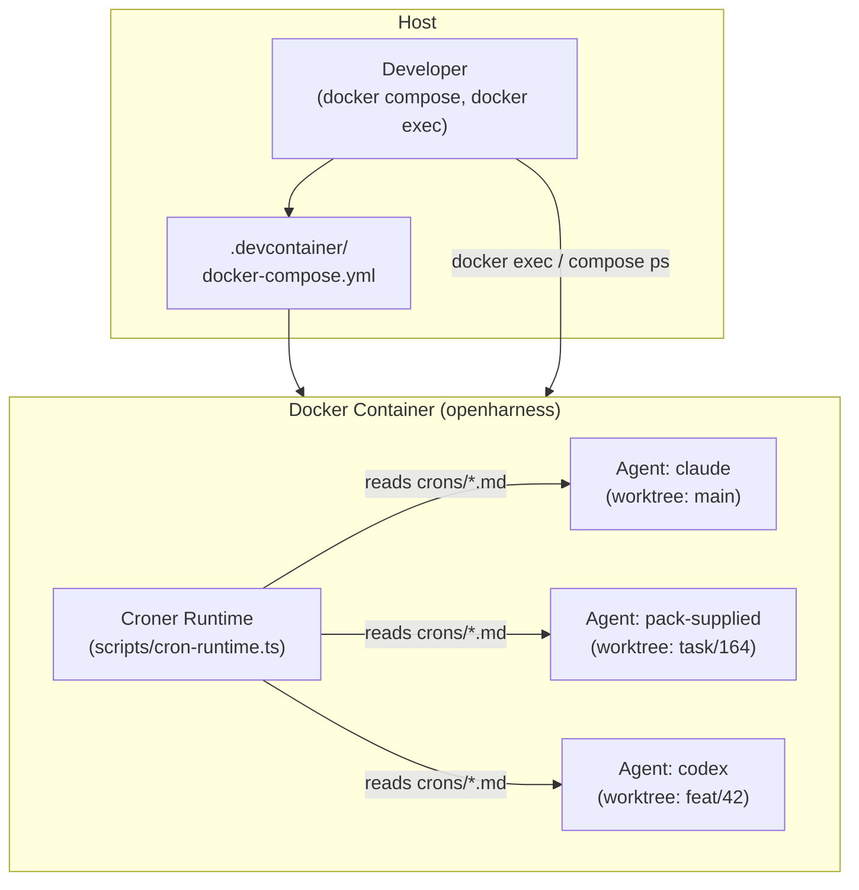

# Architecture Overview

Open Harness runs every AI agent inside a single Docker container. That container hosts multiple git worktrees side by side, one per agent branch. A croner runtime watches `crons/*.md` and fires scheduled tasks. The orchestration layer is plain `docker compose` against `.devcontainer/docker-compose.yml` on the host — no host CLI, no host Node toolchain.

There is no first-class exposure tool right now. Apps that need external access opt into the `cloudflared` overlay or run their own reverse proxy.

## The Shape of the System



**ASCII version** (for terminal-friendly viewing):

```text
┌─────────────────────────────────────────────────────────┐
│  HOST                                                   │
│  ┌──────────────────┐   ┌──────────────────────────┐   │
│  │  docker compose  │   │  docker-compose.yml       │   │
│  │  + docker exec   │──▶│  (.devcontainer/)         │   │
│  └──────────────────┘   └────────────┬─────────────┘   │
│                                      │ builds/starts    │
└──────────────────────────────────────┼─────────────────┘
                                       ▼
┌──────────────────────────────────────────────────────────┐
│  DOCKER CONTAINER  (openharness)                         │
│                                                          │
│  ┌────────────────────────────────────────────────────┐  │
│  │  In-sandbox tooling                                │  │
│  │  gh · docker CLI · tmux · claude · codex           │  │
│  └───────────┬────────────────────────────────────────┘  │
│              │                                           │
│  ┌───────────▼──────────────────────────────────────┐   │
│  │  Worktrees (bind-mounted from host)               │   │
│  │  /home/sandbox/harness/                (main)     │   │
│  │  /home/sandbox/harness/.worktrees/task/164  (PR)  │   │
│  │  /home/sandbox/harness/.worktrees/feat/42   (PR)  │   │
│  └───────────┬──────────────────────────────────────┘   │
│              │                                           │
│  ┌───────────▼──────────────────────────────────────┐   │
│  │  Agents (tmux sessions)                           │   │
│  │  agent-claude  ·  agent-codex  ·  pack agents     │   │
│  └───────────┬──────────────────────────────────────┘   │
│              │                                           │
│  ┌───────────▼──────────────────────────────────────┐   │
│  │  Croner Runtime (system-cron tmux session)        │   │
│  │  Watches crons/*.md frontmatter                   │   │
│  │  Fires schedules → invokes agent CLI              │   │
│  └──────────────────────────────────────────────────┘   │
└──────────────────────────────────────────────────────────┘
```

## Key Principles

**One container, many agents.** All AI agent CLIs — Claude Code (default), Codex, OpenCode, Pi, DeepAgents, plus any pack-supplied agents — share the same sandbox image built from `.devcontainer/Dockerfile`. There is no separate image per agent. Isolation is achieved through git worktrees and tmux sessions, not separate containers. The product surface is one developer, one project, one harness — preinstalled alternatives exist so you can pick the right tool for the task, not race them.

**Host stays thin.** The host only runs Docker. No host CLI, no Node runtime, no Python, and no agent toolchain is required on the developer's machine. The project root is bind-mounted into the container at `/home/sandbox/harness`, so files written inside the container are immediately visible on the host and in git.

**Worktrees are the unit of isolation.** Each in-flight branch maps to a worktree under `.worktrees/`. The croner runtime discovers `crons/*.md` and fires schedules from `crons/` at the repo root. Agents work in their own branch without touching each other's working tree.

**Process lifecycle is owned by tmux.** Every long-running process — dev servers, agents, tunnels, the croner runtime — runs in a named tmux session. This enables attach/detach, log capture via `tee /tmp/<session>.log`, and deterministic restart without `nohup` or background processes.

## Where to go next

- [Container Runtime](./container-runtime) — Dockerfile base, preinstalled tools, bind mounts, overlay system.
- For the repository file tree, see [Repo Layout](container-runtime.md#repo-layout).
