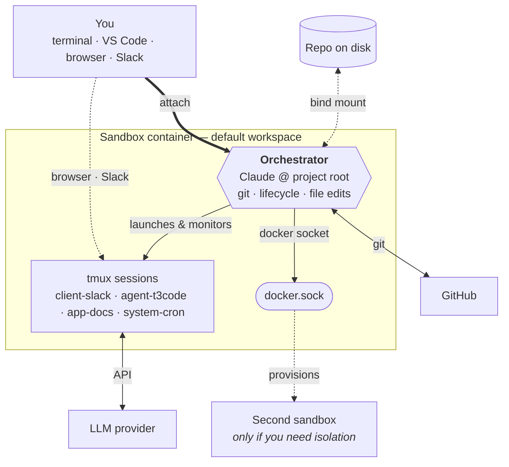

# Open Harness

Open Harness is a Docker-based agent harness for **one project**, agent-tended over time. A single sandbox container is scoped to a single repo, branch, and identity — the agent owns its workspace, runs against your code, and wakes itself on a schedule via a tiny croner runtime.

## What is Open Harness?

Open Harness packages a single AI agent in a Docker container called a sandbox. You bring it up with `docker compose`, attach to it from your terminal or VS Code, and let the agent work the project over time. There is no per-agent fan-out and no host CLI; everything happens through standard `docker compose` commands and the croner runtime that ships in the image.

Key capabilities:

- **One project, one sandbox.** A single container scoped to a single repo and branch. The agent owns its workspace; your laptop stays clean.
- **Markdown-defined crons.** `crons/*.md` files declare schedules; an in-container croner runtime fires the bodies as agent prompts so the agent can work autonomously while you focus on other things.
- **Only host dependency: Docker.** No Node, no Python, and no toolchain maintenance required on your laptop.
- **Composable infra.** Postgres, Cloudflare tunnels, and SSH are all opt-in Docker Compose overlays.
- **Multi-agent? Add a pack.** Slack-driven Pi+Mom and similar multi-agent setups ship as separate harness packs (e.g. [`@ryaneggz/mifune`](https://github.com/ryaneggz/mifune)).

## How it works

The harness uses Docker Compose to build a sandbox image from `.devcontainer/`. You bring the sandbox up with `docker compose -f .devcontainer/docker-compose.yml up -d --build`, attach with `docker exec -it -u sandbox openharness zsh` (or VS Code), authenticate GitHub and your chosen LLM provider once, then launch the agent with `claude` inside the sandbox. When you're done, `docker compose -f .devcontainer/docker-compose.yml down -v` tears everything down.

The agent session you attach to at the project root is your **orchestrator** — git, sandbox lifecycle, and most file edits all flow through a single attach. The orchestrator can drive other containers and edit files inside them over the Docker socket, so day-to-day work rarely needs anything else. Drop back to the host shell only when something can't be done from inside the container — typically adding a new bind-mounted volume, which requires a `.devcontainer/docker-compose.yml` change and restart.

Stand up a **second sandbox** only when you want isolation — an independent identity, branch, or provider key running on its own. Most users won't need this.

Inside the sandbox, a `system-cron` tmux session runs `scripts/cron-runtime.ts`, which reads `crons/*.md` and fires each body as a prompt to the configured agent on its declared schedule.

## How to read these docs

If you are new, follow this order:

1. [Installation](/docs/installation) — install Docker.
2. [Quickstart](/docs/quickstart) — go from zero to a running sandbox in under five minutes.

If you already have a sandbox running, jump directly to the page you need.

## Where to get help

- Source code and issues: [github.com/ryaneggz/open-harness](https://github.com/ryaneggz/open-harness)
- Learning material: [Resources](/docs/resources)

[Connecting to the Sandbox](/docs/connecting)
