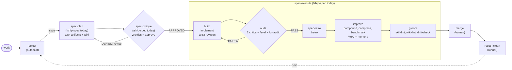

# PRD — Consolidate the harness workflow: deprecate the loop machinery, name the canonical operative path

## Introduction

The harness workflow is defined in two contradicting shapes (`AGENTS.md`'s 8-phase ring vs `context/rules/loop.md`'s 12-node executable tree) and run by two coexisting runners (`/autopilot` + `/orchestrate`). The 12-node executable-loop framework is the over-engineering the operator means by "too much going on" — what actually runs is `select → plan → execute → merge`.

This pass: (1) names the **canonical operative path** `select → spec-plan ⇄ spec-critique → spec-execute → merge → reset|clean`; (2) **deprecates the executable-loop machinery — `/orchestrate` and `context/rules/loop.md` — in this PR** (additive banner + CHANGELOG `### Deprecated`; pinned literals kept so the loop probes stay green; full deletion + probe retirement is Issue A); (3) records the remaining mechanical follow-ups as sequenced backlog issues. The deprecation **intentionally reverses the current authority chain** — loop.md today declares "this file leads" over AGENTS.md; after this PR, `AGENTS.md § Workflow` is canonical and loop.md is historical. That reversal is deliberate, not a side effect. The individual loop *skills* (`/critique`, `/approve`, `/audit`, `/retro`, `/benchmark`, …) are NOT deprecated — only the decision-tree spec and its runner.

## Goals

- One canonical operative path: `select (autopilot) → spec-plan ⇄ spec-critique → spec-execute → merge (human) → reset|clean (runner)`.
- A hard-boundaries table for autopilot, the spec-* family, human, runner.
- `/orchestrate` + `context/rules/loop.md` marked **DEPRECATED** in this PR (banner → `AGENTS.md § Workflow`; `### Deprecated` changelog; pinned literals untouched so the 4 loop probes stay green).
- One tier-A probe guarding the canonical definition from re-drift.
- Three sequenced backlog issues: **A** complete the loop/orchestrate removal; **B** fold the weekly crons into a time-dispatching heartbeat; **C** split `/ship-spec` into the four-skill spec-* family.

## Non-Goals

- **Deleting** `context/rules/loop.md` or `/orchestrate` (this PR only marks them deprecated; deletion + 4-probe retirement = Issue A).
- Building the spec-* family or editing `.claude/skills/ship-spec/SKILL.md` (protected, 5 probes) — Issue C.
- Editing `scripts/cron-runtime.ts` or deleting cron files — Issue B.
- Editing the `AGENTS.md` **Skills table** (the `/autopilot` row literals are pinned by `autopilot-executor-toggle.sh` + `watchdog-draft-prs.sh`).
- Changing `loop.md`'s §2/§7 node tables or `STATUS:` tokens (the banner is additive; reconciling the intro **authority prose** IS in scope).
- Adding a wiki entry (see Wiki Alignment).

This PR changes **six files**: `AGENTS.md` (narrative "The Loop" → "The Workflow" section only), `context/rules/loop.md` (DEPRECATED banner + intro authority/cross-ref reconcile), `.claude/skills/orchestrate/SKILL.md` (DEPRECATED banner — NOT a protected path), `evals/probes/workflow-boundaries.sh` (new), `evals/RESULTS.md`, `CHANGELOG.md`. No protected path touched.

## Workflow Decision Tree (what we're refining)

The **operative path** is canonical. `/ship-spec` splits into a symmetric **spec-* family** of four skills (Issue C); **until Issue C ships, `/ship-spec` performs all of them**. The 12-node executable loop (`loop.md` + `/orchestrate`) is **deprecated**.

- **`spec-plan ⇄ spec-critique` loop** — the spec is critiqued by 2 adversarial critics; `DENIED` routes back to `spec-plan` to revise; the loop repeats **until the critics are satisfied** (critic-before-commitment, made first-class); `APPROVED` proceeds to `spec-execute`. *(This very PRD went through that loop — pass-2 critics found 2 H findings, mitigated here.)*
- **`build ⇄ audit` loop (symmetric)** — the *same adversarial-critic mechanism* gates the build: `audit` runs 2 adversarial critics + `/eval` + `/pr-audit`; `FAIL` routes back to `build` to fix; the loop repeats **until the build is vetted**; `PASS` proceeds to `spec-retro`. The operative path thus has **two adversarial critic loops** — one on the plan, one on the build — mirroring loop.md's `DENIED → plan` and `audit FAIL → implement` edges.
- **The four spec-* skills (Issue C)** — each operates on a `tasks/<slug>/` folder, the universal interface:

| Skill | Input | Role / output | Maps to today |
|---|---|---|---|
| `/spec-plan` | a **topic** (free text), a **plan** file, or an existing **artifact folder** | produce/refresh `tasks/<slug>/` (prd, prd.json, prompt, progress) + wiki → draft PR | ship-spec 1–9, `/prd`, `/ralph` |
| `/spec-critique` | a **task folder** | 2 adversarial critics + approve → `critique.md` + APPROVED/DENIED; **loops with `/spec-plan`** | `/critique` + `/approve` |
| `/spec-execute` | a **task folder** | `build ⇄ audit → spec-retro → improve → groom` | ship-spec 10–13 + loop tail |
| `/spec-retro` | a **task folder** | reflective review of the execution | `/retro` |

- **The task folder is the universal interface.** `/spec-plan` is the producer (from a topic, a plan, or an existing artifact folder); `/spec-critique` / `/spec-execute` / `/spec-retro` are each **pointed at a `tasks/<slug>/` folder** and run **independently** (compose them in any order, resume a folder) or **at scale** (fan one skill out across many task folders via `/delegate`). This artifact-folder decoupling is what makes both the adversarial loops and parallelization possible.

- **Deprecated this PR**: `/orchestrate` + `context/rules/loop.md` (banners → `AGENTS.md § Workflow`; full removal = Issue A).
- **Wiki touchpoints**: `spec-plan` (alignment + seed) and `spec-execute → improve` (`compound`); `groom` runs `/wiki-lint` (index only).
- **Runner** = `/autopilot` (single). **Crons** = `heartbeat` (weeklies fold in → Issue B); `autopilot` keeps its own timer.

### `/spec-execute` — full pre-merge pipeline (US-001 documents; Issue C wires)

| # | Phase | Steps | Gate |
|---|---|---|---|
| 1 | **build** | `/delegate` + `scripts/ralph.sh` implement; **wiki revision** (1st touchpoint) | `STATUS: COMPLETE` |
| 2 | **audit** ⇄ build | **2 adversarial critics** + `/eval` (regression floor) + `/pr-audit` (promotable); `FAIL` → back to `build`, loop until vetted | promotable verdict |
| 3 | **spec-retro** | `/retro` — falsifiable lessons | lessons captured |
| 4 | **improve** | `compound` (`/wiki-ingest` + `MEMORY.md`, 2nd touchpoint) · `compress` (`/context-audit`) · `benchmark` | knowledge promoted |
| 5 | **groom** | see steps below | health reported |
| → | **merge** | human merges the finished unit | final gate (no auto-merge) |
| ↺ | **reset \| clean** | worktree/branch cleanup, stale-session reap, state reset | cycle continues |

**Groom phase steps (before merge):** `/skill-lint` (skill staleness) · `/wiki-lint` (wiki health + README index) · `/drift-check` (framework/branch/cron drift, read-only).

### Current sprawl → target

| Sprawl today | This PR's refinement |
|---|---|
| Two contradicting loop shapes + two runners in limbo | One canonical operative path; **`loop.md` + `/orchestrate` deprecated** (US-001/002/005); full removal → Issue A |
| `/ship-spec` is one monolith | Split into the symmetric four-skill spec-* family (`/spec-plan` ⇄ `/spec-critique` → `/spec-execute` → `/spec-retro`) → Issue C |
| Critique is an inline stage, not loopable | `/spec-plan ⇄ /spec-critique` loops until critics are satisfied (Issue C); critic-before-commitment made first-class |
| Audit is a one-shot gate | `build ⇄ audit` is an adversarial critic loop (same mechanism as `spec-plan ⇄ spec-critique`); **two loops** gate plan and build, mirroring loop.md's `DENIED → plan` + `audit FAIL → implement` |
| Self-improvement + groom scattered | `/spec-execute` owns `build → audit → spec-retro → improve → groom` before the human merge |
| 4 independent cron timers | `heartbeat` time-dispatches the weeklies; `autopilot` separate → Issue B |

## User Stories

### US-001 — Truth-up `AGENTS.md` "The Loop" → "The Workflow"
As an operator, I need one canonical, operator-facing workflow.
**Acceptance criteria:**
- In `AGENTS.md` (root; `CLAUDE.md` is its symlink alias), replace the narrative "The Loop" section with `## The Workflow` naming the operative path `select → spec-plan ⇄ spec-critique → spec-execute → merge → reset|clean`. Heading is `## The Workflow` + the `<!-- workflow-canonical -->` anchor comment (US-003 probe).
- **Honesty (H-finding):** the spec-* skills do NOT exist yet (Issue C). Label each spec-* node in the embedded mermaid with "(/ship-spec today)" AND include, inside `## The Workflow`, the sentence: "Until Issue C ships, `/ship-spec` performs spec-plan/spec-critique/spec-execute/spec-retro (see the `/ship-spec` Skills-table row)." The `/ship-spec` literal MUST appear in the section (US-003 guards it).
- **Embed the decision tree**: the mermaid + the spec-* family table + the `/spec-execute` pre-merge pipeline table + the enumerated groom steps.
- Hard-boundaries table rows for **autopilot** (select), the **spec-\* family** (plan/critique/execute/retro), **human** (merge), **runner** (reset|clean) — each with `owns` / `does NOT own` / `the seam`.
- Honest single-runner statement: "autopilot is the designated sole runner."
- **Do NOT edit the AGENTS.md Skills table** (pinned by `autopilot-executor-toggle.sh`, `watchdog-draft-prs.sh`). Identify the exact line range of the narrative section (its `## ` heading to the next `## `) and **diff the Skills table before/after** to confirm zero change. Run the full probe suite before push.
- Conciseness gate does not cover root `AGENTS.md`; keep surrounding prose tight (the diagram + tables are the substance).

### US-002 — Deprecate `context/rules/loop.md`
As an agent, I need the executable-loop spec deprecated so it stops competing with the canonical workflow.
**Acceptance criteria:**
- Add a `> **DEPRECATED**` banner after the H1, before the first `---` (NO `## ` heading inside it — loop probes scope via `awk '/^## 2\./'`): the framework is deprecated; canonical is `AGENTS.md § Workflow`; full removal is Issue A.
- **Reconcile the intro authority prose (H-finding):** lines ~8–10 currently say "this file is the executable spec … **this file leads**." Change to: "this file is preserved as a historical reference; the executable truth is `AGENTS.md § Workflow`." Also update intro/See-Also `AGENTS.md "The Loop"` → `AGENTS.md § Workflow`.
- **Do NOT change §2/§7 node tables or `STATUS:` tokens, and do NOT delete the file** — additive banner keeps `loop-handoff-consistency.sh`, `loop-benchmark-gate.sh`, `loop-repeat-gate.sh`, `orchestrate-contract.sh` green (verify via the suite). Deletion + probe retirement = Issue A.
- Add a `CHANGELOG.md` `### Deprecated` entry for `context/rules/loop.md`.

### US-005 — Deprecate `/orchestrate`
As the operator, I need the loop runner deprecated so a single runner (`/autopilot`) is unambiguous.
**Acceptance criteria:**
- Add a `> **DEPRECATED**` banner to `.claude/skills/orchestrate/SKILL.md` **after the `# Orchestrate` H1, never inside the YAML `---` frontmatter** (M-finding: inserting in the frontmatter breaks it while the file-wide `orchestrate-contract` grep still passes, masking the damage): `/orchestrate` is deprecated; canonical is `AGENTS.md § Workflow`; single runner is `/autopilot`; full removal is Issue A. (`/orchestrate` is NOT a protected path.)
- Keep the literals `orchestrate-contract.sh` pins (additive banner) so that probe stays green; verify via the suite.
- Add a `CHANGELOG.md` `### Deprecated` entry for `/orchestrate`.

### US-003 — Add the `workflow-boundaries` tier-A probe
As the harness, I need the canonical definition guarded from silent re-drift.
**Acceptance criteria:**
- Add `evals/probes/workflow-boundaries.sh` (tier A, 3-state). **Scope with awk** (not whole-file grep): extract the `## The Workflow` section via `awk '/^## The Workflow/{f=1} /^## [A-Za-z]/{if(NR>1 && !/^## The Workflow/)f=0} f'` (or equivalent section-bounded extraction, modeled on the loop probes). SKIPPED(2) if `AGENTS.md` absent; else PASS(0) only when ALL present in that section, else REGRESSION(1): the `<!-- workflow-canonical -->` comment, the operative-path markers in order (`select`, `spec-plan`, `spec-critique`, `spec-execute`, `merge`, then cycle node `reset`/`clean`), a single-runner phrase (`designated sole runner`), and the **`/ship-spec` current-monolith caveat literal** (so the honesty note cannot be silently dropped).
- Probe exits 0 against the US-001 edit; full suite regressions=0.
- Hand-insert one `evals/RESULTS.md` row (alphabetical) + one `CHANGELOG.md` `### Added` line; no wholesale RESULTS regen.

### US-004 — File the three sequenced backlog issues
As the operator, I need the deferred mechanical work tracked in order, each gated.
**Acceptance criteria:**
- File **Issue A — Complete the removal of `/orchestrate` + `context/rules/loop.md`**. **BLOCKED ON Issue C** (don't remove the framework before the spec-* replacements exist). Inventory the skills carrying handoffs first (`grep -rl '^## Handoff' .claude/skills/`) and remove/transform those sections; delete both files; retire the 4 probes (`loop-handoff-consistency.sh`, `loop-benchmark-gate.sh`, `loop-repeat-gate.sh`, `orchestrate-contract.sh`) with a proof-gate (soft-retire to SKIPPED → suite green → delete); retire the gitignored `.claude/specs/autopilot-process-map/spec.md`.
- File **Issue B — Single time-dispatch heartbeat for the weeklies**: fold `eval-weekly` + `cleanup-tasks` behavior into `crons/heartbeat.md` (`date`-gated); autopilot stays its own timer. **PROTECTED-PATH override required** for `crons/cleanup-tasks.md` + `scripts/cron-runtime.ts` — each override note states verbatim what supersedes it (e.g. "`crons/cleanup-tasks.md` is consolidated into `crons/heartbeat.md` as a date-gated step; the protected-path entry is superseded when this PR merges"). **Probe retirement (cleanup-tasks-*) is evaluated in that PR's own critic pass**, not pre-decided here. cron-runtime.ts is documented, not edited here.
- File **Issue C — Split `/ship-spec` into the spec-\* family**: `/spec-plan` (task artifacts + wiki) · `/spec-critique` (2 critics + approve, **loops with `/spec-plan`** until satisfied) · `/spec-execute` (`build ⇄ audit → spec-retro → improve → groom`) · `/spec-retro` (the retro phase). **I/O contract:** `/spec-plan` takes a **topic / plan / artifact folder** and produces `tasks/<slug>/`; `/spec-critique`, `/spec-execute`, `/spec-retro` are each **pointed at a `tasks/<slug>/` folder** and run **independently or fan out at scale** (via `/delegate`) — the task folder is the shared interface. **PROTECTED-PATH override required:** `ship-spec` is on `.claude/protected-paths.txt:26` and 5 probes pin its literals (`ship-spec-ready-finalization.sh`, `submitted-by-trailers.sh`, `autopilot-upstream-default.sh`, `autopilot-pi-agent.sh`, `autopilot-executor-toggle.sh`) — override note + keep all 5 green (extends, never removes, the ready-finalization contract).
- Each issue references this PRD; each is built as its own PR (not bundled). **Filing touches no protected path** (text only).

## Wiki Alignment

- **Impact**: NOT-APPLICABLE — the canonical home is `AGENTS.md § Workflow` + the deprecation of `loop.md`. A `wiki/` entry would re-create the sprawl this task removes.
- **Local entries**: none. **DeepWiki comparison**: n/a. **Acceptance criteria**: none.

## Verification

- `bash evals/probes/workflow-boundaries.sh` exits 0; full `evals/probes/*.sh` regressions=0. **Critical**: the deprecation banners must be additive — `loop-handoff-consistency`/`loop-benchmark-gate`/`loop-repeat-gate`/`orchestrate-contract` must stay green (independently verified in `critique.md`).
- **Known coherence gap (deferred to Issue A):** skill `## Handoff` sections and `loop-handoff-consistency.sh` both cite `context/rules/loop.md § 2` as authority while loop.md is deprecated; intentional for this PR to keep probes green; Issue A's deletion + probe retirement closes it.
- Manual coherence read: `AGENTS.md § Workflow` is self-canonical with the `/ship-spec`-today caveat; loop.md + orchestrate carry DEPRECATED banners (incl. the reconciled authority prose) pointing to it.
- One PR off `origin/development`; `/ci-status` green; the three backlog issues filed.

## Critic Synthesis

Pass-2 critics (implementer + user lens) reviewed this rewritten PRD. They **independently verified the load-bearing claim** — the deprecation-by-additive-banner keeps all 4 loop probes green. 2 high-severity findings (AGENTS.md naming unbuilt spec-* skills as canonical; loop.md's "this file leads" authority contradicting the DEPRECATED banner) plus 6 M and 4 L — **all mitigated at the AC level** (honesty `/ship-spec`-today framing + probe-guarded caveat; intro-authority reconciliation; frontmatter-safe banner placement; Issue A BLOCKED-ON-C; awk-scoped probe; override-note wording). The authority-chain reversal is now surfaced as intentional in the Introduction. Recommendation: **PROCEED**. See `critique.md` (pass 2).
