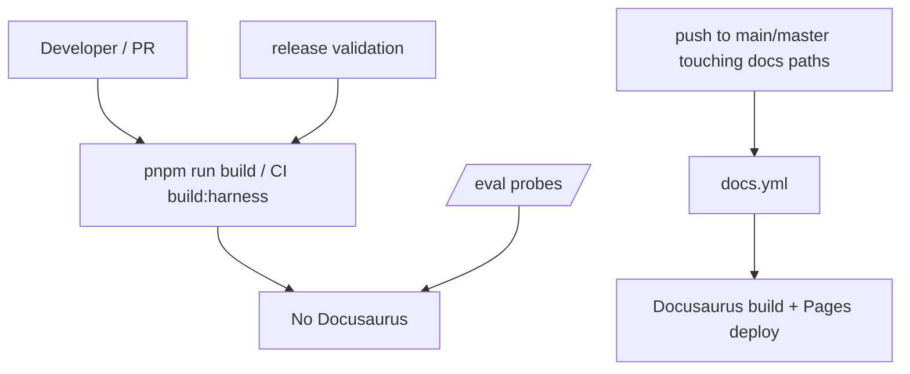

# CI Build Gates

## Relevant Source Files
- `package.json` — root scripts define the fast build and explicit docs commands.
- `.github/workflows/ci-harness.yml` — PR/push Harness CI uses the fast build.
- `.github/workflows/docs.yml` — automatic docs build/deploy is isolated to `main`/`master` pushes.
- `.github/workflows/release.yml` — release validation uses the fast non-docs build.
- `.claude/skills/eval/run.sh` — `/eval` runs probe scripts, not Docusaurus.
- `evals/probes/docs-build-fast-path.sh` — guards the split.

## Summary
Open Harness separates fast harness validation from docs-site validation. Root build, Harness CI, release validation, and `/eval` avoid Docusaurus; automatic docs build/deploy happens only when `docs.yml` runs on `main` or `master` pushes.

## Detail
`package.json:9-11` makes `pnpm run build` delegate to `build:harness`, which excludes `@openharness/docs` and builds the standalone `packages/oh` package. Manual docs commands remain explicit at `package.json:20-22`, so an operator can run `pnpm docs:build` only when they intentionally want Docusaurus feedback.

Harness CI installs dependencies, then its Build step calls `pnpm run build:harness` (`.github/workflows/ci-harness.yml:84-102`). Release validation uses the same fast Build step (`.github/workflows/release.yml:38-56`), so release tags do not build docs automatically. The docs workflow is the sole automatic Docusaurus path: it triggers on pushes to `main` and `master` with docs path filters (`.github/workflows/docs.yml:3-12`) and runs `pnpm run build` in `packages/docs` (`.github/workflows/docs.yml:43-45`). Deploy guards are also scoped to `main`/`master` refs (`.github/workflows/docs.yml:50-62`).

`/eval` remains a fast regression floor: its runner executes each `evals/probes/*.sh` with a timeout (`.claude/skills/eval/run.sh:84-95`) rather than invoking package builds. The `docs-build-fast-path` probe keeps Docusaurus out of the fast path.

| Gate | Command / trigger | Builds docs? |
| --- | --- | --- |
| Fast local build | `pnpm run build` | No |
| Manual docs check | `pnpm docs:build` | Yes, explicit only |
| Harness CI | `pnpm run build:harness` | No |
| Release validation | `pnpm run build:harness` | No |
| Docs workflow | push to `main`/`master` docs paths | Yes |
| `/eval` | `bash .claude/skills/eval/run.sh` | No |

## System Relationships

## See Also
- [[cron-runtime]]
