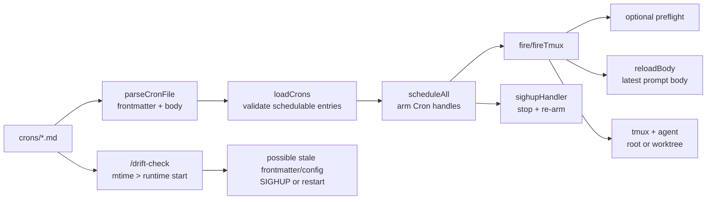

# Cron Runtime

## Relevant Source Files
- `scripts/cron-runtime.ts:8-26` — `CronEntry` carries both scheduler/config fields and the prompt body path.
- `scripts/cron-runtime.ts:51-72` — frontmatter parsing maps `schedule`, `enabled`, `tmux`, `worktree`, `agent`, and `preflight` into `CronEntry`.
- `scripts/cron-runtime.ts:101-145` — `loadCrons` filters disabled crons, invalid ids, id mismatches, unsafe agents, and invalid schedules before scheduling.
- `scripts/cron-runtime.ts:164-176` — `reloadBody` re-reads only the cron body from disk at fire time.
- `scripts/cron-runtime.ts:513-571` — `fireTmux` decides worktree isolation, reloads the body, writes the prompt file, and launches tmux.
- `scripts/cron-runtime.ts:592-627` — `preflight` runs before worktree/tmux/agent creation.
- `scripts/cron-runtime.ts:722-790` — `scheduleAll` arms crons and `sighupHandler` stops/re-arms them on SIGHUP.
- `.claude/skills/drift-check/SKILL.md:190-203` — `/drift-check` defines conservative stale frontmatter/config detection.

## Summary
Open Harness' cron runtime is a small scheduler that reads `crons/*.md` frontmatter into `CronEntry` records, then uses the markdown body as the agent prompt. Body text can hot-reload at fire time, but scheduler/config frontmatter is captured when the runtime arms jobs and therefore needs a SIGHUP reschedule or runtime restart to take effect reliably.

## Detail
A cron file has two lifecycles. Its leading frontmatter becomes scheduler/config state: `parseCronFile` maps `schedule`, `enabled`, `tmux`, `worktree`, `agent`, and `preflight` into a `CronEntry` (`scripts/cron-runtime.ts:51-72`). `loadCrons` then drops entries that the runtime will not arm: disabled files, invalid ids, filename/id mismatches, unsafe agent overrides, and invalid schedules (`scripts/cron-runtime.ts:101-145`). Those filters define what counts as a schedulable cron.

The body lifecycle is different. `reloadBody` re-reads the file at fire time and returns the latest body text while keeping the already-armed entry's scheduler/config context (`scripts/cron-runtime.ts:164-176`). `fireTmux` calls `reloadBody`, writes the prompt file, and launches the tmux/agent wrapper; if `worktree: true`, it isolates that fire in a fresh `.worktrees/cron/<session>` checkout (`scripts/cron-runtime.ts:513-571`). A configured `preflight` gate runs before any worktree, tmux session, or agent is created (`scripts/cron-runtime.ts:592-627`).

Rescheduling is explicit. `scheduleAll` reads the cron directory and arms jobs, while `sighupHandler` stops active handles and re-runs `scheduleAll` without exiting the runtime (`scripts/cron-runtime.ts:722-790`). That means body-only edits hot-reload on the next fire, but frontmatter/config edits need either SIGHUP reschedule or a `cron-system` restart.

`/drift-check` is the read-only guard for this distinction. It compares schedulable cron file mtimes against the live runtime start time and conservatively warns that restart-required frontmatter/config may be stale; without a runtime snapshot it does not prove which field changed (`.claude/skills/drift-check/SKILL.md:190-203`). Its Step C-2 predicate mirrors the runtime's schedulable filters and names the restart-required field set in the diagnostic (`.claude/skills/drift-check/SKILL.md:250-392`).

## System Relationships

## See Also
- [[pi-loop]]
- [[ship-spec-orchestration]]
