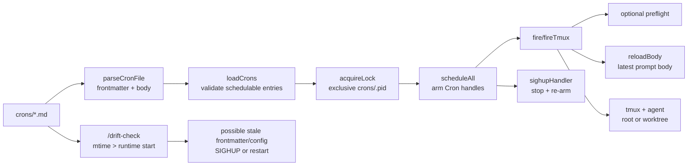

# Cron Runtime

## Relevant Source Files
- `scripts/cron-runtime.ts:8-29` — `CronEntry` carries both scheduler/config fields and the prompt body path.
- `scripts/cron-runtime.ts:35-39` — `CRONS_DIR`, `PID_FILE`, `LOG_FILE`, and `LOCKED_APPEND` define the runtime's local state files and locked append helper.
- `scripts/cron-runtime.ts:76-101` — frontmatter parsing maps `schedule`, `enabled`, `tmux`, `worktree`, `agent`, and `preflight` into `CronEntry`.
- `scripts/cron-runtime.ts:126-177` — `loadCrons` filters disabled crons, invalid ids, id mismatches, unsafe agents, and invalid schedules before scheduling.
- `scripts/cron-runtime.ts:179-219` — `acquireLock` is the singleton guard: it uses exclusive pidfile creation, preserves live holders, and reclaims stale/unparsable files by unlinking then retrying exclusive creation.
- `scripts/cron-runtime.ts:291-325` — `appendCronLog`, `log`, and `cronLogCommand` route runtime and shell-wrapper liveness lines through `scripts/locked-append.sh`.
- `scripts/cron-runtime.ts:278-291` — `reloadBody` re-reads only the cron body from disk at fire time.
- `scripts/cron-runtime.ts:750-818` — `fireTmux` decides worktree isolation, reloads the body, writes the prompt file, and launches tmux.
- `scripts/cron-runtime.ts:843-883` — `preflight` runs before worktree/tmux/agent creation.
- `scripts/cron-runtime.ts:990-1060` — `scheduleAll` arms crons and `sighupHandler` stops/re-arms them on SIGHUP.
- `.claude/skills/drift-check/SKILL.md:190-203` — `/drift-check` defines conservative stale frontmatter/config detection.

## Summary
Open Harness' cron runtime is a small scheduler that reads `crons/*.md` frontmatter into `CronEntry` records, uses the markdown body as the agent prompt, and protects the scheduler with a singleton pidfile lock. Runtime liveness records are serialized through `scripts/locked-append.sh` so concurrent fires write whole `.cron.log` records. Body text can hot-reload at fire time, but scheduler/config frontmatter is captured when the runtime arms jobs and therefore needs a SIGHUP reschedule or runtime restart to take effect reliably.

## Detail
A cron file has two lifecycles. Its leading frontmatter becomes scheduler/config state: `parseCronFile` maps `schedule`, `enabled`, `tmux`, `worktree`, `agent`, and `preflight` into a `CronEntry` (`scripts/cron-runtime.ts:76-101`). `loadCrons` then drops entries that the runtime will not arm: disabled files, invalid ids, filename/id mismatches, unsafe agent overrides, and invalid schedules (`scripts/cron-runtime.ts:126-177`). Those filters define what counts as a schedulable cron.

Before arming jobs, the runtime acquires `crons/.pid` through `acquireLock` (`scripts/cron-runtime.ts:179-219`). The lock path uses exclusive pidfile creation (`wx`) first, so two concurrent starts cannot both create the singleton marker. If an existing holder is live, startup returns false and exits; if the pidfile is stale or unparsable, the runtime unlinks it and retries exclusive creation instead of overwriting blindly. If another contender wins between stale cleanup and retry, the next loop re-inspects that live holder and backs off.

The body lifecycle is different. `reloadBody` re-reads the file at fire time and returns the latest body text while keeping the already-armed entry's scheduler/config context (`scripts/cron-runtime.ts:278-291`). `fireTmux` calls `reloadBody`, writes the prompt file, and launches the tmux/agent wrapper; if `worktree: true`, it isolates that fire in a fresh `.worktrees/cron/<session>` checkout (`scripts/cron-runtime.ts:750-818`). A configured `preflight` gate runs before any worktree, tmux session, or agent is created (`scripts/cron-runtime.ts:843-883`).

Liveness logging has two writers: in-process runtime events call `log`, and shell-wrapper events such as `AGENT_START`/`AGENT_DONE` are emitted by command strings from `cronLogCommand`. Both routes now feed a complete tab-separated line into `scripts/locked-append.sh` (`scripts/cron-runtime.ts:291-325`), matching the prompt-level convention in `crons/heartbeat.md`, `crons/cleanup-tasks.md`, and `crons/eval-weekly.md`. This preserves `.cron.log` as a reliable flight recorder when cron fires overlap or multiple kept sessions finish at similar times.

Rescheduling is explicit. `scheduleAll` reads the cron directory and arms jobs, while `sighupHandler` stops active handles and re-runs `scheduleAll` without exiting the runtime (`scripts/cron-runtime.ts:990-1060`). That means body-only edits hot-reload on the next fire, but frontmatter/config edits need either SIGHUP reschedule or a `cron-system` restart.

If the singleton lock is wedged, recover manually rather than adding broad auto-recovery: stop the `cron-system` tmux session, verify the PID recorded in `crons/.pid` is not a live runtime/session you need to preserve, remove `crons/.pid`, then restart the cron runtime from the repository root.

`/drift-check` is the read-only guard for this distinction. It compares schedulable cron file mtimes against the live runtime start time and conservatively warns that restart-required frontmatter/config may be stale; without a runtime snapshot it does not prove which field changed (`.claude/skills/drift-check/SKILL.md:190-203`). Its Step C-2 predicate mirrors the runtime's schedulable filters and names the restart-required field set in the diagnostic (`.claude/skills/drift-check/SKILL.md:250-392`).

## System Relationships

## See Also
- [[pi-loop]]
- [[ship-spec-orchestration]]
