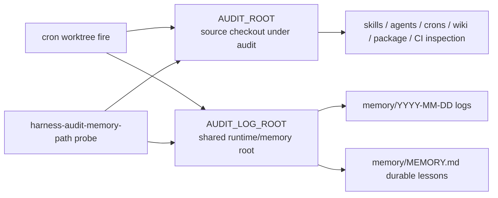

# Harness Audit

## Relevant Source Files
- `.claude/skills/harness-audit/SKILL.md:57-71` — resolves `AUDIT_ROOT` from the active cron worktree and `AUDIT_LOG_ROOT` from `AUTOPILOT_LOG_ROOT` or the shared worktree root.
- `.claude/skills/harness-audit/SKILL.md:73-91` — gathers source context from `AUDIT_ROOT` while reading memory logs and durable memory through `AUDIT_LOG_ROOT`.
- `.claude/skills/harness-audit/SKILL.md:346-358` — documents key paths, including the long-term-memory split.
- `evals/probes/harness-audit-memory-path.sh:17-38` — guards `AUDIT_ROOT`/`CRON_WORKTREE` source resolution and rejects an `AUDIT_ROOT` long-term-memory tail.
- `tasks/make-harness-audit-load-shared/prd.md` — issue #432 implementation contract and critic mitigation.

## Summary
`/harness-audit` is the research input for autopilot's next-item selection. In cron worktree mode it inspects source from the isolated worktree (`AUDIT_ROOT`) but reads runtime observability and durable lessons from the shared log root (`AUDIT_LOG_ROOT`), so auditors see current memory instead of a template-empty worktree copy.

## Detail
The skill has two roots. `AUDIT_ROOT` is the checkout under audit: it prefers `$CRON_WORKTREE` when that path is a git worktree, otherwise it uses the current checkout (`.claude/skills/harness-audit/SKILL.md:57-63`). `AUDIT_LOG_ROOT` starts as `$AUTOPILOT_LOG_ROOT` when provided; in cron worktree mode, if it still equals `AUDIT_ROOT`, the skill asks `git worktree list --porcelain` for the shared root and uses that path when available (`.claude/skills/harness-audit/SKILL.md:65-71`).

That split is deliberate. Skills, agents, crons, wiki pages, packages, CI workflows, and `git worktree list` stay rooted at `AUDIT_ROOT`, preserving source isolation for the run (`.claude/skills/harness-audit/SKILL.md:73-88`). Memory logs and the recent long-term-memory tail use `AUDIT_LOG_ROOT`, including `tail -40 "$AUDIT_LOG_ROOT/memory/MEMORY.md" 2>/dev/null` (`.claude/skills/harness-audit/SKILL.md:77-91`). Missing memory remains non-fatal because the tail still suppresses stderr.

Cron worktree troubleshooting: if `/harness-audit` starts re-surfacing stale lessons or ignores recent `memory/MEMORY.md` entries, compare the `Context Snapshot` roots. Expected: `AUDIT_ROOT` points at `.worktrees/cron/<session>` and `AUDIT_LOG_ROOT` points at the shared checkout. Then run `bash evals/probes/harness-audit-memory-path.sh`; it fails if the skill reverts to `tail -40 "$AUDIT_ROOT/memory/MEMORY.md"` for long-term memory (`evals/probes/harness-audit-memory-path.sh:22-30`).

## System Relationships

## See Also
- [[cron-runtime]]
