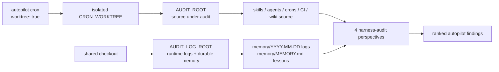

# Harness Audit

## Relevant Source Files
- `.claude/skills/harness-audit/SKILL.md:56-63` — resolves `AUDIT_ROOT` to the cron worktree when the audit is invoked from an isolated run.
- `.claude/skills/harness-audit/SKILL.md:65-71` — resolves `AUDIT_LOG_ROOT` to the shared checkout when runtime observability differs from source inspection.
- `.claude/skills/harness-audit/SKILL.md:73-98` — gathers source files from `AUDIT_ROOT`, recent daily logs from `AUDIT_LOG_ROOT`, and durable long-term memory from `AUDIT_LOG_ROOT` with an explicit load-status line.
- `.claude/skills/harness-audit/SKILL.md:231-239` — directs memory/log-related Explorer checks through the Context Snapshot and `AUDIT_LOG_ROOT`, while keeping skill source checks on `AUDIT_ROOT`.
- `evals/probes/harness-audit-memory-path.sh:17-48` — guards that source resolution remains worktree-aware, durable memory stays rooted at `AUDIT_LOG_ROOT`, and load status stays visible.
- `crons/autopilot.md:1-11` — declares the hourly autopilot cron as a worktree-mode job.

## Summary
`/harness-audit` is the first-principles research pass that feeds the autopilot queue when no actionable `autopilot` issue is available. In worktree-mode cron runs, it must split source inspection from durable memory: audit the isolated checkout via `AUDIT_ROOT`, but read runtime logs and long-term lessons from `AUDIT_LOG_ROOT`. The context snapshot reports `long_term_memory: loaded` or `missing-or-unreadable` so a quiet memory miss is visible.

## Detail
The audit root exists to make source inspection truthful for the checkout that invoked the skill. When `CRON_WORKTREE` points at a valid checkout, `/harness-audit` sets `AUDIT_ROOT` to that worktree; otherwise it falls back to the current repository root (`.claude/skills/harness-audit/SKILL.md:56-63`). Skills, agents, crons, package metadata, CI workflows, wiki files, and worktree state are all read through that source root (`.claude/skills/harness-audit/SKILL.md:73-88`).

Runtime observability has a different lifecycle. Cron worktrees are ephemeral and can be based on a public/template branch whose `memory/MEMORY.md` is intentionally sparse, while the live operator's durable lessons and daily logs live in the shared checkout. `/harness-audit` therefore resolves `AUDIT_LOG_ROOT` separately (`.claude/skills/harness-audit/SKILL.md:65-71`) and uses it for recent memory directories and long-term memory (`.claude/skills/harness-audit/SKILL.md:77,90-98`).

The distinction matters because autopilot selection quality depends on the audit context. A successful-looking audit that reads template-empty memory can re-discover stale lessons or miss recent guardrails. The `harness-audit-memory-path` probe makes the split executable: it fails if the skill stops resolving `AUDIT_ROOT`/`CRON_WORKTREE`, fails if long-term memory is not read via `AUDIT_LOG_ROOT`, fails if the load-status line disappears, and fails if auditor prompts stop routing memory/log checks through the Context Snapshot (`evals/probes/harness-audit-memory-path.sh:17-48`).

Troubleshooting: if an audit report shows `long_term_memory: missing-or-unreadable`, compare the snapshot's `AUDIT_ROOT` and `AUDIT_LOG_ROOT`. Source findings may still be valid, but memory-derived judgments are incomplete until the shared root has a readable `memory/MEMORY.md` or `AUTOPILOT_LOG_ROOT` is set to the checkout that owns durable logs.

## System Relationships

## See Also
- [[cron-runtime]]
