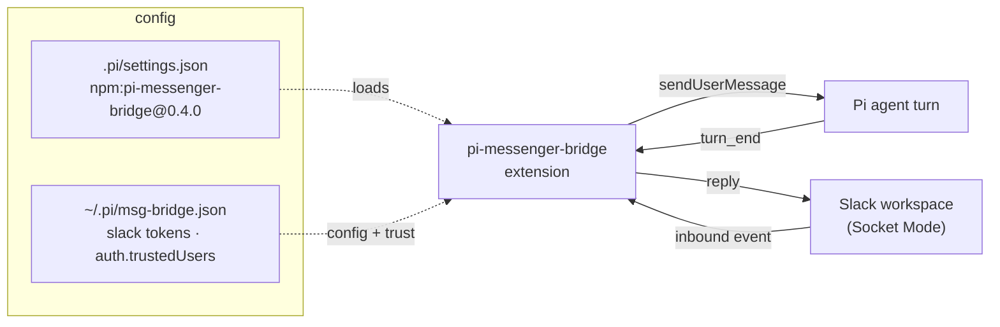

# pi-messenger-bridge

## Relevant Source Files
- `.pi/settings.json` — pins `npm:pi-messenger-bridge@0.4.0` in `packages[]` (`.pi/settings.json:27`), loading the extension into every project Pi session.
- `packages/oh/src/config/slack.ts` — the `oh config slack` wizard: prompts for the two Slack tokens, seeds `~/.pi/msg-bridge.json` mode `0600` (`slack.ts:134`–`137`), and (re)launches the bridge's `client-slack` tmux session (`slack.ts:17`, `:143`–`155`).
- `.devcontainer/entrypoint.sh` — sandbox boot script; the `client-slack` tmux session and the `~/.pi/msg-bridge.json` config persist in the sandbox runtime it establishes.
- `docs/integrations/slack.md` — operator-facing setup guide for the Slack path (create the app, capture `xapp-`/`xoxb-` tokens, run the wizard).
- External: the MIT-licensed npm package `pi-messenger-bridge` (GitHub README captured in the snapshot below).

## Summary
`pi-messenger-bridge` is an MIT-licensed npm package that bridges common messengers — Telegram, WhatsApp, Slack, Discord, and Matrix — into a running Pi coding agent as an in-session extension, so remote users can drive the agent from their messenger app. Open Harness pins it (`npm:pi-messenger-bridge@0.4.0`) and uses it for **Slack**, replacing the removed in-tree `.pi/extensions/slack/` extension (#481). It loads through `.pi/settings.json` and is wired up by the `oh config slack` wizard.

## Detail
The package installs with `pi install npm:pi-messenger-bridge` and registers the `/msg-bridge` command plus a toggleable status widget. In the harness it is pinned in `.pi/settings.json` `packages[]` (`.pi/settings.json:27`) so every project Pi session loads it.

**Configuration.** State lives in `~/.pi/msg-bridge.json`, written mode `0600` inside `~/.pi/` (mode `0700`). The Slack shape the wizard seeds is `{ slack: { botToken, appToken }, auth: { trustedUsers: ["slack:U…"], adminUserId }, autoConnect: true, showWidget, debug }` (`packages/oh/src/config/slack.ts:223`–`231`). `autoConnect: true` makes the bridge open its transports headlessly on boot — no interactive `/msg-bridge connect` needed — which is what lets the `client-slack` session come up unattended.

**Credentials & env overrides.** Tokens are supplied as `PI_SLACK_BOT_TOKEN` (`xoxb-…`) and `PI_SLACK_APP_TOKEN` (`xapp-…`); environment variables take precedence over the file config. The wizard upserts these into the sandbox env-overrides file and sources it when launching the bridge (`slack.ts:216`, `:155`).

**Auth model.** Authentication is challenge-based and deny-default: a first-time messenger user receives a 6-digit code printed in the Pi terminal, which they echo back to become a trusted user. Trust is namespaced per transport (`slack:U…`) to prevent cross-platform impersonation. Trusted users can DM the bot admin commands (`/trusted`, `/revoke`, `/channels`, `/enable`, `/disable`).

**Single-instance guard.** A global flag plus a PID lock file at `~/.pi/msg-bridge.lock` stops duplicate Socket-Mode polling when Pi spawns sub-agents.

**Runtime shape.** It is a *pi-native* extension: it injects inbound messages with Pi's `sendUserMessage()` and reads `turn_end` events to post the agent's reply back — no tool-loop hack. In Open Harness the bridge process runs as `pi` inside the `client-slack` tmux session (`slack.ts:17`), (re)started by the wizard, which polls the connection log line before declaring the bridge live.

## System Relationships

The `oh config slack` wizard seeds `~/.pi/msg-bridge.json` and runs the bridge inside the `client-slack` tmux session; the `.pi/settings.json` pin is what loads the extension into that session.

## See Also
- [[pi-loop]]
- [[pi-tasks]]
