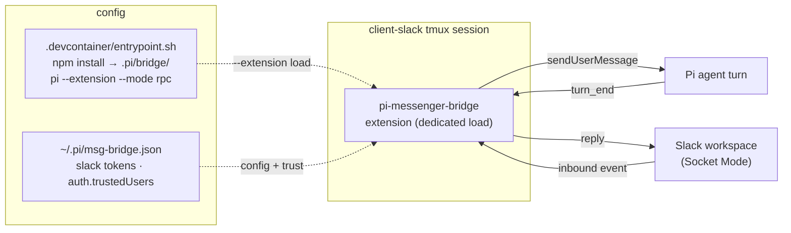

# pi-messenger-bridge

## Relevant Source Files
- `.devcontainer/entrypoint.sh` — installs the package via `npm install pi-messenger-bridge@0.4.0` into the gitignored `.pi/bridge/` dir and loads it via `pi --extension …/dist/index.js --mode rpc --approve` **only** in the `client-slack` tmux session (`.devcontainer/entrypoint.sh:439`–`457`). It is **not** pinned in `.pi/settings.json` `packages[]`, so no other Pi session loads the bridge or contends for the Slack connection.
- `.devcontainer/client-slack-supervise.sh` — the self-healing supervisor the `client-slack` session runs pi under; restarts pi on the `ctx is stale` signature and on any crash, clearing the lock each time (below).
- `.pi/msg-bridge.json` (tracked) + `.devcontainer/.env` (gitignored) — Slack's two config files (no wizard): non-secret runtime config (`autoConnect`, `auth.trustedUsers`, `auth.channels`) and the `PI_SLACK_*` tokens respectively; the entrypoint copies the tracked json to `~/.pi/msg-bridge.json` (mode `0600`) before launch.
- `docs/integrations/slack.md` — operator-facing setup guide (create the app, capture `xapp-`/`xoxb-` tokens, edit the two config files).
- External: the MIT-licensed npm package `pi-messenger-bridge` (GitHub README captured in the snapshot below).

## Summary
`pi-messenger-bridge` is an MIT-licensed npm package that bridges common messengers — Telegram, WhatsApp, Slack, Discord, and Matrix — into a running Pi coding agent as an in-session extension, so remote users can drive the agent from their messenger app. Open Harness installs it via npm into the gitignored `.pi/bridge/` dir and uses it for **Slack**, replacing the removed in-tree `.pi/extensions/slack/` extension (#481). It is **not** globally pinned in `.pi/settings.json`; instead `.devcontainer/entrypoint.sh` loads it via `--extension` only in the dedicated `client-slack` tmux session, so no other Pi session contends for the Slack connection. Slack is configured by hand-editing `.devcontainer/.env` (tokens) plus the tracked `.pi/msg-bridge.json` (trust and channels).

## Detail
The package installs with `pi install npm:pi-messenger-bridge` and registers the `/msg-bridge` command plus a toggleable status widget. In the harness it is **not** pinned in `.pi/settings.json` `packages[]`; instead `.devcontainer/entrypoint.sh` runs `npm install pi-messenger-bridge@0.4.0` into the gitignored `.pi/bridge/` dir (npm builds the package's native transport deps, which pnpm does not) and loads it via `pi --extension "$HARNESS/.pi/bridge/node_modules/pi-messenger-bridge/dist/index.js" --mode rpc --approve` **only** in the `client-slack` tmux session (`.devcontainer/entrypoint.sh:439`–`444`). Dedicated-session-only load means no other Pi session loads the bridge — important because the single-instance lock (below) would otherwise let multiple instances contend for and steal the Slack Socket-Mode connection. `--mode rpc` keeps the bridge alive headlessly (plain `pi | tee` exits at idle on non-TTY stdout).

**Configuration.** State lives in `~/.pi/msg-bridge.json`, written mode `0600` inside `~/.pi/` (mode `0700`). There is no wizard — config is hand-edited in the two files above. `autoConnect: true` makes the bridge open its transports headlessly on boot — no interactive `/msg-bridge connect` needed — which is what lets the `client-slack` session come up unattended.

**Credentials & env overrides.** Tokens are supplied as `PI_SLACK_BOT_TOKEN` (`xoxb-…`) and `PI_SLACK_APP_TOKEN` (`xapp-…`) in `.devcontainer/.env`; environment variables take precedence over the file config, so the secret tokens stay out of the tracked `.pi/msg-bridge.json`.

**Auth model.** Authentication is challenge-based and deny-default: a first-time messenger user receives a 6-digit code printed in the Pi terminal, which they echo back to become a trusted user. Trust is namespaced per transport (`slack:U…`) to prevent cross-platform impersonation. Trusted users can DM the bot admin commands (`/trusted`, `/revoke`, `/channels`, `/enable`, `/disable`).

**Single-instance guard.** A global flag plus a PID lock file at `~/.pi/msg-bridge.lock` stops duplicate Socket-Mode polling when Pi spawns sub-agents.

**Stale-ctx self-heal.** The bridge binds its long-lived Slack socket to a *session-scoped* pi ctx; when pi replaces the session (compaction/fork/switch/reload) the ctx goes stale and every later Slack message throws `extension ctx is stale after session replacement or reload`, with no in-package recovery — the process lives on but the bridge silently stops responding. `.devcontainer/client-slack-supervise.sh` wraps the launch: it tails the log for that signature (and any crash), kills the bridge pi, clears `~/.pi/msg-bridge.lock`, and relaunches a fresh process that reconnects (a clean `rc=0` exit stops the loop).

**Runtime shape.** It is a *pi-native* extension: it injects inbound messages with Pi's `sendUserMessage()` and reads `turn_end` events to post the agent's reply back — no tool-loop hack. In Open Harness the bridge process runs as `pi` inside the `client-slack` tmux session; the `[Slack] Bot user ID:` log line is its connect marker.

## System Relationships

The tracked `.pi/msg-bridge.json` (hand-edited, no wizard) seeds `~/.pi/msg-bridge.json`; `.devcontainer/entrypoint.sh` installs the package into `.pi/bridge/` and loads it via `--extension` inside the dedicated `client-slack` tmux session, under the `.devcontainer/client-slack-supervise.sh` self-healing supervisor. Because it is **not** globally pinned in `.pi/settings.json`, no other Pi session loads the bridge to contend for the Slack connection.

## See Also
- [[pi-loop]]
- [[pi-tasks]]
