# prompt-miner

## Relevant Source Files
- `.claude/skills/prompt-miner/scripts/mine-traces.mjs:766` — the impure pipeline, in order: `read → aggregate → score → feature → rank → report`.
- `.claude/skills/prompt-miner/scripts/mine-traces.mjs:186` — `classifyLine` normalizes the two harness schemas (Claude nested `is_error` vs Pi `toolResult.isError`).
- `.claude/skills/prompt-miner/scripts/mine-traces.mjs:307` — `aggregateSession` dedupes/merges resumed sessions by `sessionId`.
- `.claude/skills/prompt-miner/scripts/mine-traces.mjs:391-409` — `scoreSession`: the friction formula plus the ground-truth bonus, clamped 0..100.
- `.claude/skills/prompt-miner/scripts/mine-traces.mjs:753-762` — `resolveGroundTruth`: PR-url OR a commit on `origin/development` inside the session window; `--no-git` stubs it to 0.
- `.claude/skills/prompt-miner/scripts/mine-traces.mjs:894-895` — ranking: rankable sessions sorted by `score` descending.
- `.claude/skills/prompt-miner/SKILL.md:126` — the interactive Step 3 mines markers **stratified by session type**; `:154` is the `/retro`-style propose-then-confirm gate.
- `.claude/skills/prompt-miner/references/markers.md:57-76` — marker thresholds (`sessions_supporting ≥ 10`, `effect_size ≥ 0.3`) and the `NO-CORPUS` vs `NO-CANDIDATE` distinction.
- `crons/prompt-miner.md:74-88` — the daily cron ships a finding to `development` via `/ship-spec`, then labels the created PR.

## Summary
prompt-miner is a self-improvement subsystem that mines the harness's own Claude + Pi session traces to learn which prompt traits produce the best sessions. A deterministic, zero-dependency Node engine collects traces, scores each session by a friction + ground-truth outcome proxy, and ranks the initiating prompts; an LLM skill step then mines falsifiable prompt **markers** stratified by session type and feeds them back — interactively behind a `/retro`-style gate, and unattended via a daily, cap-gated cron that ships a finding to `development` through `/ship-spec`. It is a cross-session, data-driven cousin of `/retro`. No DeepWiki counterpart exists; this is a net-new subsystem, so the page establishes the model rather than reconciling one.

## Detail
The pipeline runs in a fixed order — `read → aggregate → score → feature → rank → report` (`mine-traces.mjs:766`). Reading streams each `.jsonl` line through `node:readline` with per-line `JSON.parse` in try/catch, so malformed lines are tolerated, not thrown. `classifyLine` (`:186`) normalizes both harnesses to one event shape — the load-bearing difference is the tool-error path: Claude's is the nested `message.content[].is_error`, Pi's is `message.toolResult.isError`. `aggregateSession` (`:307`) merges resumed sessions across files by `sessionId` so counts are unioned, not double-counted.

Scoring is a documented heuristic **proxy**, not a verdict. `scoreSession` (`:391-409`) computes `base = 100 − 35·toolErrorRate − 30·correctionDensity − 20·abandoned − 10·incomplete − 5·turnBloat`, then adds a +15 ground-truth bonus and clamps to 0..100. `resolveGroundTruth` (`:753-762`) awards the bonus when a PR URL appears in assistant text **or** a commit lands on `origin/development` within the session window — cross-referenced against `development` only; `--no-git` stubs the bonus to 0 for CI and offline runs. Every number is reconstructable from the per-session `scoreBreakdown`. Weights are overridable and validated (`validateWeights`, `:155`). `correctionDensity` is flagged as the highest-variance signal — calibrate before trusting it.

Each attributed prompt is reduced to a 13-key feature vector (`extractFeatures`, `:444`) and each session tagged with a type (`detectSessionType`, `:474`: `impl|retro|query|audit|cron|other`). Sessions are window-sorted and the rankable subset (human-prompted, `turns ≥ minTurns`) is sorted by `score` descending (`:894-895`). The report (`json` + `md`) lands in the gitignored `memory/<UTC-date>/`; default output is feature vectors + metadata only — raw prompt text appears only under `--include-prompt-text`, which also runs a redaction pass (`redact`, `:493`) and prints a warning.

Marker mining is the judgment layer. The skill correlates each feature against the score **per session-type stratum** — never pooled, to avoid Simpson's-paradox artifacts — and emits the falsifiable schema `{feature, direction, threshold, sessions_supporting, sessions_contradicting, effect_size}`. A marker is reportable only at `sessions_supporting ≥ 10` and `effect_size ≥ 0.3` (`markers.md:57-58`). When no stratum reaches the support floor, the run emits `NO-CORPUS` (too small to mine) — distinct from `NO-CANDIDATE` (large enough, nothing crossed the bar) (`markers.md:67-76`).

Two feedback paths exist. **Interactive** (`SKILL.md:154`): reportable markers become candidate lessons that pass through a qualify + dedup filter and a propose-then-confirm gate before any `MEMORY.md`/`IDENTITY.md` write — exactly like `/retro`; nothing is written without `APPROVE`. **Unattended** (`crons/prompt-miner.md`): the daily cron mines `--hours 24 --report-only`, and only on a threshold-clearing marker files an issue and runs `/ship-spec --repo mifunedev/openharness --base development --issue <N>` (`:74`), then labels the created PR `prompt-miner` (`:88`) because GitHub does not propagate the issue label to the PR — an unlabeled PR would defeat the prompt-miner-scoped cap. The cron ships `enabled: false`, is gated by `preflight: scripts/prompt-miner-caps.sh`, never auto-merges, and never mutates `MEMORY.md`/`IDENTITY.md` directly (improvements land as loop-gated PRs through `/ship-spec`, which does not walk retro/compound).

## System Relationships

```mermaid
flowchart LR
  subgraph Engine["mine-traces.mjs (deterministic)"]
    Read["read traces<br/>Claude + Pi .jsonl"] --> Agg["aggregate<br/>dedupe by sessionId"]
    Agg --> Score["score<br/>friction + ground-truth"]
    Score --> Feat["feature vector<br/>+ session type"]
    Feat --> Rank["rank by score desc"]
    Rank --> Report["report json + md<br/>memory/&lt;date&gt;/ (gitignored)"]
  end
  Report --> Mine["/prompt-miner Step 3<br/>mine markers (stratified)"]
  Mine -->|interactive| Gate["propose-then-confirm<br/>MEMORY.md / IDENTITY.md"]
  Mine -->|unattended| Cron["crons/prompt-miner.md<br/>enabled:false, cap-gated"]
  Cron --> Issue["issue<br/>label: prompt-miner"]
  Issue --> Ship["/ship-spec --repo mifunedev/openharness"]
  Ship --> PR["draft→ready PR (origin)<br/>relabel + never auto-merge"]
```

## See Also
- [[cron-runtime]]
- [[ship-spec-orchestration]]
- [[compound-engineering]]
