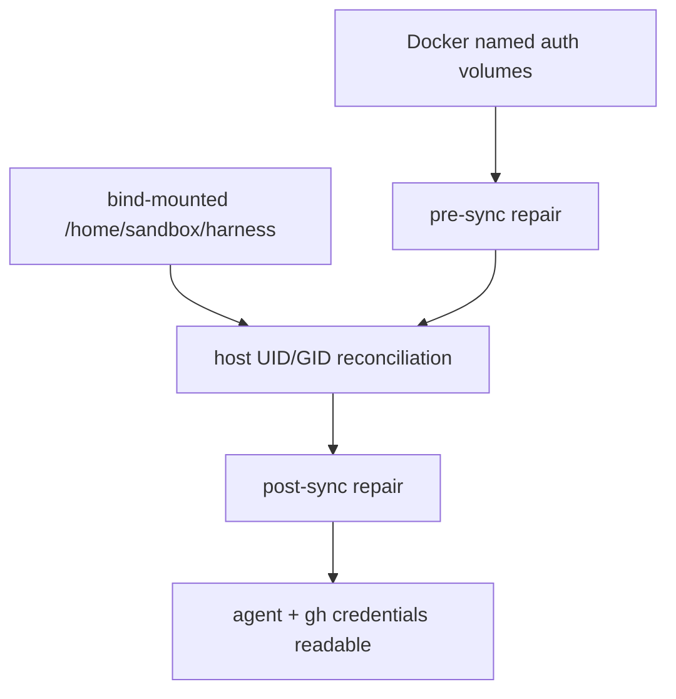

# Sandbox Auth Volume Ownership

## Relevant Source Files

- `.devcontainer/docker-compose.yml` — mounts the repo plus persistent agent/GitHub auth named volumes.
- `.devcontainer/entrypoint.sh` — reconciles the sandbox UID/GID and repairs ownership of auth/config mounts.
- `scripts/__tests__/entrypoint.test.ts` — pins the ordering and numeric-owner invariant.

## Summary

Open Harness keeps agent and GitHub auth state in Docker named volumes under `/home/sandbox`, while the repo itself is bind-mounted at `/home/sandbox/harness`. The entrypoint must repair auth-volume ownership both before and after UID/GID reconciliation so credentials stay readable when the sandbox user is remapped to the host checkout owner.

## Detail

Compose mounts `claude-auth`, `codex-auth`, `pi-auth`, `opencode-auth`, `grok-auth`, `deepagents-auth`, `cloudflared-auth`, and `gh-config` below `/home/sandbox` while mounting the checkout separately at `/home/sandbox/harness` (`.devcontainer/docker-compose.yml:31-40`). Docker can create those volume targets as root, so the entrypoint computes the sandbox user's current numeric owner with `id -u sandbox` and `id -g sandbox` before repair (`.devcontainer/entrypoint.sh:15-22`). Numeric ownership matters because UID/GID reconciliation can move `sandbox` to an existing host group whose name is not `sandbox`; `sandbox:sandbox` would then target the wrong group.

The repair helper fixes existing auth/config mounts, preserves `.ssh` mode hardening, repairs root-created parents non-recursively, and handles legacy `/home/sandbox/.hermes` state without recursing into `$HERMES_HOME` when it lives inside the bind-mounted checkout (`.devcontainer/entrypoint.sh:24-56`). It runs once before the host UID block for default-host compatibility and again after UID/GID reconciliation so the final numeric identity owns persisted credentials (`.devcontainer/entrypoint.sh:59-95`). Tests assert both the numeric owner calculation and the pre/post UID-sync invocation order (`scripts/__tests__/entrypoint.test.ts:12-36`).

Operator symptoms of ownership drift: `gh auth status` fails despite a populated `gh-config` volume, agent CLIs ask to re-authenticate after restart, or writes under `~/.claude`, `~/.codex`, `~/.pi`, `~/.grok`, `~/.deepagents`, `~/.cloudflared`, or `~/.config/gh` return EACCES. Verify with `stat -c '%u:%g %n' ~/.config/gh ~/.claude ~/.pi` inside the sandbox; expected owner is `$(id -u sandbox):$(id -g sandbox)`. If auth still fails, restart the sandbox to re-run the entrypoint, then manually chown only the affected auth volume path to that numeric owner; do not chown the whole bind-mounted checkout as a recovery shortcut.

## System Relationships

## See Also

- [[hermes-agent]]
- [[inspectable-agent-harness]]
